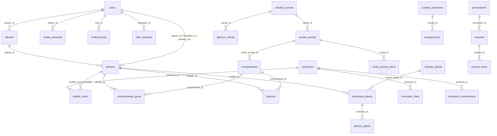

# 02 — Modelo de Datos (Esquema y Relaciones)

> **Última verificación contra código:** 2026-07-12
> **Estado:** ERP/CRM y separación Campo/Planta en producción; facturación de Campo pendiente de desplegar
> **Archivos clave:** `src/lib/types.ts`, `scripts/migrate-produccion-2026-05-29.sql`, `scripts/migrate-produccion-fase-2-3-consolidado.sql`, `scripts/migrate-clientes-avicola-2026-07-07.sql`, `scripts/migrate-planta-clientes-cobranzas-2026-07-08.sql` y las tres migraciones de Campo/NC del 12 jul listadas en §4

Este documento define la estructura física de la base de datos Neon Postgres del proyecto Transavic.

---

## 1. Diagrama de Relaciones (ER)



---

## 2. Diccionario por dominios

El esquema actual ya no cabe en una lista de 17 tablas. Las migraciones SQL del repositorio declaran
40 tablas y el core inicial agrega `users`, `clientes`, `pedidos`, `pedido_items`, `productos` y
`settings`. El inventario debe entenderse por dominio:

| Dominio | Tablas principales |
|---|---|
| Identidad/configuración | `users`, `settings` |
| Ejecutivas | `clientes`, `pedidos`, `pedido_items`, `pedido_ediciones`, `facturas`, `metas_asesoras` |
| Campo | `clientes_avicola`, `ventas_avicola`, `venta_avicola_items`, `abonos_avicola` |
| Planta | `clientes_planta`, `cobranzas_planta`, `abonos_planta`; la venta sigue en `pedidos` con origen POS |
| Catálogo/precios | `productos`, `precios_productos`, `precios_audit_log`, `autorizaciones_precio` |
| SUNAT | `comprobantes`, `comprobantes_guias`, `comprobantes_contador`, `correlativos`, `resumenes_diarios` |
| Compras/proveedores | `proveedores`, `compras`, `compra_items`, `cuentas_por_pagar` |
| Inventario/producción | `inventario_lotes`, `inventario_movimientos`, `mermas_diarias`, `prestamos_saldos`, `prestamos_transacciones` |
| Tesorería | `caja_diaria`, `cuentas_bancarias`, `transacciones`, `gastos`, `pago_imagenes` |
| CRM/comunicación | `leads`, `lead_mensajes`, `notificaciones`, `comunicados`, `comunicado_imagenes`, `comunicado_lecturas` |
| Operación/IA/GPS | `ia_insights_cache`, `rider_locations` |

No uses este conteo como prueba de que una base concreta está migrada: verifica `information_schema`
en el entorno objetivo. El estado de pases vive en [20](./20-migracion-produccion.md).

---

## 3. DDL del core original (referencia, no manifiesto completo)

El bloque siguiente conserva el DDL de referencia del core. **No es el esquema completo actual**:
las extensiones ERP/Campo/Planta/SUNAT se definen en migraciones posteriores y en §5. Para
inspección exacta usa la base objetivo y los scripts de `scripts/`.

```sql
-- Extensiones requeridas
CREATE EXTENSION IF NOT EXISTS "uuid-ossp";

-- 1. Usuarios
CREATE TABLE users (
    id        UUID DEFAULT uuid_generate_v4() PRIMARY KEY,
    name      VARCHAR(255) NOT NULL UNIQUE,          -- TRIM de espacios al consultar (gotcha #11)
    password  TEXT NOT NULL,                         -- hash bcrypt
    role      VARCHAR(50) NOT NULL                   -- 'admin' | 'asesor' | 'repartidor' | 'produccion'
);

-- 2. Clientes
CREATE TABLE clientes (
    id               UUID DEFAULT uuid_generate_v4() PRIMARY KEY,
    nombre           VARCHAR(255) NOT NULL,
    whatsapp         VARCHAR(50),
    direccion        TEXT NOT NULL,
    distrito         VARCHAR(100) NOT NULL,
    tipo_cliente     VARCHAR(50) DEFAULT 'Nuevo',    -- 'Nuevo' | 'Frecuente'
    razon_social     VARCHAR(255),
    ruc_dni          VARCHAR(20),
    notas            TEXT,
    asesor_id        UUID REFERENCES users(id) ON DELETE SET NULL,
    plazo_pago_dias  INTEGER DEFAULT 0,              -- 0 = Contado, >0 = Crédito
    rubro            VARCHAR(50)                     -- Giro de negocio (Restaurante, Chifa, etc.)
);

-- 3. Productos
CREATE TABLE productos (
    id             UUID DEFAULT uuid_generate_v4() PRIMARY KEY,
    nombre         VARCHAR(255) NOT NULL,
    categoria      VARCHAR(100),
    unidad         VARCHAR(50) NOT NULL,             -- 'kg' | 'uni'
    activo         BOOLEAN DEFAULT TRUE,             -- soft delete
    precio_compra  NUMERIC(10, 2),
    precio_venta   NUMERIC(10, 2),                   -- CON IGV incluido
    codigo         VARCHAR(50)                       -- Código SUNAT o SKU
);

-- 4. Pedidos
CREATE TABLE pedidos (
    id                     UUID DEFAULT uuid_generate_v4() PRIMARY KEY,
    cliente                VARCHAR(255) NOT NULL,        -- denormalizado
    cliente_id             UUID REFERENCES clientes(id) ON DELETE SET NULL,
    whatsapp               VARCHAR(50),
    direccion              TEXT NOT NULL,
    direccion_mapa         TEXT,
    distrito               VARCHAR(100) NOT NULL,
    tipo_cliente           VARCHAR(50) DEFAULT 'Nuevo',
    detalle                TEXT,                         -- descripción original
    hora_entrega           VARCHAR(100),                 -- rango horario
    razon_social           VARCHAR(255),
    ruc_dni                VARCHAR(20),
    notas                  TEXT,
    empresa                VARCHAR(100) NOT NULL,        -- 'Transavic' | 'Avícola de Tony'
    fecha_pedido           DATE NOT NULL,                -- fecha de entrega
    latitude               DECIMAL(10, 8),
    longitude              DECIMAL(11, 8),
    estado                 VARCHAR(50) DEFAULT 'Pendiente', -- máquina de estados (§4)
    entregado              BOOLEAN DEFAULT FALSE,        -- legacy sync
    entregado_por          VARCHAR(255),                 -- legacy sync
    entregado_at           TIMESTAMP WITH TIME ZONE,     -- legacy sync
    repartidor_id          UUID REFERENCES users(id) ON DELETE SET NULL,
    orden_ruta             INTEGER DEFAULT 0,
    distancia_km           NUMERIC(6, 2),                -- congelada al asignar
    duracion_estimada_min  INTEGER,
    inicio_viaje_at        TIMESTAMP WITH TIME ZONE,
    hora_llegada_estimada  TIMESTAMP WITH TIME ZONE,
    razon_fallo            TEXT,
    numero_guia            VARCHAR(50),                  -- correlativo de orden interna
    guia_firmada_data      TEXT,                         -- base64 de foto firmada
    guia_firmada_mime      VARCHAR(100),
    guia_firmada_at        TIMESTAMP WITH TIME ZONE,
    pesado_por             VARCHAR(255),
    pesado_at              TIMESTAMP WITH TIME ZONE,
    created_at             TIMESTAMP WITH TIME ZONE DEFAULT CURRENT_TIMESTAMP, -- fecha de preventa
    asesor_id              UUID REFERENCES users(id) ON DELETE SET NULL,
    notificado_por_llegar  BOOLEAN DEFAULT FALSE,
    notificado_llegada     BOOLEAN DEFAULT FALSE
);

-- 5. Items de Pedido
CREATE TABLE pedido_items (
    id               UUID DEFAULT uuid_generate_v4() PRIMARY KEY,
    pedido_id        UUID REFERENCES pedidos(id) ON DELETE CASCADE,
    producto_id      UUID REFERENCES productos(id) ON DELETE SET NULL,
    producto_nombre  VARCHAR(255) NOT NULL,
    cantidad         DECIMAL(10, 2) NOT NULL,
    unidad           VARCHAR(50) NOT NULL,           -- unidad de venta final
    unidad_pedido    VARCHAR(50),                    -- unidad original de preventa
    precio_unitario  NUMERIC(10, 2),                 -- CON IGV
    subtotal         NUMERIC(10, 2),
    cantidad_real    NUMERIC(10, 2),                 -- peso real balanza
    subtotal_real    NUMERIC(10, 2),                 -- total cobrado final
    notas            TEXT,
    created_at       TIMESTAMP WITH TIME ZONE DEFAULT CURRENT_TIMESTAMP
);

-- 6. Configuración Key/Value
CREATE TABLE settings (
    key         VARCHAR(255) PRIMARY KEY,            -- 'base_location' | 'incentivos_config'
    value       JSONB NOT NULL,
    updated_at  TIMESTAMP WITH TIME ZONE DEFAULT CURRENT_TIMESTAMP
);

-- 7. Comprobantes (SUNAT)
CREATE TABLE comprobantes (
    id                      UUID DEFAULT uuid_generate_v4() PRIMARY KEY,
    pedido_id               UUID REFERENCES pedidos(id) ON DELETE SET NULL,
    ruc_emisor              VARCHAR(11) NOT NULL,
    empresa                 VARCHAR(50) NOT NULL,
    tipo                    VARCHAR(20) NOT NULL,         -- '01' factura, '03' boleta, '07' NC
    serie                   VARCHAR(10) NOT NULL,
    numero                  INTEGER NOT NULL,
    serie_numero            VARCHAR(50) NOT NULL,
    cliente_doc_tipo        VARCHAR(2),
    cliente_doc_num         VARCHAR(20),
    cliente_razon_social    VARCHAR(255),
    monto_subtotal          NUMERIC(12, 2),
    monto_igv               NUMERIC(12, 2),
    monto_total             NUMERIC(12, 2),
    moneda                  VARCHAR(3) DEFAULT 'PEN',
    estado                  VARCHAR(50) NOT NULL,
    hash_cpe                TEXT,
    observaciones           TEXT,
    mensaje_sunat           TEXT,
    xml_firmado_base64      TEXT,
    cdr_base64              TEXT,
    forma_pago              VARCHAR(20),
    fecha_vencimiento       DATE,
    items_json              JSONB,
    referencia_comprobante_id UUID REFERENCES comprobantes(id) ON DELETE SET NULL,
    emitido_por             TEXT,
    fecha_emision           DATE,
    observacion_comprobante TEXT,
    venta_avicola_id        UUID REFERENCES ventas_avicola(id), -- NO ACTION por defecto
    nota_credito_claim_token UUID,
    nota_credito_claim_at   TIMESTAMP WITH TIME ZONE,
    reemplaza_comprobante_id UUID REFERENCES comprobantes(id), -- NO ACTION por defecto
    created_at              TIMESTAMP WITH TIME ZONE DEFAULT CURRENT_TIMESTAMP,
    CONSTRAINT unique_comprobante UNIQUE (ruc_emisor, serie, numero)
);

-- 8. Contadores SUNAT
CREATE TABLE comprobantes_contador (
    ruc             VARCHAR(11) NOT NULL,
    serie           VARCHAR(10) NOT NULL,
    ultimo_numero   INTEGER NOT NULL DEFAULT 0,
    updated_at      TIMESTAMP WITH TIME ZONE DEFAULT CURRENT_TIMESTAMP,
    PRIMARY KEY (ruc, serie)
);

-- 9. Correlativos Internos
CREATE TABLE correlativos (
    tipo           VARCHAR(50) PRIMARY KEY,          -- 'guia_remision' | 'guia_avicola'
    ultimo_numero  INTEGER NOT NULL DEFAULT 0,
    updated_at     TIMESTAMP WITH TIME ZONE DEFAULT CURRENT_TIMESTAMP
);

-- 10. Facturas (Cobranzas)
CREATE TABLE facturas (
    id              UUID DEFAULT uuid_generate_v4() PRIMARY KEY,
    pedido_id       UUID REFERENCES pedidos(id) ON DELETE SET NULL,
    comprobante_id  UUID REFERENCES comprobantes(id) ON DELETE SET NULL,
    cliente_id      UUID REFERENCES clientes(id) ON DELETE SET NULL,
    cliente_nombre  VARCHAR(255) NOT NULL,
    asesor_id       UUID REFERENCES users(id),
    monto           NUMERIC(12, 2) NOT NULL,
    plazo_dias      INTEGER NOT NULL DEFAULT 0,
    fecha_emision   DATE NOT NULL DEFAULT (NOW() AT TIME ZONE 'America/Lima')::date,
    fecha_vencimiento DATE NOT NULL,
    fecha_pago      DATE,
    estado          VARCHAR(20) NOT NULL DEFAULT 'Pendiente',
    numero_comprobante VARCHAR(50),
    notas           TEXT,
    metodo_pago     VARCHAR(20),
    pago_detalle    TEXT,
    pago_img_base64 TEXT,
    pago_img_mime   VARCHAR(50),
    anulada_at      TIMESTAMP WITH TIME ZONE,
    anulada_por     TEXT,
    anulada_motivo  TEXT,
    created_at      TIMESTAMP WITH TIME ZONE DEFAULT CURRENT_TIMESTAMP
);

-- 11. Metas Mensuales
CREATE TABLE metas_asesoras (
    id          UUID DEFAULT uuid_generate_v4() PRIMARY KEY,
    asesor_id   UUID REFERENCES users(id) ON DELETE CASCADE,
    mes         DATE NOT NULL,                       -- primer día del mes
    monto_meta  NUMERIC(12, 2),                      -- meta manual (NULL = usa meta automática)
    bono        TEXT,                                -- descripción del premio/bono
    created_at  TIMESTAMP WITH TIME ZONE DEFAULT CURRENT_TIMESTAMP,
    CONSTRAINT unique_asesor_mes UNIQUE (asesor_id, mes)
);

-- 12. Notificaciones In-App
CREATE TABLE notificaciones (
    id          UUID DEFAULT uuid_generate_v4() PRIMARY KEY,
    user_id     UUID REFERENCES users(id) ON DELETE CASCADE,
    tipo        VARCHAR(50) NOT NULL,
    titulo      TEXT NOT NULL,
    mensaje     TEXT NOT NULL,
    link        TEXT,
    pedido_id   UUID,
    leida       BOOLEAN DEFAULT FALSE,
    created_at  TIMESTAMP WITH TIME ZONE DEFAULT CURRENT_TIMESTAMP
);

-- 13. Precios Históricos
CREATE TABLE precios_productos (
    id             UUID DEFAULT uuid_generate_v4() PRIMARY KEY,
    producto_id    UUID REFERENCES productos(id) ON DELETE CASCADE,
    precio_compra  NUMERIC(10, 2) NOT NULL,
    precio_venta   NUMERIC(10, 2) NOT NULL,
    created_by     UUID REFERENCES users(id) ON DELETE SET NULL,
    created_at     TIMESTAMP WITH TIME ZONE DEFAULT CURRENT_TIMESTAMP
);

-- 14. Resúmenes SUNAT
CREATE TABLE resumenes_diarios (
    id                UUID DEFAULT uuid_generate_v4() PRIMARY KEY,
    empresa           VARCHAR(100) NOT NULL,
    ruc               VARCHAR(20) NOT NULL,
    fecha_referencia  DATE NOT NULL,
    correlativo       INTEGER NOT NULL,
    nombre_archivo    VARCHAR(100) NOT NULL,
    ticket            TEXT,
    estado            VARCHAR(50) NOT NULL,          -- 'PENDIENTE' | 'ACEPTADO' | 'RECHAZADO' | 'ERROR'
    boletas_incluidas INTEGER NOT NULL,
    mensaje_sunat     TEXT,
    xml_firmado_base64 TEXT,
    cdr_base64        TEXT,
    created_at        TIMESTAMP WITH TIME ZONE DEFAULT CURRENT_TIMESTAMP,
    updated_at        TIMESTAMP WITH TIME ZONE DEFAULT CURRENT_TIMESTAMP,
    CONSTRAINT unique_resumen UNIQUE (ruc, fecha_referencia, correlativo)
);

-- 15. Auditoría de Edición de Pedidos
CREATE TABLE pedido_ediciones (
    id              UUID DEFAULT uuid_generate_v4() PRIMARY KEY,
    pedido_id       UUID REFERENCES pedidos(id) ON DELETE CASCADE,
    usuario_id      UUID REFERENCES users(id) ON DELETE SET NULL,
    usuario_nombre  VARCHAR(255) NOT NULL,
    usuario_rol     VARCHAR(50) NOT NULL,
    cambios         JSONB NOT NULL,                  -- diff estructurado {columna: {old, new}}
    created_at      TIMESTAMP WITH TIME ZONE DEFAULT CURRENT_TIMESTAMP
);

-- 16. Ubicaciones Repartidores
CREATE TABLE rider_locations (
    repartidor_id         UUID PRIMARY KEY REFERENCES users(id) ON DELETE CASCADE,
    latitude              DECIMAL(10, 8) NOT NULL,
    longitude             DECIMAL(11, 8) NOT NULL,
    accuracy              NUMERIC(10, 2),
    heading               NUMERIC(6, 2),
    speed                 NUMERIC(6, 2),
    captured_at           TIMESTAMP WITH TIME ZONE NOT NULL,
    updated_at            TIMESTAMP WITH TIME ZONE NOT NULL DEFAULT now(),
    simulated             BOOLEAN DEFAULT FALSE,
    gps_status            VARCHAR(24) DEFAULT 'activo', -- 'activo' | 'permiso_revocado' | 'mock' | 'sin_senal'
    gps_status_changed_at TIMESTAMP WITH TIME ZONE
);

-- 17. Caché de Reportes IA
CREATE TABLE ia_insights_cache (
    cache_key   VARCHAR(255) PRIMARY KEY,            -- 'admin-mes-YYYY-MM' | 'asesor-{id}-mes-YYYY-MM'
    insight     TEXT NOT NULL,
    created_at  TIMESTAMP WITH TIME ZONE DEFAULT CURRENT_TIMESTAMP
);
```

---

## 4. Historial de Migraciones (`scripts/`)

El esquema se actualiza aplicando manualmente los siguientes scripts mediante **psql**:

| Script | Propósito |
|---|---|
| `migrate-products.mjs` | Crea `productos` y `pedido_items` base. |
| `migrate-estados.mjs` | Agrega `pedidos.estado` e inicializa transiciones de la máquina de estados. |
| `migrate-direccion-mapa.mjs` | Agrega `pedidos.direccion_mapa` para geocodificación. |
| `migrate-entregado-por.mjs` | Agrega `pedidos.entregado_por` para auditoría de entrega. |
| `migrate-despacho-v2.mjs` | Agrega `pedidos.orden_ruta` y variables para Google Directions. |
| `run-migration.mjs` | Script de backfill para agregar `asesor_id` a clientes existentes. |
| `migrate-produccion-2026-05-29.sql` | **Consolidación mayor en producción:** Agrega las tablas de comprobantes, facturas, correlativos, metas, precios de productos e inicializa sus campos. |
| `migrate-pedido-ediciones.sql` | Crea la tabla de auditoría `pedido_ediciones`. |
| `migrate-meta-bono.sql` | Agrega la columna de `bono` a la tabla `metas_asesoras`. |
| `migrate-cobranza-pago.sql` | Agrega los campos de métodos de pago y foto de depósito a `facturas`. |
| `migrate-ia-insights-cache.sql` | Crea la tabla `ia_insights_cache` para mitigar el error 429 de Gemini. |
| `migrate-rider-locations.sql` | Crea `rider_locations` para el tracking de los repartidores. |
| `migrate-unidad-pedido.sql` | Agrega `pedido_items.unidad_pedido` para la preventa vs pesaje físico. |
| `migrate-rider-gps-enforcement.sql` | Agrega `simulated`, `gps_status` y `gps_status_changed_at` a `rider_locations`. |
| `migrate-observacion-comprobante.sql` | Agrega `observacion_comprobante` en facturas y guías. |
| `migrate-produccion-fase-2-3-consolidado.sql` | **Expansión ERP 2026:** crea las 13 tablas de compras/tesorería/inventario del §5 y extensiones a `pedidos`/`pedido_items`. Aplicada a producción el 5 jul. |
| `migrate-crm.sql` / `migrate-crm-extensions.sql` / SQL de rotación | Crean `leads`/`lead_mensajes`, `tags`, `unread_count` y columnas de rotación en `users`. Aplicadas a producción el 5 jul. |
| `migrate-clientes-avicola-2026-07-07.sql` | Crea clientes, ventas, ítems y abonos propios de Campo. Aplicada a producción el 8 jul. |
| `migrate-planta-clientes-cobranzas-2026-07-08.sql` | Crea clientes, cobranzas y abonos propios de Planta. Aplicada a producción el 8 jul. |
| `migrate-caja-operacion-2026-07-08.sql` | Agrega `caja_diaria.operacion` e índices por operación; la UI actual usa Planta. |
| `migrate-flexibilizacion-2026-07-10.sql` | Desactivación de usuarios/proveedores/cuentas, fechas y correcciones operativas. |
| `migrate-facturacion-campo-2026-07-12.sql` | Nexo Campo→CPE, RUC, claims, índices de CPE/NC y exclusión de Campo en `ventas_facturadas`. Solo `dev-hugo` al corte. |
| `migrate-reemision-cpe-campo-rechazado-2026-07-12.sql` | Agrega `reemplaza_comprobante_id` e índices para corregir un CPE rechazado con otro correlativo sin perder auditoría. Solo `dev-hugo`. |
| `migrate-nc-error-reintento-unico-2026-07-12.sql` | Mantiene ocupada la unicidad de NC cuando el estado es `error` y ya existe XML firmado; obliga a reintentar la misma fila. Solo `dev-hugo`. |

---

## 5. Tablas de la expansión ERP 2026 (en producción, marcadas Beta)

> [!IMPORTANT]
> La expansión ERP/CRM se migró a producción el 5 jul 2026 y Campo/Planta el 8 jul. Las
> pantallas siguen marcadas Beta por validación operativa, no porque falte el esquema. Cambios
> posteriores del 12 jul (facturación de Campo) continúan solo en `dev-hugo`. Toda migración se
> aplica por **psql antes del deploy**; consulta [20](./20-migracion-produccion.md).

### 5.1 Compras / Proveedores

| Tabla | Propósito y FKs clave |
|---|---|
| **`proveedores`** | Directorio de proveedores (granjas): `ruc` UNIQUE, razón social, dirección, teléfono. |
| **`compras`** | Cabecera de la compra de mercadería: `proveedor_id` → proveedores (RESTRICT), fecha, tipo/nro de documento, subtotal/IGV/total, `created_by` → users. |
| **`compra_items`** | Detalle del pesaje de la compra: `compra_id` → compras (CASCADE), `producto_id` → productos (RESTRICT); jabas, peso bruto/tara/neto, costo unitario, subtotal. |
| **`cuentas_por_pagar`** | Deudas con proveedores: `proveedor_id` y `compra_id`; monto de deuda vs pagado, estado (`Pendiente`/`Parcial`/`Pagado`), fecha de vencimiento. |
| **`prestamos_saldos`** | Saldo NETO de préstamos de mercadería por proveedor+producto (UNIQUE): jabas y kg prestados/adeudados — siempre en especie, nunca dinero. |
| **`prestamos_transacciones`** | Historial de movimientos de préstamo: `tipo_movimiento` (`PRESTAMO_RECIBIDO`/`PRESTAMO_OTORGADO`/`DEVOLUCION_RECIBIDA`/`DEVOLUCION_OTORGADA`), jabas, kg, fecha; FKs a proveedores y productos. |

### 5.2 Tesorería

| Tabla | Propósito y FKs clave |
|---|---|
| **`gastos`** | Egresos operativos (gasolina, viáticos, etc.): fecha, categoría, monto, método de pago, `created_by` → users. |
| **`caja_diaria`** | Apertura/cierre por `fecha + operacion`; hoy la UI usa Planta. Guarda apertura, ingresos, egresos, cierre calculado/real y usuarios. |
| **`cuentas_bancarias`** | Cuentas de tesorería dinámicas (`nombre` UNIQUE, tipo `efectivo`/`banco`/`billetera`, saldo). El seed crea 4: Caja Efectivo Planta, Yape/BCP/BBVA Antonio. |
| **`transacciones`** | Movimientos de dinero por cuenta: `cuenta_id` → cuentas_bancarias (CASCADE), `usuario_id` → users, tipo `ingreso`/`egreso`, `referencia_id` libre (pedido, gasto, etc.). |

### 5.3 Inventario / Producción

| Tabla | Propósito y FKs clave |
|---|---|
| **`inventario_lotes`** | Stock actual por producto (`producto_id` UNIQUE → productos, CASCADE). Modelo **flexible**: permite cantidades negativas (se vende sin stock registrado y se regulariza después). |
| **`inventario_movimientos`** | Kardex inmutable de compra, venta POS, entrega, reversión y ajuste; referencia al evento origen. |
| **`mermas_diarias`** | Registro diario de mermas de producción: peso bruto, limpio, menudencia, merma y % de merma; `usuario_id` → users (RESTRICT). |

### 5.4 CRM (Leads WhatsApp)

| Tabla | Propósito y FKs clave |
|---|---|
| **`leads`** | Prospectos del CRM: `telefono` UNIQUE, negocio, estado del kanban, `vendedor_id` → users (rotación de asesoras), `chatbot_activo`, `tags`, `unread_count`. |
| **`lead_mensajes`** | Historial del chat por lead: `lead_id` → leads (CASCADE), `sender` (`cliente`/`bot`/asesora), cuerpo y tipo del mensaje. |

### 5.5 Auditoría

| Tabla | Propósito y FKs clave |
|---|---|
| **`precios_audit_log`** | Log silencioso de cada cambio de precio: `producto_id` → productos, precio anterior/nuevo, tipo (`venta`/`compra`), `modificado_por` → users. |

### 5.6 Extensiones a tablas existentes

| Tabla | Columna nueva | Propósito |
|---|---|---|
| `pedidos` | `origen VARCHAR(20) DEFAULT 'asesor'` | Distingue la venta de asesora del POS de planta (`'pos_planta'`). Las ventas POS se **excluyen** de metas/bonos (doc 14). |
| `pedidos` | `cliente_id UUID → clientes` | Vínculo vivo al cliente (la migración lo asegura con `IF NOT EXISTS`; en producción ya existía). |
| `pedido_items` | `notas TEXT` | Notas libres por línea de pedido (asegurada con `IF NOT EXISTS`). |
| `users` | `activo_rotacion BOOLEAN DEFAULT TRUE` | Si la asesora participa en la rotación de leads del CRM. |
| `users` | `orden_rotacion INT DEFAULT 1` | Posición en la rueda de asignación de leads. |
| `users` | `leads_recibidos_hoy INT DEFAULT 0` | Contador diario para balancear la rotación. |
| `leads` | `tags TEXT[]`, `unread_count INT` | Etiquetas del kanban y contador de mensajes sin leer (`migrate-crm-extensions.sql`). |

### 5.7 Ventas y carteras separadas

| Operación | Tablas y relaciones |
|---|---|
| Campo | `clientes_avicola` → `ventas_avicola` → `venta_avicola_items`; pagos en `abonos_avicola`. Saldo calculado, no persistido. |
| Planta | `clientes_planta` → `cobranzas_planta` → `abonos_planta`; la venta fuente sigue en `pedidos` con `origen='pos_planta'`. |
| Ejecutivas | `clientes` → `pedidos` → `pedido_items`; cobranza en `facturas`. |

Detalles: [21-clientes-avicola.md](./21-clientes-avicola.md), [25-clientes-cobranzas-planta.md](./25-clientes-cobranzas-planta.md) y mapa transversal [22](./22-operaciones-ventas-facturacion.md).

### 5.8 Extensiones de facturación de Campo (pendientes de producción)

| Tabla | Campo/índice | Propósito |
|---|---|---|
| `comprobantes` | `venta_avicola_id` | FK a la venta de Campo; clasifica CPE, NC y GRE sin crear pedido. |
| `comprobantes` | `nota_credito_claim_token/at` | Serializa NC antes de reservar su fila/correlativo. |
| `comprobantes` | `reemplaza_comprobante_id` | Encadena un CPE nuevo con el CPE de Campo rechazado que corrige, sin reutilizar la referencia de NC. |
| `ventas_avicola` | `facturacion_claim_token/at` | Bloquea editar/anular/duplicar mientras se factura. |
| `clientes_avicola` | `ruc_dni` | Reutiliza el documento, pero el servidor revalida datos oficiales al facturar. |
| `comprobantes` | `ux_comprobantes_venta_avicola_cpe` | Evita dos CPE no rechazados para la misma venta. |
| `comprobantes` | `ux_comprobantes_reemplaza_cpe` | Un CPE rechazado solo puede tener un reemplazo directo. |
| `comprobantes` | `ux_comprobantes_nc_referencia_activa` | Evita dos NC activas para el mismo CPE base y considera activo un `error` que ya tiene XML firmado. |
| `ventas_facturadas` | filtros por `venta_avicola_id` | Excluye Campo y su NC de la métrica atribuible a asesoras. |

La relación de reemplazo se agrega mediante `migrate-reemision-cpe-campo-rechazado-2026-07-12.sql`
y es deliberadamente distinta de `referencia_comprobante_id` (reservada para NC).
