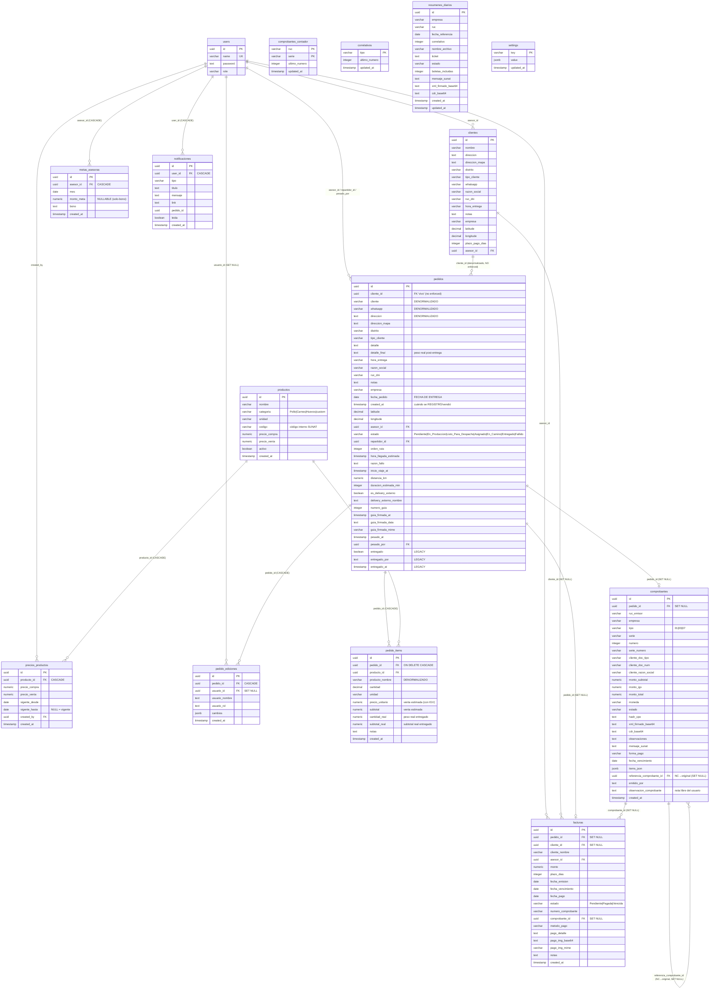

# 02 — Modelo de Datos

> **Última verificación contra código:** 2026-06-02 · **actualizado 2026-06-04** (tabla `rider_locations` migrada a producción — ya no es "pendiente"; ver §8 — y tabla `ia_insights_cache` para el caché persistente de IA — ver §2.16)
> **Archivos clave:** `scripts/migrate-produccion-2026-05-29.sql` (esquema consolidado de producción), `scripts/migrations-fase-ab.sql`, `scripts/migrate-*.sql`, `scripts/seed.mjs`, `scripts/migrate-*.mjs`, `src/lib/types.ts`, `src/lib/data.ts`, `src/lib/sunat/index.ts`, `src/app/api/pedidos/route.ts`, `src/app/api/facturas/route.ts`

> **Fuente de verdad del esquema:** `scripts/migrate-produccion-2026-05-29.sql` consolida el estado de producción al 30 may 2026 (6 tablas base + 8 tablas nuevas + 13 columnas). Encima de esa migración se aplicaron por psql (gotcha #17) varias migraciones aditivas posteriores (`migrate-codigo-producto.sql`, `migrate-comprobante-credito.sql`, `migrate-comprobante-items.sql`, `migrate-comprobante-referencia.sql`, `migrate-comprobante-emisor.sql`, `migrate-pedido-ediciones.sql`, `migrate-meta-bono.sql`, `migrate-cobranza-pago.sql`, `migrate-factura-vinculo.sql`, `migrate-ia-insights-cache.sql`). Este documento refleja todas ellas.

---

## 1. Diagrama de Relaciones



**Conteo de tablas:** **14** en producción (`scripts/migrate-produccion-2026-05-29.sql` lo verifica al final). Las 6 base (`users`, `clientes`, `pedidos`, `pedido_items`, `productos`, `settings`) + 8 nuevas (`comprobantes`, `comprobantes_contador`, `correlativos`, `facturas`, `metas_asesoras`, `notificaciones`, `precios_productos`, `resumenes_diarios`). **`pedido_ediciones`** se agregó *después* de ese conteo (migración aparte, `migrate-pedido-ediciones.sql`) → 15; y **`rider_locations`** se migró a producción el 4 jun 2026 (Mejora 3 — tracking GPS) → 16; y **`ia_insights_cache`** (4 jun 2026, caché persistente de IA — §2.16) → **17 tablas** reales hoy.

> **`rider_locations` YA EXISTE** (desde el 4 jun 2026, migrada a producción por psql — `scripts/migrate-rider-locations.sql` + `…-accuracy.sql`). Guarda la **última posición viva** de cada motorizado (modelo "1 fila por rider", `PRIMARY KEY = repartidor_id`, UPSERT `ON CONFLICT`; **NO** guarda histórico de recorrido). La llena `POST /api/repartidor/ubicacion` (la app nativa o la web de `/mi-ruta`) y la lee `GET /api/despacho` para el marker en vivo. Schema y detalle en §8. El tracking NO usa Pusher (salió con polling).

---

## 2. Schema completo por tabla

### 2.1 `users`

**Origen:** `scripts/seed.mjs:26-33`. Nunca modificada por migraciones posteriores.

```sql
CREATE TABLE users (
    id        UUID DEFAULT uuid_generate_v4() PRIMARY KEY,
    name      VARCHAR(255) NOT NULL UNIQUE,
    password  TEXT NOT NULL,           -- hash bcrypt salt 10
    role      VARCHAR(50) NOT NULL     -- 'admin' | 'asesor' | 'repartidor' | 'produccion'
);
```

**Sin índices explícitos** más allá de los implícitos de PK y UNIQUE.

**Roles:** el seed inicial creó 3 (`admin`, `asesor`, `repartidor`). El 4º rol **`produccion`** (asistente de producción) ya está en producción (desde 30 may 2026) — es solo un valor de `role`, no requirió cambio de esquema. Ver `CLAUDE.md` §6.

**Cómo se popula:**
- Inicial: `scripts/seed.mjs:36-46` inserta 8 usuarios (1 admin, 4 asesoras, 3 repartidores).
- Runtime: `POST /api/users` con bcrypt hash. Solo admin.

**Quién la lee:**
- `auth.ts` (`getUser`) — para login.
- `lib/data.ts:fetchAsesores`, `fetchRepartidores` — para selects de UI.
- `api/users/route.ts` — gestión CRUD.
- Múltiples LEFT JOINs en queries de pedidos/comprobantes/facturas para resolver nombres (`asesor_name`, `repartidor_name`, `emitido_por`, etc.).

**⚠️ Gotcha de datos:** la DB de producción tiene nombres con **espacio al final** (`"Leslie "`, `"Jhoselyn "`) — data legacy. NO usar `WHERE name='Leslie'`; filtrar por `id` o `TRIM(name)`. Ver `CLAUDE.md` gotcha #11.

---

### 2.2 `clientes`

**⚠️ Origen no documentado en migraciones del repo.** La tabla **se usa** en código (`api/clientes/route.ts`) pero **no existe un script que la cree desde cero**. `scripts/run-migration.mjs` (+ `migration_add_asesor_to_clientes.sql`) solo **agrega** `asesor_id` asumiendo que la tabla ya existe; `migrations-fase-ab.sql` y `migrate-produccion-2026-05-29.sql` solo **agregan** `plazo_pago_dias` con `ALTER TABLE ... ADD COLUMN IF NOT EXISTS`.

**Schema reconstruido del código de uso** (`api/clientes/route.ts`) + columnas agregadas:

```sql
CREATE TABLE clientes (
    id              UUID DEFAULT uuid_generate_v4() PRIMARY KEY,
    nombre          VARCHAR(255) NOT NULL,
    razon_social    VARCHAR(255),
    ruc_dni         VARCHAR(50),
    whatsapp        VARCHAR(50),
    direccion       TEXT,
    direccion_mapa  TEXT,
    distrito        VARCHAR(100) DEFAULT 'La Victoria',
    tipo_cliente    VARCHAR(50) DEFAULT 'Frecuente',
    hora_entrega    VARCHAR(100),
    notas           TEXT,
    empresa         VARCHAR(100) DEFAULT 'Transavic',
    latitude        DECIMAL(10, 8),
    longitude       DECIMAL(11, 8),
    plazo_pago_dias INTEGER DEFAULT 0,                            -- agregado fase B (cobranzas)
    asesor_id       UUID REFERENCES users(id) ON DELETE SET NULL,
    created_at      TIMESTAMP WITH TIME ZONE DEFAULT CURRENT_TIMESTAMP
);

CREATE INDEX idx_clientes_asesor_id ON clientes(asesor_id);
```

**Columnas agregadas por migración:**

| Columna | Migración | Para qué |
|---|---|---|
| `asesor_id` | `run-migration.mjs` (+ `migration_add_asesor_to_clientes.sql`) | Scoping por asesora; índice `idx_clientes_asesor_id`. |
| `plazo_pago_dias INTEGER DEFAULT 0` | `migrate-cobranzas.mjs` / `migrations-fase-ab.sql` / `migrate-produccion-2026-05-29.sql:213` | Plazo de crédito por cliente (0 = paga al momento). Define el vencimiento de la cobranza. |

**Cómo se popula:**
- `POST /api/clientes` desde `/dashboard/clientes` (modal de cliente nuevo).
- Desde el form de pedido al crear un cliente nuevo durante un pedido.
- `UPDATE clientes ... SET ruc_dni = ...` al emitir un comprobante a un cliente que no tenía documento válido (completa la ficha con el uso; ver `CLAUDE.md` §"Validaciones de emisión").

**Quién la lee:**
- `GET /api/clientes` — autocomplete (`?q=`) y listado paginado (`?page=&limit=&search=`), con scoping por rol (`asesor_id = userId` si no es admin).
- `GET /api/clientes/[id]/pedidos` — historial de un cliente.
- `GET /api/clientes/[id]/perfil` — perfil 360° (KPIs + tabs de pedidos/comprobantes/cobranzas/top productos).

---

### 2.3 `pedidos`

La tabla central del sistema. Es la **más mutada** — recibió varias migraciones encima del seed inicial.

#### Schema completo final

```sql
CREATE TABLE pedidos (
    -- ─── Identidad ───
    id                       UUID DEFAULT uuid_generate_v4() PRIMARY KEY,
    cliente_id               UUID,                              -- FK no enforced (vínculo "vivo")
    created_at               TIMESTAMP WITH TIME ZONE DEFAULT CURRENT_TIMESTAMP,  -- cuándo se REGISTRÓ/vendió
    fecha_pedido             DATE NOT NULL,                     -- FECHA DE ENTREGA (no de venta)

    -- ─── Datos del cliente (DENORMALIZADOS, copiados al crear pedido) ───
    cliente                  VARCHAR(255) NOT NULL,
    whatsapp                 VARCHAR(50),
    direccion                TEXT,
    direccion_mapa           TEXT,                              -- migrate-direccion-mapa.mjs
    distrito                 VARCHAR(100),
    tipo_cliente             VARCHAR(50),
    razon_social             VARCHAR(255),                      -- migración no documentada
    ruc_dni                  VARCHAR(50),                       -- migración no documentada
    hora_entrega             VARCHAR(100),                      -- "HH:MM AM - HH:MM PM"
    latitude                 DECIMAL(10, 8),
    longitude                DECIMAL(11, 8),
    empresa                  VARCHAR(100) NOT NULL,             -- 'Transavic' | 'Avícola de Tony'

    -- ─── Detalle del pedido ───
    detalle                  TEXT NOT NULL,                     -- texto generado por ProductSelector
    detalle_final            TEXT,                              -- peso REAL registrado post-entrega
    notas                    TEXT,

    -- ─── Asignación de usuarios ───
    asesor_id                UUID REFERENCES users(id),

    -- ─── Estado MODERNO + flujo de despacho (migrate-estados.mjs) ───
    estado                   VARCHAR(20) NOT NULL DEFAULT 'Pendiente',
    repartidor_id            UUID REFERENCES users(id),
    orden_ruta               INTEGER,
    hora_llegada_estimada    TIMESTAMP WITH TIME ZONE,
    razon_fallo              TEXT,                              -- requerido si estado='Fallido' (≥5 chars)
    inicio_viaje_at          TIMESTAMP WITH TIME ZONE,

    -- ─── Métricas de ruta (migrate-despacho-v2.mjs) ───
    distancia_km             NUMERIC(6, 2),                     -- distancia DESDE LA BASE (se congela al asignar)
    duracion_estimada_min    INTEGER,                           -- duración acumulada en ruta optimizada

    -- ─── Delivery externo (migración no documentada) ───
    es_delivery_externo      BOOLEAN DEFAULT FALSE,
    delivery_externo_nombre  TEXT,

    -- ─── Guía de remisión / orden de pedido + foto firmada (Fase A) ───
    numero_guia              INTEGER,                           -- correlativo (UNIQUE WHERE NOT NULL)
    guia_firmada_data        TEXT,                              -- foto de la guía firmada en base64
    guia_firmada_mime        VARCHAR(50),
    guia_firmada_at          TIMESTAMP WITH TIME ZONE,

    -- ─── Pesado real (Fase A) ───
    pesado_por               UUID REFERENCES users(id),         -- quién pesó (producción/repartidor)
    pesado_at                TIMESTAMP WITH TIME ZONE,

    -- ─── LEGACY (pre-migrate-estados.mjs) — sincronizado con 'estado' ───
    entregado                BOOLEAN NOT NULL DEFAULT FALSE,    -- ⚠️ NO usar como source of truth
    entregado_por            TEXT,                              -- nombre del repartidor/admin (no FK)
    entregado_at             TIMESTAMP WITH TIME ZONE
);

-- Índices
CREATE INDEX        idx_pedidos_estado       ON pedidos(estado);                          -- migrate-estados.mjs
CREATE INDEX        idx_pedidos_repartidor   ON pedidos(repartidor_id);                   -- migrate-estados.mjs
CREATE INDEX        idx_pedidos_fecha_estado ON pedidos(fecha_pedido, estado);            -- migrate-estados.mjs
CREATE UNIQUE INDEX idx_pedidos_numero_guia  ON pedidos(numero_guia) WHERE numero_guia IS NOT NULL;  -- fase A
```

#### Migraciones que la modificaron (cronológico)

| # | Migración | Qué agregó/modificó |
|---|---|---|
| 1 | `seed.mjs:58-80` | Creación inicial (sin `estado`, sin `repartidor_id`, sin `distancia_km`, sin guía/pesado). Ya traía `direccion_mapa`, `detalle_final`, `created_at`, `entregado`, `entregado_por`, `entregado_at`. |
| 2 | `migrate-entregado-por.mjs` | + `entregado_por TEXT`, `entregado_at TIMESTAMP WITH TIME ZONE` (idempotente; el seed actual ya las trae). |
| 3 | `migrate-direccion-mapa.mjs` | + `direccion_mapa TEXT`. |
| 4 | `migrate-estados.mjs:31-47` | + `estado`, `repartidor_id`, `orden_ruta`, `hora_llegada_estimada`, `razon_fallo`, `inicio_viaje_at` + **3 índices**. Migra datos: `entregado=TRUE` → `estado='Entregado'`, etc. |
| 5 | `migrate-despacho-v2.mjs` | + `distancia_km`, `duracion_estimada_min`. (También crea `settings`.) |
| 6 | `migrate-correlativos-guias.mjs` / `migrations-fase-ab.sql` / `migrate-produccion-2026-05-29.sql:216-219` | + `numero_guia`, `guia_firmada_data`, `guia_firmada_mime`, `guia_firmada_at` + índice único de `numero_guia`. |
| 7 | `migrate-cantidad-real.mjs` / `migrations-fase-ab.sql` / `migrate-produccion-2026-05-29.sql:220-221` | + `pesado_por`, `pesado_at`. |
| ? | **No documentada** (confirmada por uso) | + `cliente_id`, `razon_social`, `ruc_dni`, `es_delivery_externo`, `delivery_externo_nombre`. Ver `api/pedidos/route.ts:118` y `api/despacho/asignar-externo/route.ts:26-27`. |

**⚠️ Las columnas "no documentadas" sí existen en producción** (el código las lee/escribe), pero no aparecen como `ALTER TABLE` en `/scripts/`. Si reconstruís la DB desde cero, hay que agregarlas a mano.

#### Cómo se popula

- `POST /api/pedidos` — inserta una fila. Columnas insertadas (`api/pedidos/route.ts:118`):
  ```
  cliente, cliente_id, whatsapp, direccion, direccion_mapa, distrito,
  tipo_cliente, detalle, hora_entrega, razon_social, ruc_dni, notas,
  empresa, fecha_pedido, latitude, longitude, asesor_id
  ```
  El resto se llena con defaults (`estado='Pendiente'`, `entregado=FALSE`) o se actualiza después.
- `PATCH /api/pedidos/[id]` — update genérico dinámico desde el body validado. Audita los cambios de campos de datos en `pedido_ediciones` (ver §2.13).
- Transiciones específicas (`api/pedidos/[id]/iniciar-viaje`, `entregar`, `cancelar-viaje`).
- `POST /api/despacho/asignar` — UPDATE de `repartidor_id`, `estado='Asignado'`, `orden_ruta`, `distancia_km`, `duracion_estimada_min`.
- Producción: pesos reales (`pesado_por`, `pesado_at` + `pedido_items.cantidad_real/subtotal_real`) y guía firmada (`guia_firmada_*`).

#### Quién la lee

- `lib/data.ts:fetchFilteredPedidos` — lista paginada para `/dashboard` (scoping por rol).
- `lib/data.ts:fetchMiRuta` — pedidos del día del repartidor.
- `api/despacho/route.ts` — vista del admin.
- `api/repartidor/mi-ruta/route.ts` — vista del repartidor.
- `api/produccion/*` — cola del día (rol `produccion`).
- `api/reportes/ventas`, `api/resumen-diario`, `api/mi-dia`, `api/clientes/[id]/pedidos`, etc.

#### Decisiones de schema explicadas

**A) Denormalización del cliente** — los campos `cliente`, `whatsapp`, `direccion`, `direccion_mapa`, `distrito`, `tipo_cliente`, `razon_social`, `ruc_dni`, `hora_entrega`, `latitude`, `longitude`, `notas`, `empresa` se **copian** del cliente al pedido en el INSERT.

**Motivo:** preservar histórico. Si el cliente cambia de dirección la semana que viene, los pedidos pasados no se reescriben — siguen mostrando dónde se entregó realmente.

**`cliente_id`** es el vínculo "vivo" para queries como "todos los pedidos de este cliente". **No es FK enforced** — es un `UUID` sin `REFERENCES clientes(id)`, así borrar un cliente no rompe sus pedidos históricos. **No está en el tipo `Pedido` de TS** todavía (ver gotcha #4 del CLAUDE.md / §3).

**B) Doble fuente de verdad `estado` vs `entregado`** — coexisten dos columnas con info solapada:
- `entregado BOOLEAN NOT NULL DEFAULT FALSE` — original del seed.
- `estado VARCHAR(20) NOT NULL DEFAULT 'Pendiente'` — agregado por `migrate-estados.mjs`.

`migrate-estados.mjs:52-60` migró los datos (`entregado=TRUE` → `estado='Entregado'`), pero **ambas columnas siguen existiendo**. La lógica de sincronización vive en `api/pedidos/[id]/route.ts` (~líneas 80-114):
- Si se cambia `estado`, se sincroniza `entregado = (estado === 'Entregado')`.
- Si se cambia `entregado` (legacy), se sincroniza `estado`.
- Si `estado='Pendiente'`, se limpian `entregado_por`, `entregado_at`, `razon_fallo`, `repartidor_id`, `orden_ruta`.

**Source of truth canónica: `estado`.** No leer `entregado` en código nuevo. Se mantiene por compatibilidad; eventualmente se eliminarán `entregado`, `entregado_por`, `entregado_at` (gotcha #1 — por ahora NO eliminar).

**C) `distancia_km` se congela, `duracion_estimada_min` se actualiza**:
- `distancia_km` = distancia **desde la base** al cliente. Se calcula UNA VEZ al asignar (`api/despacho/asignar/route.ts`) y no se sobrescribe al optimizar ruta.
- `duracion_estimada_min` = duración acumulada en la ruta. SÍ se actualiza al optimizar (`api/despacho/optimizar-ruta/route.ts`).

**D) `detalle` vs `detalle_final` (+ pesos por ítem)**:
- `detalle TEXT NOT NULL` — generado por `ProductSelector` al crear el pedido (lo que pidió el cliente, texto libre).
- `detalle_final TEXT` — el **peso real** registrado por el repartidor/producción al pesar.
- A nivel de ítem, el peso real se estructura en `pedido_items.cantidad_real` y `subtotal_real` (ver §2.5), y se trackea quién/cuándo pesó con `pedidos.pesado_por` / `pesado_at`.

**E) `created_at` vs `fecha_pedido` (distinción crítica de negocio)**:
- `fecha_pedido` (`DATE`, sin hora) es la **FECHA DE ENTREGA** (así se rotula en `PedidoForm`), NO la fecha de venta.
- `created_at` (`TIMESTAMP WITH TIME ZONE`) es **cuándo la asesora REGISTRÓ/vendió** el pedido.
- ~86% de los pedidos se entregan en fecha posterior a la venta. Las **metas/incentivos** de la asesora miden por `created_at` (ventas); los **reportes de admin/facturación** miden por `fecha_pedido` + `Entregado`. Ver `CLAUDE.md` gotcha #8 y §13.

**F) Estados de producción ya en producción** — el enum `EstadoPedido` (ver §3) incluye `En_Produccion` y `Listo_Para_Despacho`, que van **antes** de `Asignado`. `estado` sigue siendo un `VARCHAR(20)` sin enum SQL (los valores se validan con zod en `/api/pedidos/[id]/route.ts`). La máquina de estados completa está en `04-flujos-de-negocio.md`.

---

### 2.4 `productos`

**Origen:** `scripts/migrate-products.mjs:20-29` + columnas de catálogo agregadas en mayo 2026.

```sql
CREATE TABLE productos (
    id            UUID DEFAULT uuid_generate_v4() PRIMARY KEY,
    nombre        VARCHAR(255) NOT NULL,
    categoria     VARCHAR(50) NOT NULL,         -- 'Pollo' | 'Carnes' | 'Huevos' | custom
    unidad        VARCHAR(50) NOT NULL,         -- 'uni' | 'kg' | 'uni/kg' | 'paquete x N' | etc.
    codigo        VARCHAR(30),                  -- código interno SUNAT (POL001/CAR001/HUE001…)
    precio_compra NUMERIC(10, 2),               -- costo
    precio_venta  NUMERIC(10, 2),               -- precio CON IGV incluido (ver gotcha #10)
    activo        BOOLEAN DEFAULT TRUE,
    created_at    TIMESTAMP WITH TIME ZONE DEFAULT CURRENT_TIMESTAMP
);
```

**Sin índices** explícitos.

**Columnas agregadas por migración:**

| Columna | Migración | Para qué |
|---|---|---|
| `precio_compra`, `precio_venta` | `migrate-precios-productos.mjs` / `migrations-fase-ab.sql:20-21` / `migrate-produccion-2026-05-29.sql:231-232` | Precio de costo y de venta (snapshot del vigente). El histórico vive en `precios_productos`. |
| `codigo VARCHAR(30)` | `migrate-codigo-producto.sql` / `migrate-produccion-2026-05-29.sql:230` | Código interno estable para el `SellersItemIdentification` de SUNAT. Backfill por categoría: `POL001`, `CAR001`, `HUE001`… (prefijo + correlativo de 3 dígitos). Los nuevos productos lo generan en `POST /api/productos`. |

**⚠️ Convención de precios (gotcha #10):** `precio_venta` se almacena **CON IGV incluido** (lo que Antonio cobra). Antes de mandar a SUNAT se divide entre 1.18 para obtener el neto (`api/comprobantes/emitir/route.ts`).

**Cómo se popula:**
- Inicial: `migrate-products.mjs` inserta ~35 productos. El seed de precios 2026 (`seed-precios-2026.mjs` / bloque en `migrations-fase-ab.sql:181-248`) puebla `precio_compra`/`precio_venta` para 39 productos del catálogo cuyo nombre coincide exactamente.
- Runtime: `POST /api/productos` (admin) — genera `codigo`. `PATCH /api/productos` actualiza precios y **preserva histórico** en `precios_productos` (cierra el vigente, inserta el nuevo).

**Quién la lee:** `GET /api/productos` (devuelve `precio_venta`, `precio_compra`, `codigo`); LEFT JOINs en analytics/resumen/reportes para resolver el nombre actual.

**Soft delete:** `DELETE /api/productos/[id]` setea `activo = FALSE` (no borra la fila) — preserva el catálogo histórico que referencian los `pedido_items`.

> Los endpoints `/api/precios*` y los clientes `productos-client.tsx` / `precios-client.tsx` quedaron `@deprecated` tras la unificación en `/dashboard/catalogo`. La fuente de precios hoy es `/api/productos`.

---

### 2.5 `pedido_items`

**Origen:** `scripts/migrate-products.mjs:33-44` + columnas de precios/pesos de la Fase A.

```sql
CREATE TABLE pedido_items (
    id                UUID DEFAULT uuid_generate_v4() PRIMARY KEY,
    pedido_id         UUID REFERENCES pedidos(id) ON DELETE CASCADE,
    producto_id       UUID REFERENCES productos(id),
    producto_nombre   VARCHAR(255) NOT NULL,        -- DENORMALIZADO (snapshot)
    cantidad          DECIMAL(10, 2) NOT NULL,
    unidad            VARCHAR(50) NOT NULL,         -- snapshot también
    precio_unitario   NUMERIC(10, 2),               -- venta estimada al crear (CON IGV)
    subtotal          NUMERIC(10, 2),               -- venta estimada (cantidad × precio_unitario)
    cantidad_real     NUMERIC(10, 2),               -- peso REAL entregado (lo registra producción/repartidor)
    subtotal_real     NUMERIC(10, 2),               -- subtotal REAL entregado
    notas             TEXT,
    created_at        TIMESTAMP WITH TIME ZONE DEFAULT CURRENT_TIMESTAMP
);
```

**Columnas agregadas por migración** (`migrate-precios-productos.mjs`, `migrate-cantidad-real.mjs`, consolidadas en `migrations-fase-ab.sql:38-46` y `migrate-produccion-2026-05-29.sql:224-227`):
- `precio_unitario`, `subtotal` — el precio/subtotal **estimado** al momento de vender.
- `cantidad_real`, `subtotal_real` — el peso/subtotal **real** al entregar (los pedidos avícolas se venden al peso, que difiere del estimado).

**Cascade delete:** si se elimina el pedido, sus ítems se borran (`ON DELETE CASCADE`).

**Denormalización:** `producto_nombre` y `unidad` son snapshots al momento del INSERT. En analytics/resumen se usa `COALESCE(prod.nombre, pi.producto_nombre)` para preferir el nombre actual del catálogo y caer al snapshot si el producto fue eliminado.

**Medición de ventas (incentivos):** usan `pi.subtotal` (estimado al vender), NO `subtotal_real`. Ver `CLAUDE.md` §13.

---

### 2.6 `precios_productos`

**Origen:** `scripts/migrate-precios-productos.mjs` / `migrations-fase-ab.sql:23-36` / `migrate-produccion-2026-05-29.sql:121-131`. Histórico de precios con vigencia.

```sql
CREATE TABLE precios_productos (
    id            UUID DEFAULT uuid_generate_v4() PRIMARY KEY,
    producto_id   UUID REFERENCES productos(id) ON DELETE CASCADE,
    precio_compra NUMERIC(10, 2),
    precio_venta  NUMERIC(10, 2) NOT NULL,
    vigente_desde DATE NOT NULL DEFAULT (NOW() AT TIME ZONE 'America/Lima')::date,
    vigente_hasta DATE,                              -- NULL = registro vigente
    created_at    TIMESTAMP WITH TIME ZONE DEFAULT CURRENT_TIMESTAMP,
    created_by    UUID REFERENCES users(id)
);

CREATE INDEX idx_precios_vigentes
  ON precios_productos(producto_id, vigente_desde DESC)
  WHERE vigente_hasta IS NULL;
```

**Patrón de auditoría:** al cambiar el precio de venta (vía `PATCH /api/productos` o el legacy `/api/precios/[id]`), se cierra el registro vigente (`SET vigente_hasta = hoy`) y se inserta uno nuevo con `vigente_hasta = NULL`. El índice parcial acelera "el precio vigente de este producto".

---

### 2.7 `comprobantes`

**Origen:** `scripts/migrate-comprobantes.mjs` / `migrations-fase-ab.sql:146-170` / `migrate-produccion-2026-05-29.sql:35-62` + migraciones aditivas posteriores. Es la tabla de comprobantes electrónicos SUNAT (factura `01`, boleta `03`, nota de crédito `07`).

```sql
CREATE TABLE comprobantes (
    id                        UUID DEFAULT uuid_generate_v4() PRIMARY KEY,
    pedido_id                 UUID REFERENCES pedidos(id) ON DELETE SET NULL,  -- NULL = standalone
    ruc_emisor                VARCHAR(11) NOT NULL,
    empresa                   VARCHAR(50) NOT NULL,             -- 'transavic' | 'avicola'
    tipo                      VARCHAR(20) NOT NULL,             -- '01' factura | '03' boleta | '07' NC
    serie                     VARCHAR(10) NOT NULL,             -- F001/B001/FC01/BC01…
    numero                    INTEGER NOT NULL,
    serie_numero              VARCHAR(50) NOT NULL,             -- 'F001-23'
    cliente_doc_tipo          VARCHAR(2),                       -- '0'|'1' DNI |'6' RUC
    cliente_doc_num           VARCHAR(20),
    cliente_razon_social      VARCHAR(255),
    monto_subtotal            NUMERIC(12, 2),                   -- neto (sin IGV)
    monto_igv                 NUMERIC(12, 2),
    monto_total               NUMERIC(12, 2),
    moneda                    VARCHAR(3) DEFAULT 'PEN',
    estado                    VARCHAR(50) NOT NULL,             -- pendiente|aceptado|observado|rechazado|error|anulado
    hash_cpe                  TEXT,                             -- digest del CPE
    xml_firmado_base64        TEXT,                             -- ⚠️ documento legal (fuente para PDF/correo)
    cdr_base64                TEXT,                             -- ZIP crudo del CDR de SUNAT
    observaciones             TEXT,
    mensaje_sunat             TEXT,                             -- motivo de rechazo/observación
    forma_pago                VARCHAR(10),                      -- 'Contado' | 'Credito'
    fecha_vencimiento         DATE,                             -- si es crédito
    items_json                JSONB,                            -- líneas emitidas (red de seguridad para reintento)
    referencia_comprobante_id UUID REFERENCES comprobantes(id) ON DELETE SET NULL,  -- NC → comprobante original
    emitido_por               TEXT,                             -- nombre de quien emitió (atribución)
    observacion_comprobante   TEXT,                             -- nota libre impresa y emitida en XML
    created_at                TIMESTAMP WITH TIME ZONE DEFAULT NOW(),
    UNIQUE (ruc_emisor, serie, numero)
);

CREATE INDEX idx_comp_pedido     ON comprobantes(pedido_id);
CREATE INDEX idx_comp_estado     ON comprobantes(estado);
CREATE INDEX idx_comp_referencia ON comprobantes(referencia_comprobante_id);
```

**Columnas agregadas DESPUÉS del esquema base** (todas aditivas, idempotentes, aplicadas por psql — gotcha #17):

| Columna(s) | Migración | Para qué |
|---|---|---|
| `forma_pago`, `fecha_vencimiento` | `migrate-comprobante-credito.sql` | El PDF arma la sección "INFORMACIÓN DEL CRÉDITO". Antes la forma de pago solo viajaba en el XML, no se persistía. |
| `items_json` (JSONB) | `migrate-comprobante-items.sql` | Guarda las líneas emitidas (descripción, unidad, cantidad, precio, código, afectación IGV) para que el reintento de un comprobante standalone reconstruya el XML con los ítems reales, no una línea genérica. `index.ts` lo persiste en cada emisión. |
| `referencia_comprobante_id` | `migrate-comprobante-referencia.sql` | Vincula explícitamente una NC (07) con la factura/boleta que acredita → la UI muestra "↩ anula F001-X" y bloquea una 2ª NC. |
| `emitido_por` (TEXT) | `migrate-comprobante-emisor.sql` | Atribución (quién emitió) **y visibilidad por asesora**: cada asesora ve los comprobantes de sus pedidos (`pedidos.asesor_id`) **o** los que ella emitió (`emitido_por`, match TRIM+lower). Denormalizado, mismo patrón que `pedidos.entregado_por`. Backfill best-effort desde la asesora dueña del pedido; sueltos viejos quedan NULL (solo los ve el admin). |
| `observacion_comprobante` (TEXT) | `migrate-observacion-comprobante.sql` | Observación libre escrita por el usuario. **No confundir con `observaciones`**, que guarda observaciones del CDR/SUNAT y logs internos. En factura/boleta se emite como un segundo `cbc:Note` libre, sin `languageLocaleID`, porque SUNAT Beta rechazó `languageLocaleID="2012"` con 3027. |

**Persistencia:** `src/lib/sunat/index.ts` hace 3 INSERTs (pendiente/éxito/error) que ya incluyen `forma_pago, fecha_vencimiento, items_json, referencia_comprobante_id, emitido_por, observacion_comprobante`. El **reintento** hace UPDATE (no reinserta) → preserva `emitido_por` y reenvía el XML firmado original si existe.

**⚠️ El PDF y el correo leen las líneas del `xml_firmado_base64`, NO de la DB** (`src/lib/sunat/parse-cpe-items.ts`). Las facturas/boletas standalone (sin pedido) NO guardan sus líneas en `pedido_items` — solo en el XML firmado (y, como respaldo, en `items_json`). Ver `CLAUDE.md` gotcha #18. **El XML firmado nunca se modifica** (es el documento legal aceptado por SUNAT). **El CDR (`cdr_base64`) se sirve como ZIP crudo de SUNAT**, no se intenta extraer el XML.

**Visibilidad (scoping por asesora):** `GET /api/comprobantes` SÍ scopea por rol — cada asesora ve **solo los suyos** (de sus pedidos vía `pedidos.asesor_id` **o** los que ella emitió vía `emitido_por`, match TRIM+lower); el admin ve todos. Helper `lib/comprobante-scope.ts:asesoraPuedeVerComprobante`, aplicado en `GET /api/comprobantes` y en los endpoints por id. _(La "visibilidad total" se probó por unas horas el 2 jun 2026 y se **revirtió** el mismo día por decisión de Antonio — CLAUDE.md §13.)_

---

### 2.8 `comprobantes_contador`

**Origen:** `scripts/migrate-comprobantes.mjs:22-29` / `migrations-fase-ab.sql:138-144` / `migrate-produccion-2026-05-29.sql:64-70`. Correlativo atómico por emisor + serie.

```sql
CREATE TABLE comprobantes_contador (
    ruc           VARCHAR(11) NOT NULL,
    serie         VARCHAR(10) NOT NULL,
    ultimo_numero INTEGER NOT NULL DEFAULT 0,
    updated_at    TIMESTAMP WITH TIME ZONE DEFAULT NOW(),
    PRIMARY KEY (ruc, serie)
);
```

**Patrón:** `UPDATE … SET ultimo_numero = ultimo_numero + 1 RETURNING ultimo_numero` (atómico) — `src/lib/sunat/contador.ts`. Una serie por (RUC, tipo): `F001`/`B001` para Transavic, `F002`/`B002` para Avícola de Tony; las NC usan serie propia (`FC01`/`BC01`); y desde el 10 jun 2026 (gotcha #29) las **guías de remisión legales** usan **`T001`** (Transavic) / **`T002`** (Avícola) acá mismo (antes compartían el correlativo `correlativos.guia_remision` con la orden interna). Nunca se reusa un número ya aceptado. `migrations-fase-ab.sql:256-261` siembra las 4 filas F/B iniciales; `migrate-guias-numeracion-2026-06-10.sql` siembra T001/T002.

---

### 2.9 `correlativos`

**Origen:** `scripts/migrate-correlativos-guias.mjs:23-27` / `migrations-fase-ab.sql:55-62` / `migrate-produccion-2026-05-29.sql:72-77`. Correlativo genérico key/value para documentos internos.

```sql
CREATE TABLE correlativos (
    tipo          VARCHAR(50) PRIMARY KEY,        -- ej. 'orden_pedido'
    ultimo_numero INTEGER NOT NULL DEFAULT 0,
    updated_at    TIMESTAMP WITH TIME ZONE DEFAULT NOW()
);
```

**Tipos (desde 10 jun 2026, gotcha #29):**
- **`orden_pedido`** — correlativo de la **"orden de pedido" interna** (`/pedidos/[id]/guia`, NO fiscal). Es el tipo ACTIVO.
- **`guia_remision`** — DEPRECATED / **congelado**. Era el correlativo compartido entre la orden interna y la guía legal; se separó porque abrir una orden gastaba un número de la numeración LEGAL de las guías. Ya nada lo consume.

`src/lib/correlativos.ts:siguienteCorrelativo` usa **UPSERT** (`INSERT … ON CONFLICT (tipo) DO UPDATE SET ultimo_numero = correlativos.ultimo_numero + 1`) → nunca falla aunque la fila no esté sembrada (fix del crash en producción, gotcha #20).

> **La GRE legal (T001/T002) NO usa esta tabla.** Reserva su número en `comprobantes_contador` (contador POR SERIE, igual que boletas/facturas) vía un CTE atómico en `api/guias/emitir/route.ts`. Ver gotcha #29 y `docs/arquitectura/06-guias-remision-rest.md`.

---

### 2.10 `facturas` (cobranzas)

**Origen:** `scripts/migrate-cobranzas.mjs:26-43` / `migrations-fase-ab.sql:112-127` / `migrate-produccion-2026-05-29.sql:79-96` + 2 migraciones aditivas. A pesar del nombre, modela las **cobranzas / cuentas por cobrar** (deuda con plazo), no los comprobantes SUNAT (eso es `comprobantes`).

```sql
CREATE TABLE facturas (
    id                 UUID DEFAULT uuid_generate_v4() PRIMARY KEY,
    pedido_id          UUID REFERENCES pedidos(id) ON DELETE SET NULL,   -- NULLABLE (cobranza standalone)
    cliente_id         UUID REFERENCES clientes(id) ON DELETE SET NULL,  -- agregado migrate-factura-vinculo
    cliente_nombre     VARCHAR(255) NOT NULL,
    asesor_id          UUID REFERENCES users(id),
    monto              NUMERIC(12, 2) NOT NULL,
    plazo_dias         INTEGER NOT NULL DEFAULT 0,
    fecha_emision      DATE NOT NULL DEFAULT (NOW() AT TIME ZONE 'America/Lima')::date,
    fecha_vencimiento  DATE NOT NULL,
    fecha_pago         DATE,                                             -- NULL = no pagada
    estado             VARCHAR(20) NOT NULL DEFAULT 'Pendiente',         -- Pendiente|Pagada|Vencida
    numero_comprobante VARCHAR(50),
    comprobante_id     UUID REFERENCES comprobantes(id) ON DELETE SET NULL,  -- agregado migrate-factura-vinculo
    metodo_pago        VARCHAR(20),                                      -- agregado migrate-cobranza-pago
    pago_detalle       TEXT,                                             -- agregado migrate-cobranza-pago
    pago_img_base64    TEXT,                                             -- agregado migrate-cobranza-pago
    pago_img_mime      VARCHAR(50),                                      -- agregado migrate-cobranza-pago
    notas              TEXT,
    created_at         TIMESTAMP WITH TIME ZONE DEFAULT NOW()
);

CREATE INDEX idx_facturas_vencimiento    ON facturas(fecha_vencimiento) WHERE fecha_pago IS NULL;
CREATE INDEX idx_facturas_asesor         ON facturas(asesor_id, estado);
CREATE INDEX idx_facturas_cliente        ON facturas(cliente_id);
CREATE INDEX idx_facturas_cliente_id     ON facturas(cliente_id);        -- duplicado (migrate-factura-vinculo)
CREATE INDEX idx_facturas_comprobante_id ON facturas(comprobante_id);
```

**Columnas agregadas DESPUÉS del esquema base:**

| Columna(s) | Migración | Para qué |
|---|---|---|
| `cliente_id`, `comprobante_id` | `migrate-factura-vinculo.sql` | Vincula la cobranza manual a un cliente del catálogo y/o a un comprobante ya emitido (autocomplete + selector de facturas). Ambas `NULL`-ables, `SET NULL` al borrar el referenciado. |
| `metodo_pago`, `pago_detalle`, `pago_img_base64`, `pago_img_mime` | `migrate-cobranza-pago.sql` | Método de pago (`efectivo`/`transferencia`/`yape`/`plin`/`otro`), nota libre y **captura del comprobante de pago** comprimida (~50-90KB webp) en base64 (sin storage externo, $0). El endpoint limita el tamaño. |

**Lazo cerrado del dinero:** una factura SUNAT (tipo `01`) Contado o Crédito crea una cobranza automáticamente (`lib/cobranzas.ts:crearFacturaStandalone`), salvo opt-out "ya cobrado". Las boletas NO crean cobranza. Pago en 1 clic con undo de 5s (`/api/facturas/[id]/pago`); el DELETE revierte el pago. Cron diario `/api/cron/facturas-vencidas` marca vencidas.

---

### 2.11 `metas_asesoras`

**Origen:** `scripts/migrate-metas.mjs:22-31` / `migrations-fase-ab.sql:76-83` / `migrate-produccion-2026-05-29.sql:98-106` + `migrate-meta-bono.sql`. Overrides manuales de la meta mensual por asesora + bono personalizado.

```sql
CREATE TABLE metas_asesoras (
    id         UUID DEFAULT uuid_generate_v4() PRIMARY KEY,
    asesor_id  UUID REFERENCES users(id) ON DELETE CASCADE,
    mes        DATE NOT NULL,                  -- primer día del mes, 'YYYY-MM-01'
    monto_meta NUMERIC(12, 2),                 -- ⚠️ NULLABLE (ver abajo)
    bono       TEXT,                           -- premio en texto libre al cumplir la meta
    created_at TIMESTAMP WITH TIME ZONE DEFAULT NOW(),
    UNIQUE (asesor_id, mes)
);

CREATE INDEX idx_metas_asesor_mes ON metas_asesoras(asesor_id, mes);
```

**Cambios de `migrate-meta-bono.sql`:**
- `+ bono TEXT` — premio configurable por asesora/mes. La asesora lo ve en "Mis Metas" (banner ámbar → verde al cumplir).
- `monto_meta` pasó a **NULLABLE** (`ALTER COLUMN monto_meta DROP NOT NULL`): permite una fila con **solo bono** sin override de meta. El código (`lib/metas.ts:calcularMetaDiaria`) trata `monto_meta IS NULL` como "sin override" → usa la **meta automática** (mes anterior × factor de crecimiento configurable).

**Nota:** la **configuración global de incentivos** (meta de equipo, ranking, racha, toggles) NO vive aquí — vive en `settings.incentivos_config` (JSONB). Esta tabla es solo el override individual mensual.

---

### 2.12 `notificaciones`

**Origen:** `scripts/migrate-notificaciones.mjs:22-32` / `migrations-fase-ab.sql:91-101` / `migrate-produccion-2026-05-29.sql:108-119`. Notificaciones in-app (campanita 🔔, polling 30s).

```sql
CREATE TABLE notificaciones (
    id         UUID DEFAULT uuid_generate_v4() PRIMARY KEY,
    user_id    UUID REFERENCES users(id) ON DELETE CASCADE,
    tipo       VARCHAR(50) NOT NULL,           -- pedido_asignado | pedido_entregado | comprobante_rechazado | …
    titulo     TEXT NOT NULL,
    mensaje    TEXT NOT NULL,
    link       TEXT,
    pedido_id  UUID,                           -- NO enforced (denormalizado, opcional)
    leida      BOOLEAN NOT NULL DEFAULT FALSE,
    created_at TIMESTAMP WITH TIME ZONE DEFAULT NOW()
);

CREATE INDEX idx_notif_user_unread ON notificaciones(user_id, leida, created_at DESC);
```

**Tipos** (`src/lib/notificaciones.ts:TipoNotificacion`, que `NotificationBell.tsx` importa con `import type` para no desfasarse): `pedido_asignado`, `pedido_en_camino`, `pedido_entregado`, `pedido_fallido`, `guia_firmada`, `listo_para_despacho`, `meta_diaria_alcanzada`, `comprobante_rechazado`, `comprobante_error`, entre otros. El `pedido_id` es opcional y no es FK.

**Limpieza:** el cron `daily-digest-admin` purga las **leídas** de más de 30 días (`limpiarNotificacionesAntiguas(30)`); las no leídas se respetan siempre. Se enganchó a ese cron por el límite de crons de Vercel.

---

### 2.13 `pedido_ediciones`

**Origen:** `scripts/migrate-pedido-ediciones.sql:13-21` (migración aparte, posterior al consolidado de producción). Auditoría de correcciones de datos de un pedido.

```sql
CREATE TABLE pedido_ediciones (
    id             UUID PRIMARY KEY DEFAULT uuid_generate_v4(),
    pedido_id      UUID NOT NULL REFERENCES pedidos(id) ON DELETE CASCADE,
    usuario_id     UUID REFERENCES users(id) ON DELETE SET NULL,
    usuario_nombre TEXT NOT NULL,                  -- denormalizado (sobrevive al borrar el user)
    usuario_rol    TEXT,
    cambios        JSONB NOT NULL DEFAULT '[]'::jsonb,  -- [{ campo, etiqueta, antes, despues }]
    created_at     TIMESTAMP WITH TIME ZONE NOT NULL DEFAULT NOW()
);

CREATE INDEX idx_pedido_ediciones_pedido ON pedido_ediciones(pedido_id, created_at DESC);
```

**Qué audita:** solo campos de **datos** del pedido (`src/lib/pedido-historial.ts:CAMPOS_AUDITABLES`: cliente, dirección, detalle, fecha, etc.), NO el ruido del ciclo de vida (estado, repartidor, ruta, banderas legacy). El `PATCH /api/pedidos/[id]` inserta la fila de forma **no-bloqueante** (si falla, la edición igual queda aplicada). El admin lo consulta con `GET /api/pedidos/[id]/ediciones` (solo admin) → modal "Ver historial".

---

### 2.14 `resumenes_diarios`

**Origen:** `scripts/migrate-resumenes-diarios.{mjs,sql}` / `migrate-produccion-2026-05-29.sql:133-149`. Idempotencia del Resumen Diario de boletas (RC-) que SUNAT exige.

```sql
CREATE TABLE resumenes_diarios (
    id                 UUID DEFAULT uuid_generate_v4() PRIMARY KEY,
    empresa            VARCHAR(50) NOT NULL,
    ruc                VARCHAR(11) NOT NULL,
    fecha_referencia   DATE NOT NULL,                 -- el día de las boletas resumidas
    correlativo        INTEGER,
    nombre_archivo     VARCHAR(120),
    ticket             TEXT,                           -- ticket SUNAT para consultar el estado
    estado             VARCHAR(20) NOT NULL DEFAULT 'enviando',  -- enviando|enviado|aceptado|…
    boletas_incluidas  INTEGER DEFAULT 0,
    mensaje_sunat      TEXT,
    xml_firmado_base64 TEXT,
    cdr_base64         TEXT,
    created_at         TIMESTAMP WITH TIME ZONE DEFAULT NOW(),
    updated_at         TIMESTAMP WITH TIME ZONE DEFAULT NOW()
);

CREATE INDEX idx_resumen_ruc_fecha ON resumenes_diarios(ruc, fecha_referencia);
CREATE INDEX idx_resumen_ticket    ON resumenes_diarios(ticket);
```

**Idempotencia:** el helper `src/lib/sunat/resumen-diario.ts` (usado por el cron `/api/cron/resumen-diario-sunat` y por el endpoint manual) NO reenvía un RC si ya hay uno `enviado`/`aceptado`/`enviando`-reciente del mismo día. `forzar:true` permite resúmenes complementarios.

---

### 2.15 `settings`

**Origen:** `scripts/migrate-despacho-v2.mjs`. Tabla key/value JSONB extensible.

```sql
CREATE TABLE settings (
    key         VARCHAR(100) PRIMARY KEY,
    value       JSONB NOT NULL,
    updated_at  TIMESTAMP WITH TIME ZONE DEFAULT NOW()
);

INSERT INTO settings (key, value) VALUES
    ('base_location', '{"lat": -12.0464, "lng": -77.0428, "address": "Centro de Lima", "name": "Local Principal"}'::jsonb)
ON CONFLICT (key) DO NOTHING;
```

**Claves actuales:**

| `key` | Estructura del `value` | Quién lo usa |
|---|---|---|
| `base_location` | `{ lat, lng, address, name }` | Origen del almacén para Google Directions/optimización de ruta y mapas (`api/despacho/*`, `api/repartidor/mi-ruta`). Escribe `POST /api/settings` (admin). |
| `incentivos_config` | `{ metaEquipoSemanal, rankingMensual, rachaSemanal, metasIndividuales }` (ver `CLAUDE.md` §13) | Config global del sistema de incentivos. Helpers `getIncentivosConfig()`/`saveIncentivosConfig()` en `src/lib/incentivos.ts`. `lib/metas.ts` lee de aquí el `factorCrecimientoPct`. |

**Fallback de `base_location`** (si no hay row): env vars `BASE_LATITUDE`/`BASE_LONGITUDE`, y como último recurso `-12.0464, -77.0428` (Centro de Lima).

**Patrón UPSERT:** `INSERT … ON CONFLICT (key) DO UPDATE SET value = …::jsonb, updated_at = NOW()`.

---

### 2.16 `ia_insights_cache`

**Origen:** `scripts/migrate-ia-insights-cache.sql` (4 jun 2026). Caché PERSISTENTE de los insights del Asistente IA — reemplaza el viejo `new Map()` in-memory que no sobrevivía a los cold starts de Vercel y disparaba el 429 de Gemini (gotcha #16).

```sql
CREATE TABLE ia_insights_cache (
    cache_key   VARCHAR(120) PRIMARY KEY,   -- 'admin-{tipo}' / 'asesor-{uuid}-{tipo}'
    value       JSONB NOT NULL,             -- el insight serializado
    expires_at  TIMESTAMP WITH TIME ZONE NOT NULL,  -- NOW() + 1h
    updated_at  TIMESTAMP WITH TIME ZONE DEFAULT NOW()
);
CREATE INDEX idx_ia_insights_cache_expires ON ia_insights_cache (expires_at);
```

- **Una fila por (scope, tipo)**, upsert por `cache_key` (mismas claves que el caché anterior). TTL 1h vía `expires_at`. Lo manejan `cached()`/`clearInsightsCacheFor()` en `src/lib/insights.ts`.
- **Sin cron de purga**: las claves son acotadas (4 admin + 4 × Nº asesoras) y se upsertean, así que la tabla no crece (~24 filas). `expires_at` solo controla la frescura.
- **No guarda datos sensibles sin anonimizar** del lado del prompt — guarda el insight ya generado (texto + datos agregados que la UI muestra).

---

## 3. Tipos TypeScript (`src/lib/types.ts`)

`src/lib/types.ts` solo define los tipos del núcleo (`EstadoPedido`, `Pedido`, `User`, `Producto`, `PedidoItem`, `PedidoRuta`). Las tablas nuevas (comprobantes, facturas, metas, etc.) NO tienen tipo en este archivo — se tipan localmente en cada endpoint/módulo (p. ej. `OpcionesEmision` en el módulo SUNAT, tipos inline en `api/facturas/route.ts`).

### 3.1 `EstadoPedido`

```typescript
export type EstadoPedido =
  | 'Pendiente'
  | 'En_Produccion'
  | 'Listo_Para_Despacho'
  | 'Asignado'
  | 'En_Camino'
  | 'Entregado'
  | 'Fallido';
```

Coincide con los valores válidos de `pedidos.estado`. **Incluye `En_Produccion` y `Listo_Para_Despacho`** (van antes de `Asignado`). **No hay enum en SQL** — `estado` es `VARCHAR(20)` validado con zod.

### 3.2 `Producto`

```typescript
export type Producto = {
  id: string;
  nombre: string;
  categoria: 'Pollo' | 'Carnes' | 'Huevos' | string;   // permite categorías custom
  unidad: string;
  activo: boolean;
  codigo?: string | null;                               // código interno SUNAT
  precio_venta?: number | string | null;               // CON IGV
  precio_compra?: number | string | null;
};
```

Se extendió con `codigo`, `precio_venta`, `precio_compra` (opcionales). `precio_venta`/`precio_compra` pueden venir como `string` (el driver de Neon devuelve `NUMERIC` como string).

### 3.3 `Pedido`

```typescript
export type Pedido = {
  id: string;
  cliente: string;
  whatsapp: string | null;
  direccion: string | null;
  distrito: string | null;
  tipo_cliente: string | null;
  detalle: string;
  hora_entrega: string | null;
  razon_social: string | null;
  ruc_dni: string | null;
  notas: string | null;
  empresa: string;
  fecha_pedido: string;              // formateado en data.ts; otros endpoints usan otro formato
  detalle_final: string | null;
  created_at: Date;
  latitude: number | null;
  longitude: number | null;
  estado: EstadoPedido;
  repartidor_id: string | null;
  repartidor_name: string | null;    // JOIN, no columna
  orden_ruta: number | null;
  hora_llegada_estimada: string | null;
  razon_fallo: string | null;
  inicio_viaje_at: string | null;
  distancia_km: number | null;
  duracion_estimada_min: number | null;
  es_delivery_externo: boolean;
  delivery_externo_nombre: string | null;
  entregado: boolean;
  entregado_por: string | null;
  entregado_at: string | null;
  asesor_id: string | null;
  asesor_name: string | null;        // JOIN, no columna
};
```

#### Gotchas del tipo `Pedido` (campos de DB que el tipo NO refleja)

| Campo en DB | Status en el tipo TS |
|---|---|
| `cliente_id` | **Existe en DB y se inserta**, pero **NO está en el tipo**. Si lo agregás, actualizá también `fetchFilteredPedidos` para seleccionarlo. (gotcha #4) |
| `direccion_mapa` | **Existe en DB y se inserta**, pero **NO está en el tipo**. |
| `numero_guia`, `guia_firmada_data/mime/at` | **Existen en DB** (Fase A), **NO están en el tipo `Pedido`** — se leen en endpoints específicos de guía. |
| `pesado_por`, `pesado_at` | **Existen en DB** (Fase A), **NO están en el tipo `Pedido`** — se leen en el flujo de producción. |
| `created_at` | Tipo TS es `Date`; la columna es `TIMESTAMP WITH TIME ZONE`. `lib/data.ts` hace `new Date(...)`. |
| `fecha_pedido` | Tipo TS es `string`. En `data.ts` viene como `DD/MM/YYYY` (TO_CHAR); otros endpoints (reportes/resumen) lo devuelven `YYYY-MM-DD`. Cuidar al consumir. |
| `latitude`, `longitude` | El driver devuelve `DECIMAL` como string; `lib/data.ts` hace `parseFloat()`. |
| `repartidor_name`, `asesor_name` | No son columnas — vienen de LEFT JOIN con `users`. Si la query no incluye los JOINs, vienen `null`. |

### 3.4 `User` / `PedidoItem` / `PedidoRuta`

- **`User`** = `{ id, name, role }` — omite `password` (correcto). `role` es `string` (4 valores válidos: admin/asesor/repartidor/produccion).
- **`PedidoItem`** = `{ id, pedido_id, producto_id, producto_nombre, cantidad, unidad, notas }` — **NO refleja** `precio_unitario`, `subtotal`, `cantidad_real`, `subtotal_real` ni `created_at`, que sí existen en la tabla. Se leen como campos extra donde hacen falta (reportes, pesos).
- **`PedidoRuta`** = subconjunto de `Pedido` para `/dashboard/mi-ruta` (sin `asesor_id`, `entregado*`, etc.).

### 3.5 Mapping tabla ↔ tipo TS

| Tabla SQL | Tipo TS | Notas |
|---|---|---|
| `users` | `User` | Omite `password`. |
| `productos` | `Producto` | Incluye `codigo`/`precio_venta`/`precio_compra` opcionales; omite `created_at`. |
| `pedido_items` | `PedidoItem` | NO refleja precios/pesos reales ni `created_at`. |
| `pedidos` | `Pedido` | Tiene gotchas (faltan `cliente_id`, `direccion_mapa`, guía y pesado). |
| `pedidos` (subconjunto) | `PedidoRuta` | Para vista del repartidor. |
| `clientes`, `settings`, `comprobantes`, `facturas`, `metas_asesoras`, `notificaciones`, `precios_productos`, `resumenes_diarios`, `comprobantes_contador`, `correlativos`, `pedido_ediciones`, `rider_locations`, `ia_insights_cache` | **Sin tipo central** | Se tipan inline en cada endpoint/módulo. `notificaciones` sí tiene `TipoNotificacion` en `lib/notificaciones.ts`. |

---

## 4. Convenciones SQL

### 4.1 Naming

| Elemento | Convención | Ejemplo |
|---|---|---|
| Tablas | `snake_case`, plural | `pedidos`, `pedido_items`, `comprobantes` |
| Columnas | `snake_case` | `asesor_id`, `repartidor_id`, `referencia_comprobante_id` |
| Valores de `estado` (pedido) | `PascalCase`, underscore en multi-palabra | `'Pendiente'`, `'En_Produccion'`, `'Listo_Para_Despacho'`, `'En_Camino'` |
| Valores de `estado` (comprobante/factura) | minúscula / PascalCase según tabla | `'aceptado'`/`'rechazado'` (comprobantes), `'Pendiente'`/`'Pagada'`/`'Vencida'` (facturas) |
| Valores de `categoria` | `PascalCase` simple | `'Pollo'`, `'Carnes'`, `'Huevos'` |
| Índices | `idx_<tabla>_<columna>` | `idx_pedidos_estado`, `idx_comp_referencia` |
| PKs | `id UUID` (o PK compuesta) | `uuid_generate_v4()`; `comprobantes_contador` usa `(ruc, serie)` |

### 4.2 UUID

**Extensión:** `uuid-ossp` (`CREATE EXTENSION IF NOT EXISTS "uuid-ossp";`). **Función:** `uuid_generate_v4()`. No usar `gen_random_uuid()` por consistencia.

### 4.3 Timezone

Lima es **UTC-5** sin DST. Para "hoy/esta semana/este mes" se usa explícitamente:

```sql
(NOW() AT TIME ZONE 'America/Lima')::date
```

Aparece en `lib/data.ts:fetchMiRuta`, `api/despacho/*`, reportes/metas/incentivos, defaults de columnas (`facturas.fecha_emision`, `precios_productos.vigente_desde`), etc. Derivados: `date_trunc('week'|'month', (NOW() AT TIME ZONE 'America/Lima')::date)`.

`fecha_pedido`/`mes`/`fecha_emision`/`fecha_vencimiento`/`vigente_*` son `DATE` (sin hora). Los timestamps de evento (`created_at`, `entregado_at`, `inicio_viaje_at`, `pesado_at`, `guia_firmada_at`, etc.) son `TIMESTAMP WITH TIME ZONE` (UTC).

### 4.4 Tipos decimales

| Concepto | Tipo | Notas |
|---|---|---|
| Latitud | `DECIMAL(10, 8)` | ±99.99999999°. |
| Longitud | `DECIMAL(11, 8)` | Un dígito más para el oeste americano. |
| Distancia (km) | `NUMERIC(6, 2)` | Hasta 9999.99 km. |
| Cantidad de producto | `DECIMAL(10, 2)` | Fracciones de 2 decimales. |
| Precios de producto / ítem | `NUMERIC(10, 2)` | `productos.precio_*`, `pedido_items.precio_unitario/subtotal/…`, `precios_productos.*`. |
| Montos de comprobante / cobranza | `NUMERIC(12, 2)` | `comprobantes.monto_*`, `facturas.monto`, `metas_asesoras.monto_meta`. |
| Duración | `INTEGER` (minutos) | Sin decimales. |

> ⚠️ El driver de Neon devuelve `NUMERIC/DECIMAL` como **string**. Hacer `parseFloat()`/`Number()` al consumir (el tipo `Producto` ya admite `number | string`).

### 4.5 Drivers y patrones de query

**Driver:** `@neondatabase/serverless` — cliente HTTP (no es un pool). Reinstanciar por request (`const sql = neon(process.env.DATABASE_URL!)`). **Sin ORM, sin RLS** (Neon no usa Row-Level Security; el scoping por rol vive en cada query SQL, no en la DB).

- **Patrón 1 — tagged template** (parámetros fijos): ``await sql`SELECT … WHERE role = ${role}` ``.
- **Patrón 2 — `sql.query(query, params)`** (WHERE dinámico): construir `conditions[]` + `params[]` con placeholders `$1,$2,…`. Visto en `fetchFilteredPedidos`, `api/clientes/route.ts`, `api/facturas/route.ts`.
- **Patrón 3 — UPSERT `ON CONFLICT`**: `settings`, `comprobantes_contador`, `correlativos`, `metas_asesoras`.

---

## 5. Sistema de migraciones

### 5.1 Cómo funciona

**Sistema manual** — no hay herramienta automatizada (sin Prisma/Drizzle). Dos formatos coexisten:
- **`.mjs`** (originales, abril–mayo 2026): `node scripts/migrate-<feature>.mjs`. Leen `DATABASE_URL` de dotenv, instancian Neon, ejecutan ALTER/CREATE/INSERT idempotentes.
- **`.sql`** (mayo–junio 2026): se aplican con **psql** porque **Node 26 + `@neondatabase/serverless` rompe los `.mjs`** con `TypeError: fetch failed` (gotcha #13). `psql "$DATABASE_URL_UNPOOLED" -f scripts/migrate-<feature>.sql`.

Toda migración es **idempotente** (`IF NOT EXISTS`, `ON CONFLICT DO NOTHING`, guards `DO/EXCEPTION` para FKs).

### 5.2 El esquema consolidado de producción

**`scripts/migrate-produccion-2026-05-29.sql`** es la fuente de verdad: lleva producción de las 6 tablas base a 14 tablas + 13 columnas + backfill de `productos.codigo`, en una sola transacción aditiva e idempotente. Rollback: `scripts/rollback-produccion-2026-05-29.sql`. **Para futuros cambios de esquema:** probar en `dev-hugo`, y al mergear a `main` aplicar la migración a producción **por psql ANTES** de que el deploy del código nuevo quede activo (gotcha #17).

### 5.3 Migraciones aplicadas (orden lógico)

**Esquema base + Fase A/B** (consolidadas en `migrations-fase-ab.sql` y luego en el consolidado de producción):

| Script | Qué hace |
|---|---|
| `seed.mjs` | DROP + CREATE inicial de `users` y `pedidos`. Inserta 8 usuarios. **DESTRUCTIVO.** |
| `migrate-products.mjs` | Crea `productos` y `pedido_items`. Inserta ~35 productos. |
| `migrate-entregado-por.mjs` | + `entregado_por`, `entregado_at` a `pedidos`. |
| `migrate-direccion-mapa.mjs` | + `direccion_mapa` a `pedidos`. |
| `migrate-estados.mjs` | + `estado` y campos de despacho a `pedidos`. Migra datos legacy. 3 índices. |
| `migrate-despacho-v2.mjs` | Crea `settings`. + `distancia_km`, `duracion_estimada_min`. |
| `run-migration.mjs` (+ `migration_add_asesor_to_clientes.sql`) | + `asesor_id` a `clientes`. Índice. Asume `clientes` ya existe. |
| `migrate-precios-productos.mjs` / `seed-precios-2026.mjs` | + `precio_compra`/`precio_venta` a `productos`, `pedido_items`; crea `precios_productos`; seed de 39 precios. |
| `migrate-cantidad-real.mjs` | + `cantidad_real`/`subtotal_real` a `pedido_items`; `pesado_por`/`pesado_at` a `pedidos`. |
| `migrate-correlativos-guias.mjs` | Crea `correlativos`; + columnas de guía a `pedidos`; índice único `numero_guia`. |
| `migrate-metas.mjs` | Crea `metas_asesoras`. |
| `migrate-notificaciones.mjs` | Crea `notificaciones`. |
| `migrate-cobranzas.mjs` | + `plazo_pago_dias` a `clientes`; crea `facturas`. |
| `migrate-comprobantes.mjs` | Crea `comprobantes_contador` y `comprobantes`. |
| `migrate-resumenes-diarios.{mjs,sql}` | Crea `resumenes_diarios`. |
| `migrate-codigo-producto.sql` | + `productos.codigo` + backfill por categoría. |
| `migrate-comprobante-credito.sql` | + `comprobantes.forma_pago`, `fecha_vencimiento`. |

**Migraciones aditivas posteriores al consolidado** (psql, dev-hugo + producción):

| Script | Qué hace |
|---|---|
| `migrate-comprobante-items.sql` | + `comprobantes.items_json` (JSONB). |
| `migrate-comprobante-referencia.sql` | + `comprobantes.referencia_comprobante_id` (FK self) + índice. |
| `migrate-comprobante-emisor.sql` | + `comprobantes.emitido_por` + backfill best-effort. |
| `migrate-observacion-comprobante.sql` | + `comprobantes.observacion_comprobante` y `comprobantes_guias.observacion_comprobante`. |
| `migrate-factura-vinculo.sql` | + `facturas.cliente_id`, `comprobante_id` (FKs) + índices. |
| `migrate-cobranza-pago.sql` | + `facturas.metodo_pago`, `pago_detalle`, `pago_img_base64`, `pago_img_mime`. |
| `migrate-pedido-ediciones.sql` | Crea `pedido_ediciones` + índice. |
| `migrate-meta-bono.sql` | + `metas_asesoras.bono`; `monto_meta` → NULLABLE. |
| `migrate-rider-locations.sql` (+ `…-accuracy.sql`) | Crea `rider_locations` (tracking GPS en vivo). `accuracy` ampliado a `NUMERIC(10,2)`. |
| `migrate-cobranza-anular.sql` | + `facturas.anulada_por`, `anulada_at`, `anulada_motivo` (estado `Anulada`). |
| `migrate-ia-insights-cache.sql` | Crea `ia_insights_cache` (caché persistente de IA — §2.16). |

**No documentadas** (existen en producción, sin `ALTER TABLE` en `/scripts/`, confirmadas por uso): `pedidos.cliente_id`, `razon_social`, `ruc_dni`, `es_delivery_externo`, `delivery_externo_nombre`, y la tabla base `clientes` (solo existe el ALTER de `asesor_id`/`plazo_pago_dias`).

### 5.4 Cómo crear una migración nueva

Hoy se prefiere **`.sql` aplicado por psql** (por el gotcha #13). Reglas:
- **Nunca modificar** una migración ya aplicada. Crear una nueva.
- **Siempre `IF NOT EXISTS`** en `ADD COLUMN`, `CREATE TABLE`, `CREATE INDEX`; **FKs** envueltas en `DO $$ … EXCEPTION WHEN duplicate_object THEN NULL; END $$;`.
- **Aditiva y backwards-compatible** — que la app vieja no se rompa si la migración corre antes del deploy.
- **Documentar en el header** qué hace, por qué, y el comando psql. Aplicar a producción **antes** del deploy del código que la usa.

### 5.5 Roles iniciales del seed

`scripts/seed.mjs:37-46` inserta 8 usuarios: Antonio (admin); Leslie, Yoshelin, Sarai, Yesica (asesor); Marco, Yhorner, Anghelo (repartidor). Las contraseñas están en plain text en el script y se hashean con bcrypt salt 10. **Cambiarlas en producción.** (El rol `produccion` no viene del seed; se crea por `POST /api/users`.)

---

## 6. Decisiones de schema — tabla resumen

| Decisión | Motivo | Ubicación en código |
|---|---|---|
| **`pedidos` denormalizado** | Preservar histórico del cliente | `api/pedidos/route.ts:118` (INSERT) |
| **`cliente_id` sin FK enforced** | Borrar cliente sin romper pedidos | `api/clientes/[id]/route.ts:DELETE` |
| **`entregado` (boolean) coexiste con `estado`** | Migración progresiva — se sincronizan | `api/pedidos/[id]/route.ts` (~80-114) |
| **`distancia_km` congelada al asignar** | "Cuánto está del local" es info fija | `api/despacho/optimizar-ruta/route.ts` (no toca distancia_km) |
| **`detalle_final` + `*_real` separados del estimado** | Peso pedido vs peso real (venta al peso) | `PesoModal`, flujo de producción |
| **`created_at` (venta) ≠ `fecha_pedido` (entrega)** | Medir asesora por venta, admin por entrega | `lib/metas.ts` vs `lib/insights.ts` (gotcha #8) |
| **Precios CON IGV incluido** | Es lo que cobra Antonio; se neteo antes de SUNAT | `api/comprobantes/emitir/route.ts` (gotcha #10) |
| **`productos.codigo` estable** | `SellersItemIdentification` de SUNAT | `migrate-codigo-producto.sql` |
| **`precios_productos` con vigencia** | Auditoría de cambios de precio | `PATCH /api/productos` |
| **`comprobantes` scopeado por asesora** | Cada asesora ve solo los suyos (de sus pedidos o emitidos por ella); admin ve todos | `lib/comprobante-scope.ts` · `GET /api/comprobantes` |
| **PDF/correo leen del `xml_firmado_base64`** | El XML firmado es el documento legal fiel | `lib/sunat/parse-cpe-items.ts` (gotcha #18) |
| **`items_json` como red de seguridad del reintento** | Reconstruir XML correcto sin pedido | `migrate-comprobante-items.sql` (gotcha #19) |
| **NC ↔ original vía `referencia_comprobante_id`** | Mostrar el vínculo + bloquear 2ª NC | `migrate-comprobante-referencia.sql` |
| **`facturas` = cobranzas (no comprobantes)** | CxC con plazo; `pedido_id` nullable | `migrate-cobranzas.mjs`, `lib/cobranzas.ts` |
| **`metas_asesoras.monto_meta` NULLABLE** | Fila solo-bono sin override de meta | `migrate-meta-bono.sql` |
| **Captura de pago en base64 en DB** | Sin storage externo ($0) | `migrate-cobranza-pago.sql` |
| **`pedido_ediciones` auditoría no-bloqueante** | Trazabilidad de correcciones del admin | `lib/pedido-historial.ts` |
| **`resumenes_diarios` idempotente** | No duplicar el RC de boletas si el cron corre 2× | `lib/sunat/resumen-diario.ts` |
| **`settings` JSONB key/value** | Configs extensibles sin migración (`base_location`, `incentivos_config`) | `api/settings`, `lib/incentivos.ts` |
| **`empresa` como string libre, no FK** | Solo 2 valores; no justifica tabla | Múltiples `GROUP BY empresa` |
| **`pedido_items` con CASCADE delete** | Si se borra el pedido, sus ítems mueren | `migrate-products.mjs` |
| **`productos.activo` soft delete** | Preservar referencias históricas | `api/productos/[id]:DELETE` |
| **Sin enum SQL para estados/categorías** | Flexibilidad — consistencia vía zod | `migrate-estados.mjs` |

---

## 7. Cómo verificar que este documento sigue vigente

```bash
# 1. Lista de tablas reales (deberían ser ~15: 6 base + 8 del consolidado + pedido_ediciones)
psql "$DATABASE_URL" -c "SELECT tablename FROM pg_tables WHERE schemaname='public' ORDER BY tablename;"

# 2. Estructura de una tabla puntual
psql "$DATABASE_URL" -c "\d comprobantes"
psql "$DATABASE_URL" -c "\d facturas"
psql "$DATABASE_URL" -c "\d pedidos"

# 3. Columnas de pedidos (debe incluir numero_guia, pesado_*, guia_firmada_*, cliente_id, etc.)
psql "$DATABASE_URL" -c "
  SELECT column_name, data_type, is_nullable
  FROM information_schema.columns WHERE table_name='pedidos'
  ORDER BY ordinal_position;"

# 4. Migraciones presentes
ls -1 scripts/*.mjs scripts/*.sql

# 5. ¿El tipo Pedido sigue consistente?
grep -A 40 "export type Pedido = {" src/lib/types.ts

# 6. ¿Nuevos INSERT/UPDATE en pedidos con columnas distintas?
grep -rn "INSERT INTO pedidos\|UPDATE pedidos" src/app/api/

# 7. Claves en settings
psql "$DATABASE_URL" -c "SELECT key FROM settings;"

# 8. rider_locations en prod (esperado: la tabla existe desde el 4 jun 2026)
grep -rn "rider_location" scripts/ src/ android/
```

Si encontrás drift, actualizá las secciones afectadas y bumpeá la fecha del header.

---

## 8. rider_locations (tracking GPS en vivo) — ✅ EN PRODUCCIÓN (4 jun 2026)

Mejora 3. Migrada a producción por psql (`scripts/migrate-rider-locations.sql` + `migrate-rider-locations-accuracy.sql`; rollback en `rollback-rider-locations.sql`). Guarda la **última posición conocida** de cada motorizado — **no** hay histórico de recorrido.

```sql
CREATE TABLE rider_locations (
  repartidor_id UUID PRIMARY KEY REFERENCES users(id) ON DELETE CASCADE, -- 1 fila por rider → habilita el UPSERT
  latitude      DECIMAL(10,8) NOT NULL,   -- convención del repo (§7 CLAUDE.md)
  longitude     DECIMAL(11,8) NOT NULL,
  accuracy      NUMERIC(10,2),            -- radio de confianza en metros; ampliado de (6,2) a (10,2): con señal mala el GPS reporta miles de m y (6,2) desbordaba → 500 → ping perdido
  heading       NUMERIC(6,2),             -- rumbo 0–360 (para la flecha del marker)
  speed         NUMERIC(6,2),             -- m/s (opcional)
  captured_at   TIMESTAMP WITH TIME ZONE NOT NULL, -- cuándo lo midió el GPS del teléfono (el frontend decide "fresca" si ≤5 min)
  updated_at    TIMESTAMP WITH TIME ZONE NOT NULL DEFAULT now()
);
```

- **Escritura:** `POST /api/repartidor/ubicacion` (rol `repartidor`, scoping por sesión — siempre contra `session.user.id`, nunca un id del body, zod). UPSERT `ON CONFLICT (repartidor_id) DO UPDATE` → **idempotente** (la cola offline / el reintento del plugin pueden mandar la misma posición sin romper nada).
- **Lectura:** `GET /api/despacho` adjunta `ubicacion` a cada rider (envuelto en try/catch: si la tabla faltara en un entorno, el resto del mapa sigue vivo). El marker "moto" en vivo está en `mapa-despacho.tsx`.
- **NO usa Pusher** — el plan original lo mencionaba, pero el tracking salió con el **polling** existente de `/despacho` (15s). Cero infra nueva.

- **Eliminar columnas legacy de `pedidos`** (`entregado`, `entregado_por`, `entregado_at`) — pendiente hasta que no queden queries que las lean (gotcha #1). Por ahora **NO eliminar**.

---

## Siguientes documentos

- **`03-autenticacion-y-roles.md`** — cómo se aplica el scoping por rol en queries (el scoping vive en SQL, no en la DB — Neon no tiene RLS).
- **`04-flujos-de-negocio.md`** — máquina de estados completa del pedido (incluye `En_Produccion` / `Listo_Para_Despacho`) + flujos de comprobantes y cobranzas.
- **`05-apis-e-integraciones.md`** — referencia de endpoints que leen/escriben cada tabla.
