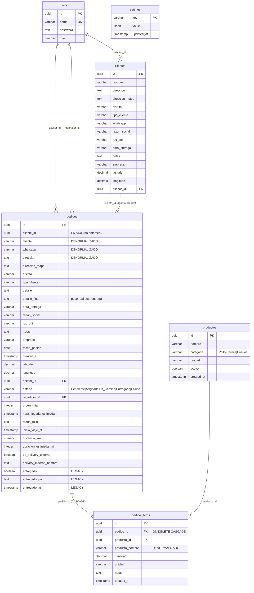

# 02 — Modelo de Datos

> **Última verificación contra código:** 2026-05-13
> **Commit del proyecto:** `d2a49cd`
> **Archivos clave:** `scripts/seed.mjs`, `scripts/migrate-*.mjs`, `src/lib/types.ts`, `src/lib/data.ts`, `src/app/api/pedidos/route.ts`, `src/app/api/despacho/asignar-externo/route.ts`

---

## 1. Diagrama de Relaciones



---

## 2. Schema completo por tabla

### 2.1 `users`

**Origen:** `scripts/seed.mjs:26-33`. Nunca modificada por migraciones posteriores.

```sql
CREATE TABLE users (
    id        UUID DEFAULT uuid_generate_v4() PRIMARY KEY,
    name      VARCHAR(255) NOT NULL UNIQUE,
    password  TEXT NOT NULL,           -- hash bcrypt salt 10
    role      VARCHAR(50) NOT NULL     -- 'admin' | 'asesor' | 'repartidor'
);
```

**Sin índices explícitos** más allá de los implícitos de PK y UNIQUE.

**Cómo se popula:**
- Inicial: `scripts/seed.mjs:36-52` inserta 8 usuarios (1 admin, 4 asesoras, 3 repartidores).
- Runtime: `POST /api/users` con bcrypt hash (`src/app/api/users/route.ts:91-95`). Solo admin.

**Quién la lee:**
- `auth.ts:9-12` (`getUser`) — para login.
- `lib/data.ts:fetchAsesores`, `fetchRepartidores` — para selects de UI.
- `api/users/route.ts` — gestión CRUD.
- Múltiples LEFT JOINs en queries de pedidos para resolver `asesor_name`, `repartidor_name`.

**Anti-patrón a evitar:** **No** hardcodear strings de rol fuera de zod schemas — actualmente están dispersos (ver doc 03 §7).

---

### 2.2 `clientes`

**⚠️ Origen no documentado en migraciones del repo.** La tabla **se usa** en código (`api/clientes/route.ts`, `api/clientes/[id]/route.ts`) pero **no existe un script que la cree**. Existe `scripts/run-migration.mjs` que **agrega** `asesor_id` asumiendo que la tabla ya existe.

**Schema reconstruido del código de uso** (`api/clientes/route.ts:174-180`):

```sql
CREATE TABLE clientes (
    id              UUID DEFAULT uuid_generate_v4() PRIMARY KEY,
    nombre          VARCHAR(255) NOT NULL,
    razon_social    VARCHAR(255),
    ruc_dni         VARCHAR(50),
    whatsapp        VARCHAR(50),
    direccion       TEXT,
    direccion_mapa  TEXT,
    distrito        VARCHAR(100) DEFAULT 'La Victoria',
    tipo_cliente    VARCHAR(50) DEFAULT 'Frecuente',
    hora_entrega    VARCHAR(100),
    notas           TEXT,
    empresa         VARCHAR(100) DEFAULT 'Transavic',
    latitude        DECIMAL(10, 8),
    longitude       DECIMAL(11, 8),
    asesor_id       UUID REFERENCES users(id) ON DELETE SET NULL,
    created_at      TIMESTAMP WITH TIME ZONE DEFAULT CURRENT_TIMESTAMP
);

CREATE INDEX idx_clientes_asesor_id ON clientes(asesor_id);
```

**Índice añadido por** `scripts/run-migration.mjs:17`.

**Cómo se popula:**
- `POST /api/clientes` desde `/dashboard/clientes` (form de cliente nuevo).
- Desde `PedidoForm` cuando se crea cliente nuevo durante un pedido (lógica en el form).

**Quién la lee:**
- `GET /api/clientes` con dos modos:
  - **Autocomplete** (`?q=`) — para `ClienteAutocomplete.tsx` (búsqueda con debounce 300ms).
  - **Listado paginado** (`?page=&limit=&search=`) — para `/dashboard/clientes`.
- Ambos con **scoping por rol**: si no es admin, filtra por `asesor_id = userId`.
- `GET /api/clientes/[id]/pedidos` — historial de un cliente.

**⚠️ Gotcha de auth:** `GET /api/clientes/[id]/pedidos` **no verifica que el cliente pertenezca al asesor que pregunta**. Riesgo de info disclosure entre asesoras. Ver doc 05.

---

### 2.3 `pedidos`

La tabla central del sistema. Es la **más mutada** — recibió 6 migraciones encima del seed inicial.

#### Schema completo final

```sql
CREATE TABLE pedidos (
    -- ─── Identidad ───
    id                       UUID DEFAULT uuid_generate_v4() PRIMARY KEY,
    cliente_id               UUID,                              -- FK no enforced; agregado en migración no documentada
    created_at               TIMESTAMP WITH TIME ZONE DEFAULT CURRENT_TIMESTAMP,
    fecha_pedido             DATE NOT NULL,

    -- ─── Datos del cliente (DENORMALIZADOS, copiados al crear pedido) ───
    cliente                  VARCHAR(255) NOT NULL,
    whatsapp                 VARCHAR(50),
    direccion                TEXT,
    direccion_mapa           TEXT,                              -- agregado migrate-direccion-mapa.mjs
    distrito                 VARCHAR(100),
    tipo_cliente             VARCHAR(50),
    razon_social             VARCHAR(255),                      -- agregado en migración no documentada
    ruc_dni                  VARCHAR(50),                       -- agregado en migración no documentada
    hora_entrega             VARCHAR(100),                      -- "HH:MM AM - HH:MM PM"
    latitude                 DECIMAL(10, 8),
    longitude                DECIMAL(11, 8),
    empresa                  VARCHAR(100) NOT NULL,             -- 'Transavic' | 'Avícola de Tony'

    -- ─── Detalle del pedido ───
    detalle                  TEXT NOT NULL,                     -- texto generado por ProductSelector
    detalle_final            TEXT,                              -- peso REAL registrado post-entrega (PesoModal)
    notas                    TEXT,

    -- ─── Asignación de usuarios ───
    asesor_id                UUID REFERENCES users(id),

    -- ─── Estado MODERNO + flujo de despacho (migrate-estados.mjs) ───
    estado                   VARCHAR(20) NOT NULL DEFAULT 'Pendiente',  -- 'Pendiente'|'Asignado'|'En_Camino'|'Entregado'|'Fallido'
    repartidor_id            UUID REFERENCES users(id),
    orden_ruta               INTEGER,                           -- orden dentro de la ruta del repartidor
    hora_llegada_estimada    TIMESTAMP WITH TIME ZONE,          -- ETA calculado con Google Directions
    razon_fallo              TEXT,                              -- requerido si estado='Fallido' (≥5 chars)
    inicio_viaje_at          TIMESTAMP WITH TIME ZONE,          -- cuando repartidor tocó "Ir al cliente"

    -- ─── Métricas de ruta (migrate-despacho-v2.mjs) ───
    distancia_km             NUMERIC(6, 2),                     -- distancia DESDE LA BASE (se congela al asignar)
    duracion_estimada_min    INTEGER,                           -- duración acumulada en la ruta optimizada

    -- ─── Delivery externo (agregado en migración no documentada) ───
    es_delivery_externo      BOOLEAN DEFAULT FALSE,
    delivery_externo_nombre  TEXT,

    -- ─── LEGACY (pre-migrate-estados.mjs) — se mantiene sincronizado con 'estado' ───
    entregado                BOOLEAN NOT NULL DEFAULT FALSE,    -- ⚠️ NO usar como source of truth
    entregado_por            TEXT,                              -- nombre del repartidor/admin (no FK)
    entregado_at             TIMESTAMP WITH TIME ZONE
);

-- Índices (migrate-estados.mjs:73-79)
CREATE INDEX idx_pedidos_estado         ON pedidos(estado);
CREATE INDEX idx_pedidos_repartidor     ON pedidos(repartidor_id);
CREATE INDEX idx_pedidos_fecha_estado   ON pedidos(fecha_pedido, estado);
```

#### Migraciones que la modificaron (cronológico)

| # | Migración | Qué agregó/modificó |
|---|---|---|
| 1 | `seed.mjs:58-82` | Creación inicial (sin `estado`, sin `repartidor_id`, sin `distancia_km`). |
| 2 | `migrate-entregado-por.mjs:6-7` | + `entregado_por TEXT`, `entregado_at TIMESTAMP WITH TIME ZONE`. |
| 3 | `migrate-direccion-mapa.mjs:6` | + `direccion_mapa TEXT`. |
| 4 | `migrate-estados.mjs:31-47` | + `estado`, `repartidor_id`, `orden_ruta`, `hora_llegada_estimada`, `razon_fallo`, `inicio_viaje_at` + **3 índices**. Migra datos: `entregado=TRUE` → `estado='Entregado'`, etc. |
| 5 | `migrate-despacho-v2.mjs:36, 42` | + `distancia_km`, `duracion_estimada_min`. |
| ? | **No documentada** | + `cliente_id`, `razon_social`, `ruc_dni`, `es_delivery_externo`, `delivery_externo_nombre`. Confirmado por uso en `api/pedidos/route.ts:106-108` y `api/despacho/asignar-externo/route.ts:32-37`. |

**⚠️ Esto significa que el schema en producción tiene más columnas que las que aparecen en `/scripts/`.** Si querés reconstruir la DB desde cero, vas a tener que agregar estas columnas manualmente o crear las migraciones faltantes.

#### Cómo se popula

- `POST /api/pedidos` — inserta una fila. Lista de columnas insertadas (`api/pedidos/route.ts:106-108`):
  ```
  cliente, cliente_id, whatsapp, direccion, direccion_mapa, distrito,
  tipo_cliente, detalle, hora_entrega, razon_social, ruc_dni, notas,
  empresa, fecha_pedido, latitude, longitude, asesor_id
  ```
  El resto se llena con defaults (`estado='Pendiente'`, `entregado=FALSE`) o se actualiza después.

- `PATCH /api/pedidos/[id]` — update genérico construido dinámicamente desde el body validado.

- Transiciones específicas (`api/pedidos/[id]/iniciar-viaje`, `entregar`, `cancelar-viaje`).

- `POST /api/despacho/asignar` — UPDATE de `repartidor_id`, `estado='Asignado'`, `orden_ruta`, `distancia_km`, `duracion_estimada_min`.

#### Quién la lee

- `lib/data.ts:fetchFilteredPedidos` — lista paginada para `/dashboard` (con scoping por rol).
- `lib/data.ts:fetchMiRuta` — pedidos del día del repartidor.
- `api/despacho/route.ts` — vista del admin (pendientes del día + de la semana + asignados + delivery externo).
- `api/repartidor/mi-ruta/route.ts` — vista del repartidor con stats y ruta optimizada.
- `api/analytics/route.ts` — KPIs por rango.
- `api/resumen-diario/route.ts` — reporte agrupado por día.
- `api/clientes/[id]/pedidos/route.ts` — historial de un cliente.

#### Decisiones de schema explicadas

**A) Denormalización del cliente** — los campos `cliente`, `whatsapp`, `direccion`, `direccion_mapa`, `distrito`, `tipo_cliente`, `razon_social`, `ruc_dni`, `hora_entrega`, `latitude`, `longitude`, `notas`, `empresa` se **copian** del cliente al pedido en el momento del INSERT.

**Motivo:** Preservar histórico. Si el cliente cambia de dirección la semana que viene, los pedidos pasados no se reescriben — siguen mostrando la dirección donde se entregó realmente.

**Hay también `cliente_id`** como vínculo "vivo" para queries como "todos los pedidos de este cliente" (`api/clientes/[id]/pedidos/route.ts`). **No es FK enforced** — está como UUID sin `REFERENCES clientes(id)`.

**Implicación práctica:** si modificás `clientes.nombre`, los pedidos pasados conservan el nombre viejo. Si querés mostrar el nombre actual, JOIN con `clientes` usando `cliente_id`.

**B) Doble fuente de verdad `estado` vs `entregado`** — coexisten dos columnas que representan información solapada:

- `entregado BOOLEAN NOT NULL DEFAULT FALSE` — original del seed.
- `estado VARCHAR(20) NOT NULL DEFAULT 'Pendiente'` — agregado por `migrate-estados.mjs`.

Cuando se ejecutó `migrate-estados.mjs:52-60` se hizo la migración de datos: `entregado=TRUE` → `estado='Entregado'`, resto → `'Pendiente'`. Pero **ambas columnas siguen existiendo**.

**Lógica de sincronización** en `api/pedidos/[id]/route.ts:80-114`:
- Si se cambia `estado` directamente, se sincroniza `entregado = (estado === 'Entregado')`.
- Si se cambia `entregado` (legacy), se sincroniza `estado` correspondientemente.
- Si `estado='Pendiente'`, también se limpia `entregado_por`, `entregado_at`, `razon_fallo`, `repartidor_id`, `orden_ruta`.

**Source of truth canónica:** `estado`. **No leer `entregado`** en código nuevo. La columna `entregado` se mantiene por compatibilidad con queries antiguas y por seguridad — eventualmente se va a eliminar.

**C) `distancia_km` se congela, `duracion_estimada_min` se actualiza** — decisión deliberada con motivo de negocio.

- `distancia_km` representa la **distancia desde la base** (almacén) hasta el cliente. Se calcula UNA VEZ al asignar el pedido (`api/despacho/asignar/route.ts:96-101`) y no se sobrescribe nunca más.
- `duracion_estimada_min` representa la **duración acumulada en la ruta** del repartidor. SE actualiza cada vez que se optimiza la ruta (`api/despacho/optimizar-ruta/route.ts:198-201`).

**Por qué:** el admin/repartidor siempre quiere saber "este cliente está a X km del local" como métrica fija de negocio. La duración acumulada, en cambio, sí cambia según el orden de la ruta.

**D) `detalle` vs `detalle_final`** — diferencia conceptual importante:

- `detalle TEXT NOT NULL` — generado por `ProductSelector` al crear el pedido. Texto con los productos pedidos en formato libre (ej: `"2 uni - Pollo entero\n5 kg - Pechuga"`).
- `detalle_final TEXT` — el **peso real registrado por el repartidor o la asistente de producción** al pesar. Por ejemplo, si pidieron "10 pollos enteros" pero la suma real fue 27.580 kg, ese número va en `detalle_final`.

**Quién lo actualiza:** `PesoModal.tsx` post-entrega (no es parte del flujo de creación del pedido). En la implementación de las **mejoras 2026**, esto se va a estructurar más (precios y márgenes por item).

**E) `settings` como JSONB extensible** — único valor actual: `base_location`.

```sql
CREATE TABLE settings (
    key         VARCHAR(100) PRIMARY KEY,
    value       JSONB NOT NULL,
    updated_at  TIMESTAMP WITH TIME ZONE DEFAULT NOW()
);

INSERT INTO settings (key, value) VALUES
    ('base_location', '{"lat": -12.0464, "lng": -77.0428, "address": "Centro de Lima", "name": "Local Principal"}'::jsonb)
ON CONFLICT (key) DO NOTHING;
```

**Estructura del valor:** `{ lat: number, lng: number, address: string, name: string }`.

**Quién lo lee:**
- `api/despacho/route.ts:23-25` — para mostrar en el mapa.
- `api/despacho/asignar/route.ts:51-54` — origen para Google Directions.
- `api/despacho/optimizar-ruta/route.ts:54-61` — origen para optimización.
- `api/repartidor/mi-ruta/route.ts:67-70` — para mapa del repartidor.

**Quién lo escribe:** `POST /api/settings` (solo admin) desde el modal de "Ubicación base" en `/despacho`.

**Fallback en cascada** (si no hay row en `settings`):
1. Env vars `BASE_LATITUDE` + `BASE_LONGITUDE` (en algunos handlers).
2. Hardcoded `-12.0464, -77.0428` (Centro de Lima).

### 2.4 `productos`

**Origen:** `scripts/migrate-products.mjs:20-29`.

```sql
CREATE TABLE productos (
    id          UUID DEFAULT uuid_generate_v4() PRIMARY KEY,
    nombre      VARCHAR(255) NOT NULL,
    categoria   VARCHAR(50) NOT NULL,         -- 'Pollo' | 'Carnes' | 'Huevos'
    unidad      VARCHAR(50) NOT NULL,         -- 'uni' | 'kg' | 'uni/kg' | 'paquete x N' | etc.
    activo      BOOLEAN DEFAULT TRUE,
    created_at  TIMESTAMP WITH TIME ZONE DEFAULT CURRENT_TIMESTAMP
);
```

**Sin índices** explícitos.

**Cómo se popula:**
- Inicial: `migrate-products.mjs:62-105` inserta ~35 productos del catálogo (Pollo entero, Pechuga deshuesada, Bistec de res, Huevos plancha, etc.).
- Runtime: `POST /api/productos` (solo admin).

**Quién la lee:**
- `GET /api/productos` — para `ProductSelector` (filtra `WHERE activo = TRUE`, ordena por categoría → nombre).
- LEFT JOINs en analytics y resumen-diario para resolver `producto_nombre` actualizado (cuando el nombre cambió en catálogo).

**Soft delete:** `DELETE /api/productos/[id]` setea `activo = FALSE` en lugar de eliminar la fila — preserva el catálogo histórico para los `pedido_items` que lo referencian.

### 2.5 `pedido_items`

**Origen:** `scripts/migrate-products.mjs:33-44`.

```sql
CREATE TABLE pedido_items (
    id                UUID DEFAULT uuid_generate_v4() PRIMARY KEY,
    pedido_id         UUID REFERENCES pedidos(id) ON DELETE CASCADE,
    producto_id       UUID REFERENCES productos(id),
    producto_nombre   VARCHAR(255) NOT NULL,        -- DENORMALIZADO (snapshot)
    cantidad          DECIMAL(10, 2) NOT NULL,
    unidad            VARCHAR(50) NOT NULL,         -- snapshot también
    notas             TEXT,
    created_at        TIMESTAMP WITH TIME ZONE DEFAULT CURRENT_TIMESTAMP
);
```

**Cascade delete:** si se elimina el pedido, sus items se borran automáticamente.

**Denormalización:** `producto_nombre` y `unidad` son snapshots del producto al momento del INSERT. Si después el admin renombra el producto en el catálogo, este item conserva el nombre original.

**En queries de analytics y resumen** se usa `COALESCE(prod.nombre, pi.producto_nombre)` para preferir el nombre actual del catálogo si existe (`producto_id` válido), y fallback al snapshot si el producto fue eliminado o el INSERT no tenía `producto_id`.

### 2.6 `settings`

Ya cubierto arriba (decisión E).

---

## 3. Tipos TypeScript (`src/lib/types.ts`)

Mapping completo de tipos a tablas:

### 3.1 `EstadoPedido`

```typescript
export type EstadoPedido = 'Pendiente' | 'Asignado' | 'En_Camino' | 'Entregado' | 'Fallido';
```

Coincide con los valores válidos de `pedidos.estado`. **No hay enum en SQL** — es solo un `VARCHAR(20)` con valores convenidos.

### 3.2 `Pedido`

```typescript
export type Pedido = {
  id: string;
  cliente: string;
  whatsapp: string | null;
  direccion: string | null;
  distrito: string | null;
  tipo_cliente: string | null;
  detalle: string;
  hora_entrega: string | null;
  razon_social: string | null;       // ⚠️ ver gotchas abajo
  ruc_dni: string | null;            // ⚠️
  notas: string | null;
  empresa: string;
  fecha_pedido: string;              // viene como 'DD/MM/YYYY' tras TO_CHAR en data.ts
  detalle_final: string | null;
  created_at: Date;
  latitude: number | null;
  longitude: number | null;
  estado: EstadoPedido;
  repartidor_id: string | null;
  repartidor_name: string | null;    // JOIN, no columna
  orden_ruta: number | null;
  hora_llegada_estimada: string | null;
  razon_fallo: string | null;
  inicio_viaje_at: string | null;
  distancia_km: number | null;
  duracion_estimada_min: number | null;
  es_delivery_externo: boolean;      // ⚠️
  delivery_externo_nombre: string | null;  // ⚠️
  entregado: boolean;
  entregado_por: string | null;
  entregado_at: string | null;
  asesor_id: string | null;
  asesor_name: string | null;        // JOIN, no columna
};
```

#### Gotchas del tipo `Pedido`

| Campo | Status |
|---|---|
| `razon_social`, `ruc_dni`, `es_delivery_externo`, `delivery_externo_nombre` | **SÍ existen en DB** (confirmado por uso en `api/pedidos/route.ts` y `api/despacho/asignar-externo/route.ts`), pero **no están en migraciones documentadas**. Si recreás la DB, hay que crearlas a mano. |
| `cliente_id` | **Existe en DB y se inserta** (`api/pedidos/route.ts:106-108`), pero **NO está en el tipo TS**. Falta agregarlo. |
| `direccion_mapa` | **Existe en DB y se inserta**, pero **NO está en el tipo TS**. Falta agregarlo. |
| `created_at` | Tipo TS es `Date`, pero la columna es `TIMESTAMP WITH TIME ZONE`. El parser en `lib/data.ts:101` hace `new Date(pedido.created_at)`. |
| `fecha_pedido` | Tipo TS es `string`, viene formateado en `data.ts:73`: `TO_CHAR(p.fecha_pedido, 'DD/MM/YYYY')`. **Otros endpoints (analytics, resumen-diario) lo devuelven con otro formato (`YYYY-MM-DD`)**. Cuidar al consumir. |
| `latitude`, `longitude` | Postgres devuelve `DECIMAL` como string vía driver. `lib/data.ts:103-104` hace `parseFloat()` antes de retornar. |
| `repartidor_name`, `asesor_name` | No son columnas — vienen de LEFT JOIN con `users` (`lib/data.ts:80-81`). Si la query no incluye los JOINs, estos campos vienen `null`. |

### 3.3 `User`

```typescript
export type User = {
  id: string;
  name: string;
  role: string;             // string, no enum — pero solo 3 valores válidos
};
```

Coincide con `users` excepto que omite `password` (correcto, nunca se expone al cliente).

### 3.4 `Producto`

```typescript
export type Producto = {
  id: string;
  nombre: string;
  categoria: 'Pollo' | 'Carnes' | 'Huevos';   // sí es enum en TS
  unidad: string;
  activo: boolean;
};
```

Coincide con `productos`. Omite `created_at`.

### 3.5 `PedidoItem`

```typescript
export type PedidoItem = {
  id: string;
  pedido_id: string;
  producto_id: string;
  producto_nombre: string;
  cantidad: number;
  unidad: string;
  notas: string | null;
};
```

Coincide con `pedido_items`. Omite `created_at`.

### 3.6 `PedidoRuta`

```typescript
export type PedidoRuta = {
  id: string;
  cliente: string;
  direccion: string | null;
  distrito: string | null;
  whatsapp: string | null;
  latitude: number | null;
  longitude: number | null;
  estado: EstadoPedido;
  orden_ruta: number | null;
  hora_entrega: string | null;
  hora_llegada_estimada: string | null;
  inicio_viaje_at: string | null;
  razon_fallo: string | null;
  detalle: string;
  notas: string | null;
  distancia_km: number | null;
  duracion_estimada_min: number | null;
};
```

**Vista simplificada** para `/dashboard/mi-ruta` (no incluye `asesor_id`, `repartidor_id`, `entregado*` legacy, etc.). Es un subconjunto de `Pedido`.

### 3.7 Mapping tabla ↔ tipo TS

| Tabla SQL | Tipo TS | Notas |
|---|---|---|
| `users` | `User` | Omite `password`. |
| `productos` | `Producto` | Omite `created_at`. |
| `pedido_items` | `PedidoItem` | Omite `created_at`. |
| `pedidos` | `Pedido` | Tiene gotchas (campos que faltan o que están de más). |
| `pedidos` (subconjunto) | `PedidoRuta` | Para vista del repartidor. |
| `clientes` | **No hay tipo** | Se trata como `Record<string, unknown>` en uses. **Pendiente:** definir `type Cliente`. |
| `settings` | **No hay tipo** | Se trata como `{ key: string; value: unknown }`. |

---

## 4. Convenciones SQL

### 4.1 Naming

| Elemento | Convención | Ejemplo |
|---|---|---|
| Tablas | `snake_case`, plural | `pedidos`, `pedido_items`, `users` |
| Columnas | `snake_case` | `asesor_id`, `repartidor_id`, `hora_llegada_estimada` |
| Valores de `estado` | `PascalCase` con underscore en multi-palabra | `'Pendiente'`, `'En_Camino'`, `'Entregado'` |
| Valores de `categoria` | `PascalCase` simple | `'Pollo'`, `'Carnes'`, `'Huevos'` |
| Índices | `idx_<tabla>_<columna>` | `idx_pedidos_estado`, `idx_pedidos_fecha_estado` |
| PKs | Siempre `id UUID` | Generado con `uuid_generate_v4()` |

### 4.2 UUID

**Extensión:** `uuid-ossp` — creada en `seed.mjs:18` con `CREATE EXTENSION IF NOT EXISTS "uuid-ossp";`.

**Función:** `uuid_generate_v4()`. **No** usar `gen_random_uuid()` (de `pgcrypto`) por consistencia.

### 4.3 Timezone

Lima está en **UTC-5** sin daylight saving. Para comparaciones "hoy/esta semana/este mes" en queries, se usa explícitamente:

```sql
(NOW() AT TIME ZONE 'America/Lima')::date
```

Aparece en:
- `lib/data.ts:178` (fetchMiRuta)
- `api/despacho/route.ts:32, 47, 64, 79`
- `api/despacho/asignar/route.ts:80`
- `api/analytics/route.ts:90, 100, 109` (date_trunc semana/mes)
- `api/pedidos/[id]/iniciar-viaje/route.ts:80`
- Otros

**Patrones derivados:**
- `date_trunc('week', (NOW() AT TIME ZONE 'America/Lima')::date)` — inicio de la semana (lunes).
- `date_trunc('month', ...)` — inicio del mes.

`fecha_pedido` es `DATE` (sin hora). Los timestamps de eventos (`created_at`, `entregado_at`, `inicio_viaje_at`, `hora_llegada_estimada`) son `TIMESTAMP WITH TIME ZONE` (almacenados en UTC).

### 4.4 Tipos decimales

| Concepto | Tipo | Precisión |
|---|---|---|
| Latitud | `DECIMAL(10, 8)` | ±99.99999999° — ~1.1mm de precisión. |
| Longitud | `DECIMAL(11, 8)` | Un dígito más para coordenadas en el oeste americano. |
| Distancia (km) | `NUMERIC(6, 2)` | Hasta 9999.99 km. |
| Cantidad de producto | `DECIMAL(10, 2)` | Hasta 99,999,999.99 — fracciones de 2 decimales. |
| Duración | `INTEGER` (minutos) | Sin decimales. |

### 4.5 Drivers y patrones de query

**Driver:** `@neondatabase/serverless` — cliente HTTP (no Postgres binary protocol). **No es un pool**; cada `neon(connectionString)` es barato y se reinstancia por request.

**Patrón 1: Tagged template literal (preferido cuando los parámetros son fijos)**

```typescript
const sql = neon(process.env.DATABASE_URL!);
const result = await sql`
  SELECT id, name FROM users WHERE role = ${role} ORDER BY name ASC
`;
```

**Patrón 2: `sql.query(query, params)` (cuando WHERE es dinámico)**

```typescript
const sql = neon(process.env.DATABASE_URL!);
const conditions: string[] = [];
const params: unknown[] = [];
let i = 1;

if (search) {
  conditions.push(`c.nombre ILIKE $${i++}`);
  params.push(`%${search}%`);
}

const result = await sql.query(`SELECT * FROM clientes WHERE ${conditions.join(' AND ')}`, params);
```

Visto en `lib/data.ts:fetchFilteredPedidos:67-92` y `api/clientes/route.ts:GET`.

**Patrón 3: UPSERT con ON CONFLICT**

```typescript
await sql`
  INSERT INTO settings (key, value, updated_at)
  VALUES (${key}, ${JSON.stringify(value)}::jsonb, NOW())
  ON CONFLICT (key) DO UPDATE SET value = ${JSON.stringify(value)}::jsonb, updated_at = NOW()
`;
```

Visto en `api/settings/route.ts:POST`.

---

## 5. Sistema de migraciones

### 5.1 Cómo funciona

**Sistema manual** — no hay herramienta automatizada (no se usa Prisma migrate, Drizzle Kit, ni similar). Las migraciones son scripts **`.mjs`** en `/scripts/` que se ejecutan a mano:

```bash
node scripts/migrate-<feature>.mjs
```

Cada migración:
1. Lee `DATABASE_URL` de `dotenv`.
2. Instancia cliente Neon.
3. Ejecuta ALTER/CREATE/INSERT con `IF NOT EXISTS` o checks previos para ser **idempotente**.
4. Reporta resultados por consola con emojis.

### 5.2 Cómo crear una migración nueva

**Patrón** basado en `migrate-despacho-v2.mjs`:

```javascript
// scripts/migrate-<nombre>.mjs
import { neon } from "@neondatabase/serverless";
import dotenv from "dotenv";
dotenv.config();

const sql = neon(process.env.DATABASE_URL);

async function migrate() {
  console.log("🔄 Iniciando migración <nombre>...\n");

  // Idempotencia: ADD COLUMN IF NOT EXISTS / CREATE TABLE IF NOT EXISTS / etc.
  console.log("1️⃣ Agregando columna foo...");
  await sql`ALTER TABLE pedidos ADD COLUMN IF NOT EXISTS foo TEXT`;
  console.log("   ✅ foo agregada");

  // Si la migración modifica datos existentes, usar checks
  const checkColumn = await sql`
    SELECT column_name FROM information_schema.columns
    WHERE table_name = 'pedidos' AND column_name = 'foo'
  `;
  if (checkColumn.length === 0) {
    throw new Error("Columna foo no se creó correctamente");
  }

  console.log("\n🎉 Migración completada!");
}

migrate().catch((err) => {
  console.error("❌ Error en migración:", err);
  process.exit(1);
});
```

**Reglas:**
- **Nunca modificar** una migración ya aplicada en producción. Crear una nueva.
- **Siempre usar `IF NOT EXISTS`** en `ADD COLUMN`, `CREATE TABLE`, `CREATE INDEX`.
- **Loguear cada paso** con consola descriptiva.
- **Verificar idempotencia** — debe poder correrse 2 veces sin romper.
- **Documentar en el header** qué hace y por qué.

### 5.3 Migraciones documentadas vs no documentadas

**Documentadas** (existen en `/scripts/`):

| Orden | Script | Qué hace |
|---|---|---|
| 1 | `seed.mjs` | DROP + CREATE inicial de `users` y `pedidos`. Inserta 8 usuarios. **DESTRUCTIVO.** |
| 2 | `migrate-products.mjs` | Crea `productos` y `pedido_items`. Inserta ~35 productos. |
| 3 | `migrate-entregado-por.mjs` | + `entregado_por`, `entregado_at` a `pedidos`. |
| 4 | `migrate-direccion-mapa.mjs` | + `direccion_mapa` a `pedidos`. |
| 5 | `migrate-estados.mjs` | + `estado` y campos de despacho a `pedidos`. **Migra datos legacy.** Crea 3 índices. |
| 6 | `migrate-despacho-v2.mjs` | Crea `settings`. + `distancia_km`, `duracion_estimada_min` a `pedidos`. |
| 7 | `run-migration.mjs` (+ `migration_add_asesor_to_clientes.sql`) | + `asesor_id` a `clientes`. Crea índice. **Asume `clientes` ya existe.** |

**No documentadas** (existen en producción pero no en `/scripts/`):

- `CREATE TABLE clientes (...)` — la tabla base.
- `ALTER TABLE pedidos ADD COLUMN cliente_id UUID;`
- `ALTER TABLE pedidos ADD COLUMN razon_social VARCHAR(255);`
- `ALTER TABLE pedidos ADD COLUMN ruc_dni VARCHAR(50);`
- `ALTER TABLE pedidos ADD COLUMN es_delivery_externo BOOLEAN DEFAULT FALSE;`
- `ALTER TABLE pedidos ADD COLUMN delivery_externo_nombre TEXT;`

**Acción recomendada:** crear `scripts/migrate-missing-schema.mjs` que aplique idempotentemente las columnas faltantes, así un developer nuevo puede reconstruir la DB desde cero.

### 5.4 Roles iniciales del seed

`scripts/seed.mjs:36-46` inserta 8 usuarios:

| Nombre | Rol |
|---|---|
| Antonio | admin |
| Leslie | asesor |
| Yoshelin | asesor |
| Sarai | asesor |
| Yesica | asesor |
| Marco | repartidor |
| Yhorner | repartidor |
| Anghelo | repartidor |

Las contraseñas están **hardcodeadas en plain text en el script** y se hashean con bcrypt salt 10 antes del INSERT. **Cambiarlas en producción** (no están en este documento por seguridad).

---

## 6. Decisiones de schema — tabla resumen

| Decisión | Motivo | Ubicación en código |
|---|---|---|
| **`pedidos` denormalizado** | Preservar histórico de cliente | `api/pedidos/route.ts:106-108` (INSERT) |
| **`cliente_id` sin FK enforced** | Permite eliminar cliente sin romper pedidos | `api/clientes/[id]/route.ts:DELETE` |
| **`entregado` (boolean) coexiste con `estado` (varchar)** | Migración progresiva — se mantienen sincronizadas | `api/pedidos/[id]/route.ts:80-114` |
| **`distancia_km` congelada al asignar** | "Cuánto está del local" es info de negocio fija | `api/despacho/optimizar-ruta/route.ts:198-201` (NO actualiza distancia_km) |
| **`detalle_final` separada de `detalle`** | Peso pedido vs peso real entregado | `PesoModal.tsx`, post-entrega |
| **`razon_fallo` requerida ≥5 chars si Fallido** | Forzar registro útil de fallos | `api/pedidos/[id]/entregar/route.ts:9-15` (zod refine) |
| **`pedido_items` con CASCADE delete** | Si se borra pedido, sus items mueren | `migrate-products.mjs:35` |
| **`productos.activo` con soft delete** | Preservar referencias en `pedido_items` históricos | `api/productos/[id]/route.ts:DELETE` |
| **`settings` JSONB key/value** | Extensible para futuras configs sin migraciones | `migrate-despacho-v2.mjs:15-21` |
| **`empresa` como string libre, no FK** | Solo 2 valores ('Transavic', 'Avícola de Tony'), no justifica tabla | Múltiples queries `GROUP BY empresa` |
| **`asesor_id` ON DELETE SET NULL en clientes** | Cliente sobrevive al borrar asesora | `run-migration.mjs:10` |
| **Sin enum SQL para `estado` o `categoria`** | Flexibilidad — solo strings consistentes con zod | `migrate-estados.mjs:31` |

---

## 7. Cómo verificar que este documento sigue vigente

```bash
# 1. Estructura de tablas — verificar contra DB real
psql $DATABASE_URL -c "\d users"
psql $DATABASE_URL -c "\d clientes"
psql $DATABASE_URL -c "\d pedidos"
psql $DATABASE_URL -c "\d productos"
psql $DATABASE_URL -c "\d pedido_items"
psql $DATABASE_URL -c "\d settings"

# 2. Columnas reales de pedidos
psql $DATABASE_URL -c "
  SELECT column_name, data_type, is_nullable, column_default
  FROM information_schema.columns
  WHERE table_name = 'pedidos'
  ORDER BY ordinal_position;
"

# 3. Migraciones aplicadas
ls -1 scripts/*.mjs scripts/*.sql

# 4. ¿El tipo Pedido sigue consistente con DB?
grep -A 40 "export type Pedido = {" src/lib/types.ts

# 5. ¿Aparecen nuevos INSERTs en pedidos con columnas distintas?
grep -A 2 "INSERT INTO pedidos" src/app/api/**/*.ts

# 6. ¿Aparecen nuevos UPDATEs en pedidos con columnas distintas?
grep -B 1 -A 5 "UPDATE pedidos" src/app/api/**/*.ts | grep "SET " | sort -u

# 7. ¿Hay nuevas entries en settings?
psql $DATABASE_URL -c "SELECT key FROM settings;"
```

Si encuentras drift, actualiza las secciones afectadas y bumpea la fecha del header.

---

## Siguientes documentos

- **`03-autenticacion-y-roles.md`** — cómo se aplica el scoping por rol en queries (incluye casos concretos del data layer).
- **`04-flujos-de-negocio.md`** — máquina de estados completa con todas las transiciones.
- **`05-apis-e-integraciones.md`** — referencia de endpoints que leen/escriben cada tabla.
