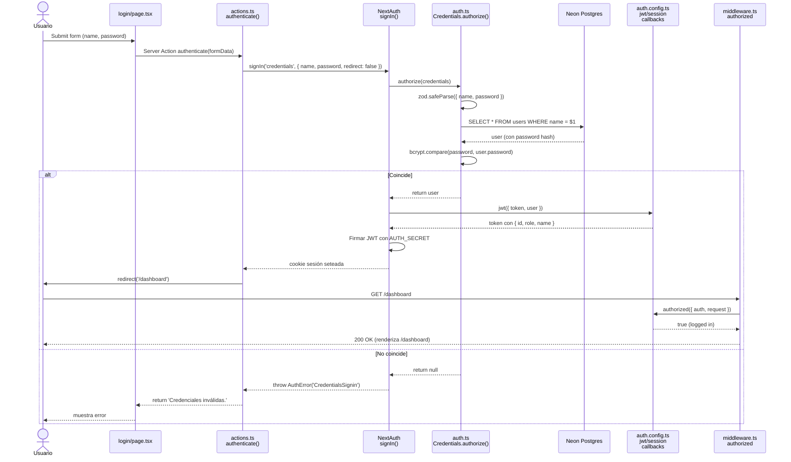

# 03 — Autenticación y Roles

> **Última verificación contra código:** 2026-06-02 (modelo de permisos + cambios recientes) · **actualizado 2026-06-04** (DELETE de usuario: pre-check de historial completo + mensaje claro, §7.4) · base previa 2026-05-13
> **Commit del proyecto:** `d2a49cd` (base) + cambios del 2 jun 2026 (PRs #6–#9)
> **Archivos clave:** `src/auth.ts`, `src/auth.config.ts`, `src/middleware.ts`, `src/lib/actions.ts`, `src/app/login/page.tsx`, `src/app/api/auth/logout/route.ts`, `src/app/api/users/route.ts`, `src/app/api/users/[id]/route.ts`, `src/components/DashboardLayout.tsx`

---

## 0. Dónde viven los permisos (LÉEME PRIMERO)

**La base de datos es Neon Postgres — NO Supabase.** No hay "Supabase CLI", ni Storage/buckets, ni políticas RLS (Row Level Security). Verificado en producción (2 jun 2026): `pg_policies = 0`, tablas con RLS activado = 0, y la app se conecta con el rol **`neondb_owner`**, que tiene **acceso total** (puede `INSERT`/`UPDATE`/`DELETE` en todas las tablas — comprobado con `has_table_privilege`).

**Consecuencia clave (mentalidad correcta para auditar permisos):** la base de datos **no decide quién puede hacer qué**; solo guarda datos y le permite todo a la conexión. TODO el control de acceso (qué ve cada rol, qué puede borrar/editar) vive en la **capa de aplicación** — en las rutas API de Next.js, que hacen `await auth()` y revisan `session.user.role` / `asesor_id` ANTES de tocar la BD.

- ¿Una asesora "tiene permiso en la BD" para borrar un pedido? La BD se lo permite a la conexión. La **restricción real** ("solo los suyos y solo si están `Pendiente`, sin comprobante") está en el **código** (`DELETE /api/pedidos/[id]`), no en la BD.
- ¿Hay "permisos para guardar la captura del pago"? No hay nada que habilitar: la imagen se guarda como **texto base64 en una columna** de `facturas` (`pago_img_base64 TEXT`), no en un bucket. Si la columna existe (existe), se guarda. Por eso se comprime a ~60-90KB antes.
- Para **cambiar** un permiso, se edita el **código del endpoint** (y, si aplica, el filtro del sidebar), nunca la base de datos.

**Dónde mirar cuando audites permisos:** la matriz **§5.3** (quién puede qué) y **§6** (los 5 patrones de scoping aplicados en cada API). Esos son la fuente de verdad — no la BD.

---

## 1. Resumen ejecutivo

El sistema usa **NextAuth v5 (beta)** con un único provider de **Credentials** + **bcrypt** para hash de contraseñas. Las sesiones son **JWT** (no DB sessions). Hay **4 roles**: `admin`, `asesor`, `repartidor` y `produccion` (este último **ya está en producción** desde el 30 may 2026).

**El control de acceso es en dos capas:**
1. **Middleware** protege todas las rutas excepto APIs y assets.
2. **Cada API route** verifica auth manualmente con `await auth()` y aplica **scoping de queries** según el rol.

**No hay RBAC centralizado** — los strings de rol están dispersos en zod schemas, lo cual es una deuda técnica conocida.

---

## 2. Flujo completo de login



### 2.1 Paso a paso con archivo:línea

**1. `login/page.tsx:32`** — el form usa `useActionState(authenticate)`:
```typescript
const [errorMessage, formAction] = useActionState(authenticate, undefined);
return <form action={formAction}>...</form>
```

**2. `lib/actions.ts:8-24`** — server action `authenticate()`:
```typescript
export async function authenticate(prevState, formData) {
  try {
    await signIn('credentials', {
      ...Object.fromEntries(formData),
      redirect: false,
    });
  } catch (error) {
    if (error instanceof AuthError && error.type === 'CredentialsSignin') {
      return 'Credenciales inválidas.';
    }
    throw error;
  }
  redirect('/dashboard');
}
```

**3. `auth.ts:23-41`** — provider Credentials con validación zod + bcrypt:
```typescript
Credentials({
  async authorize(credentials) {
    const parsedCredentials = z
      .object({ name: z.string(), password: z.string() })
      .safeParse(credentials);

    if (parsedCredentials.success) {
      const { name, password } = parsedCredentials.data;
      const user = await getUser(name);            // SELECT * FROM users WHERE name = $1
      if (!user) return null;

      const passwordsMatch = await bcrypt.compare(password, user.password);
      if (passwordsMatch) return user;
    }
    return null;
  },
})
```

**4. `auth.config.ts:25-32`** — callback `jwt` enriquece el token:
```typescript
jwt({ token, user }) {
  if (user) {
    token.id = user.id;
    token.role = user.role;
    token.name = user.name;
  }
  return token;
}
```

**5. `auth.config.ts:34-41`** — callback `session` proyecta el JWT al objeto session:
```typescript
session({ session, token }) {
  if (session.user) {
    session.user.id = token.id as string;
    session.user.role = token.role as string;
    session.user.name = token.name as string;
  }
  return session;
}
```

**6. `auth.config.ts:43-58`** — callback `authorized` (corre en middleware):
```typescript
authorized({ auth, request: { nextUrl } }) {
  const isLoggedIn = !!auth?.user;
  const isOnDashboard = nextUrl.pathname.startsWith("/dashboard");

  if (isOnDashboard) {
    if (isLoggedIn) return true;
    return false;        // Redirige a /login (NextAuth lo maneja)
  } else if (isLoggedIn) {
    if (nextUrl.pathname === "/login") {
      const role = auth?.user?.role;
      let target = "/dashboard/nuevo-pedido"; // admin / asesor por defecto
      if (role === "repartidor") target = "/dashboard/mi-ruta";
      if (role === "produccion") target = "/dashboard/produccion";
      return Response.redirect(new URL(target, nextUrl));
    }
  }
  return true;
}
```

---

## 3. Configuración de NextAuth

### 3.1 Setup base (`auth.ts:18-43`)

```typescript
export const { auth, signIn, signOut: authSignOut } = NextAuth({
  ...authConfig,
  providers: [
    Credentials({
      async authorize(credentials) { /* ... ver arriba */ }
    }),
  ],
});
```

**Exports clave:**
- `auth()` — usado en server components y route handlers para obtener la sesión actual.
- `signIn()` — para el flujo de login.
- `authSignOut()` — renombrado para no chocar con el `signOut` de actions.

### 3.2 `authConfig` (`auth.config.ts:20-61`)

```typescript
export const authConfig = {
  pages: {
    signIn: "/login",       // Redirección automática si no auth
  },
  callbacks: { jwt, session, authorized },
  providers: [],            // Vacío acá — se llena en auth.ts
} satisfies NextAuthConfig;
```

**Strategy de sesión:** **JWT** (implícito porque hay callback `jwt`). No hay DB sessions configuradas. El JWT se firma con `AUTH_SECRET` (env var) y se guarda en cookie.

### 3.3 Type augmentation (`auth.config.ts:5-18`)

NextAuth no sabe que nuestros usuarios tienen `role` e `id`. Lo extendemos:

```typescript
declare module "next-auth" {
  interface User {
    name?: string;
    role?: string;
  }

  interface Session {
    user: {
      role: string;
      id: string;
      name: string;
    };
  }
}
```

**Implicación:** en cualquier parte del código, `session.user.role` está tipado como `string` (no `string | undefined`). Si por alguna razón el JWT no tiene rol, el código asume que sí lo tiene y puede romper en runtime. **Verificar siempre `!!session?.user` antes**.

### 3.4 Middleware (`src/middleware.ts`)

```typescript
import NextAuth from 'next-auth';
import { authConfig } from './auth.config';

export default NextAuth(authConfig).auth;

export const config = {
  matcher: ['/((?!api|_next/static|_next/image|.*\\.png$).*)'],
};
```

**El matcher hace 4 exclusiones:**
- `/api/*` — las APIs manejan su propia auth con `auth()` server-side.
- `/_next/static/*`, `/_next/image/*` — assets internos de Next.js.
- `*.png` — imágenes (logos, favicon).

**Implicación crítica:** las APIs **no pasan por el middleware**, así que **cada handler debe llamar `await auth()` manualmente** si requiere autenticación. Patrón obligatorio en cada API.

---

## 4. Redirects por rol

Después del login, el usuario llega a una pantalla según su rol. Intervienen tres piezas: el server action `authenticate()` (cae en `/dashboard`), el guard de `src/app/dashboard/page.tsx` con `homeForRole` (`lib/roles.ts`), y el callback `authorized` (`auth.config.ts`, para quien YA logueado entra a `/login`):

| Caso | Origen | Destino |
|---|---|---|
| Login exitoso (cualquier rol) | `/login` → server action `authenticate()` → `redirect('/dashboard')` | Cae en `/dashboard`; ahí `dashboard/page.tsx` reenvía por rol (ver abajo) |
| Logged in + va a `/login` | `/login` | `/dashboard/mi-ruta` (si rol = `repartidor`) |
| Logged in + va a `/login` | `/login` | `/dashboard/produccion` (si rol = `produccion`) |
| Logged in + va a `/login` | `/login` | `/dashboard/nuevo-pedido` (si rol = `admin` o `asesor`) |
| Logged in + va a raíz `/` | `/` | `/dashboard/nuevo-pedido` (server-side redirect en `src/app/page.tsx`) |
| Logged in + va a `/dashboard` (lista de pedidos) | `/dashboard` | Si el rol NO es admin/asesor (repartidor o produccion), redirect a `homeForRole(role)` → `/dashboard/mi-ruta` o `/dashboard/produccion` (lógica en `src/app/dashboard/page.tsx` vía `lib/roles.ts`) |
| **No** logged in + va a `/dashboard/*` | `/dashboard/anything` | `/login` (vía middleware → `authorized` retorna `false`) |

**⚠️ El callback `authorized` NO redirige proactivamente** desde `/dashboard` a la pantalla del rol. Eso lo hace `src/app/dashboard/page.tsx` con `homeForRole(role)` (`lib/roles.ts`): si el rol NO es admin/asesor (repartidor o produccion), lo manda a su pantalla. **`homeForRole` es la fuente central del "inicio" de cada rol** → admin/asesor: `/dashboard` · repartidor: `/dashboard/mi-ruta` · produccion: `/dashboard/produccion`. (Ojo: el destino del callback `authorized` para admin/asesor es `/dashboard/nuevo-pedido`, distinto de `homeForRole` pero igualmente válido — pequeña inconsistencia interna del código, no un bug.)

---

## 5. Los roles del sistema

### 5.1 Roles existentes

| Rol | Quién es típicamente | Cantidad actual (mayo 2026) |
|---|---|---|
| `admin` | Dueño del negocio (Antonio) | 1 |
| `asesor` | Vendedoras de WhatsApp (Leslie, Yoshelin, Sarai, Yesica) | 4 |
| `repartidor` | Motorizados (Marco, Yhorner, Anghelo, etc.) | 6 |
| `produccion` | Asistente de producción (otro distrito) | ✅ activo (desde 30 may 2026) |

### 5.2 Dónde están definidos los roles

**No hay un archivo central de constantes.** Los roles aparecen como strings hardcodeados en múltiples lugares:

| Archivo:línea | Forma |
|---|---|
| `src/app/api/users/route.ts:14` | `z.enum(['admin', 'asesor', 'repartidor'])` (CreateUserSchema) |
| `src/app/api/users/[id]/route.ts:15` | `z.enum(['admin', 'asesor', 'repartidor'])` (UpdateUserSchema) |
| `src/app/dashboard/users/user-modal.tsx:18` | Select hardcoded: `<option value="admin">Administrador</option>...` |
| `src/components/DashboardLayout.tsx:32-77` | Items de nav con `roles: ['admin', 'asesor']`, `roles: ['repartidor']`, `adminOnly: true` |
| `src/lib/data.ts:55, 60` | Strings `'asesor'`, `'repartidor'` en comparaciones |
| Múltiples endpoints | `session.user.role !== 'admin'` para checks de permiso |

**Deuda técnica:** centralizar en `src/lib/constants.ts`:
```typescript
export const ROLES = {
  ADMIN: 'admin',
  ASESOR: 'asesor',
  REPARTIDOR: 'repartidor',
  PRODUCCION: 'produccion',
} as const;
export type Role = typeof ROLES[keyof typeof ROLES];
```

Cuando se haga, hay que actualizar todos los lugares mencionados.

### 5.3 Permisos por rol — tabla maestra

| Acción | admin | asesor | repartidor |
|---|---|---|---|
| Login | ✅ | ✅ | ✅ |
| Ver dashboard `/dashboard` (lista de pedidos) | ✅ (todos) | ✅ (solo suyos por `asesor_id`) | ✅ (solo suyos por `repartidor_id`) — pero auto-redirige a `/mi-ruta` |
| Crear pedido `/dashboard/nuevo-pedido` | ✅ | ✅ | ❌ (no aparece en sidebar) |
| Ver despacho `/dashboard/despacho` | ✅ | ❌ | ❌ |
| Asignar pedidos a repartidores | ✅ | ❌ | ❌ |
| Ver `/dashboard/mi-ruta` | ❌ (no en sidebar) | ❌ | ✅ |
| Transicionar estado de un pedido | ✅ (cualquiera) | ❌ | ✅ (solo de pedidos asignados a él) |
| Ver `/dashboard/clientes` | ✅ (todos los clientes, puede filtrar por asesora) | ✅ (solo los suyos por `asesor_id`) | ❌ |
| Crear/editar cliente | ✅ | ✅ | ❌ |
| Transferir cliente a otra asesora | ✅ | ❌ (PATCH no permite cambiar `asesor_id` desde el lado del asesor) | ❌ |
| Ver `/dashboard/productos` | ✅ | ❌ | ❌ |
| Crear/editar/eliminar producto | ✅ | ❌ | ❌ |
| Ver `/dashboard/users` | ✅ | ❌ | ❌ |
| Crear/editar/eliminar usuario | ✅ | ❌ | ❌ |
| Listar usuarios filtrados por rol (`GET /api/users?role=asesor`) | ✅ | ✅ (sin `role` campo en respuesta) | ✅ (sin `role` en respuesta) |
| Ver `/dashboard/analytics` | ✅ | ❌ | ❌ |
| Ver `/dashboard/resumen` | ✅ | ❌ | ❌ |
| Editar `base_location` (`POST /api/settings`) | ✅ | ❌ | ❌ |
| Optimizar ruta (`POST /api/despacho/optimizar-ruta`) | ✅ | ❌ | ✅ (solo de su propia ruta) |
| **Editar datos de un pedido** (`PATCH /api/pedidos/[id]`) | ✅ (cualquiera) | ✅ (solo los suyos) | ❌ |
| **Eliminar un pedido** (`DELETE /api/pedidos/[id]`) — *act. 2 jun 2026* | ✅ (cualquiera) | ✅ **solo los SUYOS y solo si están `Pendiente`** (y sin comprobante emitido) | ❌ |
| **Ver / descargar comprobantes** (PDF·XML·CDR) — *act. 2 jun 2026* | ✅ (todos) | ✅ **solo los suyos** (de sus pedidos o emitidos por ella) | ❌ |
| **Emitir comprobante / Nota de Crédito** | ✅ | ✅ (sobre comprobantes suyos / de sus pedidos) | ❌ |
| **Cobranzas: marcar pagada / revertir / subir captura** (`/dashboard/cobranzas`) | ✅ | ✅ (las suyas) | ❌ |
| **Revertir (Anular) una entrega YA hecha** | ✅ | ❌ (botón oculto desde 2 jun 2026) | ✅ (de sus pedidos) |
| Ver Incentivos / configurar metas y bonos (`/dashboard/incentivos`) | ✅ | ❌ | ❌ |
| Ver panel "Mis Metas" / "Mi Día" | ✅ (vista previa) | ✅ (lo suyo) | ❌ |

> **Rol `produccion`** (no figura como columna porque su acceso es muy acotado): ve **solo** `/dashboard/produccion` (cola del día + búsqueda + ingresar pesos reales) y `/dashboard/resumen`; scoping en `/api/produccion/*`. Login redirige a `/dashboard/produccion`.
>
> **⚠️ Pantallas renombradas (may 2026):** algunas filas de arriba usan nombres previos — `/productos` y `/precios` → **`/catalogo`**; `/analytics` y `/resumen`(reportes) → **`/reportes`** (los redirects viejos siguen vivos). El acceso por rol se mantiene (admin-only salvo lo indicado).

---

## 6. Cómo se aplica el scoping de queries por rol

El scoping **no está en middleware**. Está en cada query SQL que necesita ser restringida. Esto es deliberado — permite que un mismo endpoint sirva contenido distinto según quién pregunte.

### 6.1 Patrón "scoping en data layer"

Ejemplo canónico: `src/lib/data.ts:fetchFilteredPedidos:53-66`.

```typescript
const userRole = session.user.role;
const userId = session.user.id;

const whereClauses: string[] = [];
const params: (string | number)[] = [];
let paramIndex = 1;

// (filtros de búsqueda y fecha primero)

// LÓGICA DE ROLES
if (userRole === "asesor") {
  whereClauses.push(`p.asesor_id = $${paramIndex}`);
  params.push(userId);
  paramIndex++;
} else if (userRole === "repartidor") {
  whereClauses.push(`p.repartidor_id = $${paramIndex}`);
  params.push(userId);
  paramIndex++;
}
// Admin: sin where adicional (ve todos)
```

**Cómo lo usa el handler:** `src/app/api/dashboard/pedidos/route.ts` simplemente pasa la sesión completa a `fetchFilteredPedidos(query, fecha, page, session)`.

### 6.2 Patrón "scoping en el handler"

Ejemplo: `src/app/api/clientes/route.ts` (lectura paginada).

```typescript
// Scoping por rol
if (userRole !== "admin") {
  conditions.push(`c.asesor_id = $${paramIndex}`);
  params.push(userId);
  paramIndex++;
} else if (filterAsesor) {
  // Admin filtrando por asesora específica
  conditions.push(`c.asesor_id = $${paramIndex}`);
  params.push(filterAsesor);
  paramIndex++;
}
```

**Y para autocomplete (modo `?q=`)** hay un check separado en `api/clientes/route.ts:42-65` con la misma lógica pero query distinta.

### 6.3 Patrón "verificación de ownership"

Para mutaciones de recursos específicos, no basta con filtrar — hay que verificar que el recurso pertenece al usuario.

Ejemplo: `src/app/api/pedidos/[id]/iniciar-viaje/route.ts:42-43`.

```typescript
if (session.user.role !== "admin" && pedido.repartidor_id !== session.user.id) {
  return NextResponse.json(
    { error: "Este pedido no está asignado a ti." },
    { status: 403 }
  );
}
```

Idéntico patrón en:
- `api/pedidos/[id]/entregar/route.ts:61-62` (POST y PATCH revert)
- `api/pedidos/[id]/cancelar-viaje/route.ts:36-37`
- `api/clientes/[id]/route.ts:78-82` (PATCH y DELETE)

### 6.4 Patrón "admin-only"

Ejemplo: `src/app/api/despacho/route.ts:9-12`.

```typescript
const session = await auth();
if (!session?.user || session.user.role !== "admin") {
  return NextResponse.json({ error: "No autorizado." }, { status: 403 });
}
```

Aparece tal cual en:
- `api/despacho/asignar/route.ts:35-37`
- `api/despacho/asignar-externo/route.ts:11-13`
- `api/despacho/reordenar/route.ts:28-30`
- `api/productos/route.ts:POST` y `api/productos/[id]/route.ts` (PATCH, DELETE)
- `api/users/route.ts:POST` (línea 69-70) y `api/users/[id]/route.ts:PATCH:DELETE`
- `api/settings/route.ts:POST`

### 6.5 Patrón "cualquier auth"

Endpoints que requieren login pero no restringen por rol:

```typescript
const session = await auth();
if (!session?.user) {
  return NextResponse.json({ error: "No autorizado" }, { status: 401 });
}
```

Ejemplos:
- `api/pedidos/route.ts:POST` (cualquier usuario logueado puede crear pedido — pero el `asesor_id` viene del body, no de la sesión, lo cual es un detalle a auditar).
- `api/clientes/route.ts:GET` (devuelve datos filtrados según rol).
- `api/analytics/route.ts:GET` (sin restricción más allá de auth — ⚠️ posible info leak si asesoras ven KPIs globales).
- `api/resumen-diario/route.ts:GET` (igual).
- `api/settings/route.ts:GET` (todos pueden leer settings).
- `api/version/route.ts:GET` (sí está abierto a todos los logueados, pero no devuelve info sensible).

### 6.6 Sidebar: filtro de navegación por rol

`src/components/DashboardLayout.tsx:32-77` define los items del sidebar con propiedades de visibilidad:

```typescript
const navItems: NavItem[] = [
  { href: "/dashboard/mi-ruta",      roles: ["repartidor"] },
  { href: "/dashboard/despacho",     roles: ["admin"] },
  { href: "/dashboard/nuevo-pedido", roles: ["admin", "asesor"] },
  { href: "/dashboard",              /* sin restricción */ },
  { href: "/dashboard/clientes",     roles: ["admin", "asesor"] },
  { href: "/dashboard/productos",    adminOnly: true },
  { href: "/dashboard/analytics",    adminOnly: true },
  { href: "/dashboard/resumen",      adminOnly: true },
  { href: "/dashboard/users",        adminOnly: true },
];
```

**Filtro** (`DashboardLayout.tsx:102-110`):

```typescript
const filteredNavItems = navItems.filter((item) => {
  if (item.roles) return item.roles.includes(userRole);
  if (item.adminOnly) return userRole === "admin";
  if (item.repartidorOnly) return userRole === "repartidor";
  return true;  // sin restricción → todos
});
```

**⚠️ Ocultar el item del sidebar NO impide el acceso por URL directa.** La protección real está en las APIs y en `dashboard/<feature>/page.tsx`. El sidebar es solo UX.

---

## 7. Gestión de usuarios (CRUD admin)

### 7.1 `GET /api/users` (`api/users/route.ts:18-63`)

**Comportamiento dual según rol:**

- **Admin sin `?role`**: retorna todos los usuarios con `id, name, role`.
- **Admin con `?role=X`**: retorna solo los del rol X con `id, name, role`.
- **No-admin sin `?role`**: **403** (`{ error: "No autorizado" }`).
- **No-admin con `?role=X`**: retorna `id, name` (sin role). Esto permite a las asesoras ver una lista de "asesoras" o "repartidores" para selects sin exponer roles ajenos.

Ejemplo de uso: cuando una asesora va a crear un pedido y quiere asignarlo a otra asesora, `GET /api/users?role=asesor` le devuelve los nombres sin saber sus roles individualmente.

### 7.2 `POST /api/users` (`api/users/route.ts:67-105`)

**Solo admin** (`session.user.role !== 'admin'` → 403).

**Schema** (`CreateUserSchema`):
```typescript
{
  name: z.string().min(3, "El nombre debe tener al menos 3 caracteres."),
  password: z.string().min(6, "La contraseña debe tener al menos 6 caracteres."),
  role: z.enum(['admin', 'asesor', 'repartidor']),
}
```

**Lógica:**
1. Valida con zod.
2. Verifica que no exista usuario con el mismo `name` (409 si existe).
3. Hashea password con `bcrypt.hash(password, 10)`.
4. INSERT en `users` retornando `id, name, role`.

### 7.3 `PATCH /api/users/[id]` (`api/users/[id]/route.ts:23-82`)

**Solo admin**.

**Schema**: name, password (opcional), role (opcional). Requiere al menos un campo.

**Lógica:**
1. Construye query dinámico con `$N` params según campos provistos.
2. Si incluye password, lo hashea antes.
3. Verifica 404 si el usuario no existe (post-update).

### 7.4 `DELETE /api/users/[id]` (`api/users/[id]/route.ts:88-128`)

**Solo admin**. **Hard delete** (no soft).

**Pre-check de integridad referencial (completo desde 2026-06-04):** cuenta TODAS las referencias que la base protege con FK `NO ACTION` —pedidos (como `asesor_id` **o** `repartidor_id`), `facturas.asesor_id` y `precios_productos.created_by`— y si hay alguna devuelve **409** con un mensaje claro que nombra el historial (ej. *"No se puede eliminar: este usuario tiene 6 pedido(s) en su historial…"*).

```sql
SELECT COUNT(*) FROM pedidos   WHERE asesor_id = $1 OR repartidor_id = $1;
SELECT COUNT(*) FROM facturas  WHERE asesor_id = $1;
SELECT COUNT(*) FROM precios_productos WHERE created_by = $1;
```

Si **no** tiene historial, borra (las referencias CASCADE/SET NULL —`notificaciones`, `metas_asesoras`, `rider_locations`, `clientes`, `pedido_ediciones`— se limpian solas). **Defensa extra:** si una FK aún bloquea (Postgres `23503`), el `catch` responde **409** amable en vez del 500 genérico. El frontend (`users-client.tsx`) muestra el `error` real del backend en el toast (antes mostraba siempre "No se pudo eliminar el usuario."). _Antes (≤ jun 2026) el pre-check solo miraba `asesor_id`, así que un repartidor con pedidos fallaba con un 500 confuso — ya corregido._

---

## 8. Logout — dos rutas distintas

**⚠️ Esto es una inconsistencia conocida.** Hay dos formas de hacer logout, con destinos distintos:

### 8.1 `GET /api/auth/logout` (`api/auth/logout/route.ts`)

```typescript
export async function GET() {
  await authSignOut({ redirectTo: "/" });
}
```

Redirige a la **raíz `/`** que después redirige a `/dashboard/nuevo-pedido` que requiere auth → redirige a `/login`. Funciona pero es un rebote feo.

### 8.2 `doLogout()` server action (`lib/actions.ts:29-31`)

```typescript
export async function doLogout() {
  await authSignOut({ redirectTo: '/login' });
}
```

Redirige a `/login` directamente. **Esta es la usada en la UI** (`DashboardLayout.tsx:272-283`).

**Recomendación:** eliminar el endpoint GET y dejar solo el server action.

---

## 9. Type augmentation completa

`src/auth.config.ts:5-18`:

```typescript
import type { NextAuthConfig } from "next-auth";

declare module "next-auth" {
  // User es lo que retorna `authorize()` y se pasa al callback `jwt`.
  interface User {
    name?: string;       // Override: NextAuth lo tiene como string | null
    role?: string;       // Adición nuestra
  }

  // Session es lo que retorna `auth()` en server components/route handlers.
  interface Session {
    user: {
      role: string;      // Sin opcional — sabemos que existe (lo seteamos en callback session)
      id: string;
      name: string;
    };
  }
}
```

**Implicación práctica:** en cualquier handler, después de:
```typescript
const session = await auth();
if (!session?.user) return /* 401 */;
```

TypeScript sabe que `session.user.role`, `session.user.id`, `session.user.name` son todos `string` no-nullable. **Pero esto es una promesa del developer**, no una garantía runtime — si el JWT no tuviera `role` (porque algún flow lo omitió), el runtime fallaría silenciosamente con `undefined`.

---

## 10. Cómo agregar un rol nuevo

Checklist para agregar (por ejemplo) el rol `produccion` que viene con las mejoras 2026:

- [ ] **1. Actualizar zod schemas**:
  - `src/app/api/users/route.ts:14` — `z.enum([..., 'produccion'])`
  - `src/app/api/users/[id]/route.ts:15` — idem
- [ ] **2. Actualizar UI**:
  - `src/app/dashboard/users/user-modal.tsx` — agregar `<option value="produccion">Producción</option>`
- [ ] **3. Agregar items al sidebar** (`src/components/DashboardLayout.tsx`):
  - Definir nueva ruta `/dashboard/produccion` con `roles: ['produccion']`
  - Decidir qué otras rutas son visibles para `produccion`
- [ ] **4. Redirect post-login** (`src/auth.config.ts:53-55`):
  - Agregar caso para `role === 'produccion'` → `/dashboard/produccion`
- [ ] **5. Crear página `/dashboard/produccion/page.tsx`** con scoping específico
- [ ] **6. Definir scoping en queries** (si aplica):
  - ¿`produccion` ve todos los pedidos del día?
  - ¿Solo los que ya están con pesos asignados?
  - ¿Puede modificar `detalle_final`?
- [ ] **7. Si el rol crea/modifica recursos**, agregar checks en endpoints específicos:
  - Ejemplo: `if (session.user.role !== 'produccion' && session.user.role !== 'admin') return 403`
- [ ] **8. Actualizar este documento** con la nueva fila en la tabla de permisos (§5.3)
- [ ] **9. Actualizar `CLAUDE.md`** mencionando el nuevo rol

**Idealmente** antes de hacer esto, refactorizar el sistema para tener `ROLES` centralizado en `lib/constants.ts` — así agregar un rol se reduce a actualizar un solo archivo.

---

## 11. Cómo verificar que este documento sigue vigente

```bash
# 1. Provider y estrategia de sesión
grep -A 3 "providers: \[" src/auth.ts

# 2. Callbacks de NextAuth — sigue siendo JWT?
grep -E "(jwt|session|authorized)" src/auth.config.ts

# 3. Matcher del middleware sin cambios?
cat src/middleware.ts

# 4. Roles existentes en zod schemas
grep -rn "z.enum.*admin.*asesor" src/app/api/users/

# 5. ¿Aparecieron nuevos roles?
grep -rn "session.user.role ===" src/ | sort -u

# 6. ¿Hay un archivo lib/constants.ts con ROLES centralizados?
ls src/lib/constants.ts 2>/dev/null && grep -A 5 "ROLES" src/lib/constants.ts

# 7. Type augmentation
grep -A 10 "declare module \"next-auth\"" src/auth.config.ts

# 8. ¿Endpoints nuevos sin check de auth?
grep -L "await auth()" src/app/api/**/*.ts

# 9. ¿Endpoints que verifican role === 'admin'?
grep -rln "role !== \"admin\"" src/app/api/

# 10. ¿Los items del sidebar siguen las mismas restricciones?
grep -A 50 "const navItems" src/components/DashboardLayout.tsx
```

Si encuentras drift, actualizá las secciones afectadas y bumpeá la fecha del header.

---

## Siguientes documentos

- **`04-flujos-de-negocio.md`** — vida del pedido paso a paso, máquina de estados completa.
- **`05-apis-e-integraciones.md`** — referencia detallada por endpoint con auth checks.
