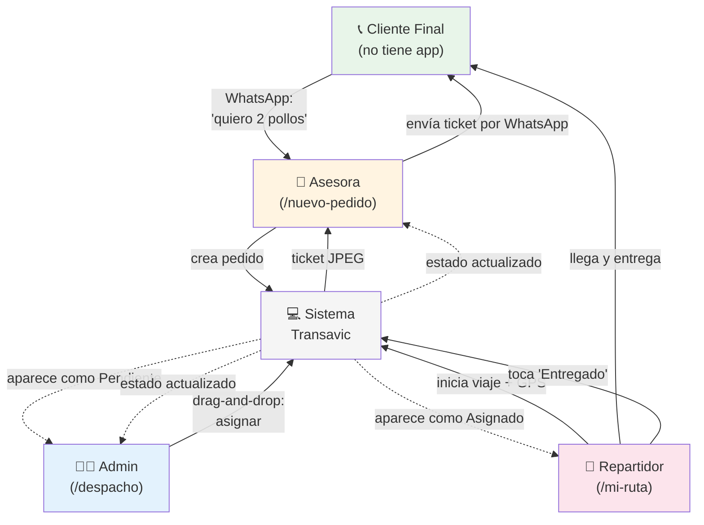
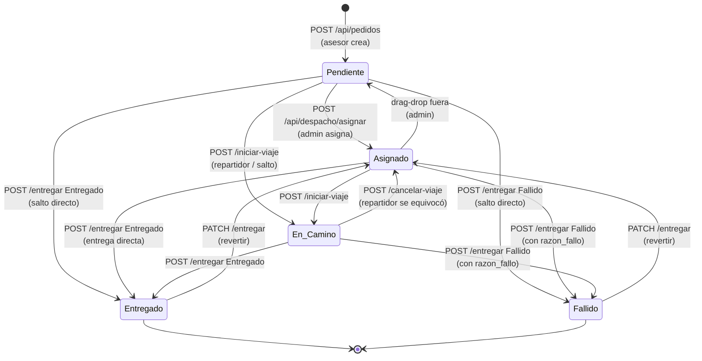

# 04 — Flujos de Negocio

> **Última verificación contra código:** 2026-05-13
> **Última actualización del flujo real:** 2026-05-13 (post-reunión Antonio)
> **Commit del proyecto:** `d2a49cd`
> **Archivos clave:** `src/components/PedidoForm.tsx`, `ClienteAutocomplete.tsx`, `ProductSelector.tsx`, `MapInput.tsx`, `TicketPedido.tsx`, `src/app/dashboard/despacho/despacho-content.tsx`, `mapa-despacho.tsx`, `src/app/dashboard/mi-ruta/mi-ruta-content.tsx`, `src/lib/offline-queue.ts`, `src/app/api/pedidos/[id]/*/route.ts`

---

## 0. El flujo real del negocio (visión humana)

Esta sección documenta **cómo opera realmente el negocio de Antonio en la vida diaria**, según conversaciones con él. Es la fuente de verdad para entender qué tiene que resolver el software. Lo que está implementado hoy (secciones 2-6 de este documento) cubre solo una parte de este flujo — el resto vive en WhatsApp, papeles y cabezas humanas.

### 0.1 Quiénes participan

| Quién | Cuántos | Dónde está físicamente | Qué hace |
|---|---|---|---|
| **Antonio (admin)** | 1 | Itinerante — controla desde el celular | Asigna pedidos a motorizados, supervisa, decide compras, mira números del negocio |
| **Asesoras** | 4 (Leslie, Yoshelin, Sarai, Yesica) | Oficina principal | Reciben pedidos por WhatsApp, los registran en el sistema, **emiten facturas**, **se comunican y cobran al cliente** |
| **Asistente de producción** | 1 | **En otro distrito** que la oficina | Imprime los pedidos del día, **pesa cada producto manualmente**, anota pesos a mano sobre el papel, **prepara las guías**, empaqueta y entrega todo listo al motorizado |
| **Motorizados** | 6 (Marco, Yhorner, Anghelo, …) | En la calle, 18 distritos de Lima | Recogen lo empaquetado del local de producción, reparten al cliente, hacen firmar la guía, mandan foto de la guía firmada a la asesora |
| **Cliente final** | 30 pedidos/día aprox | Cualquiera de los 18 distritos | Pide por WhatsApp a su asesora habitual, recibe el pedido, firma la guía, paga (al momento o a plazo) |

### 0.2 El flujo paso a paso (ejemplo real: Lucy Chiriños)

#### Paso 1 — Pedido entrante (puede ser hoy, mañana, o varios días después)

Lucy le manda WhatsApp a Sarai (su asesora habitual):
> *"Sarai, necesito para mañana 14 pechugas especiales con hueso, sin alas y sin piel. Entre 8 y 9 AM."*

**Sarai abre el sistema** desde la computadora de la oficina:
1. Va a "Nuevo Pedido".
2. Escribe "Lucy" en el buscador → autocompleta dirección, RUC, distrito, WhatsApp, hora de entrega habitual.
3. Elige los productos del catálogo (Pechuga especial con hueso × 14 unidades).
4. Define empresa (`Transavic` o `Avícola de Tony`).
5. Define la fecha de entrega (puede ser **hoy mismo, mañana, o varios días después** — el sistema acepta cualquier fecha).
6. Crea el pedido. El sistema genera un ticket JPEG con todos los datos.
7. Sarai reenvía el ticket por WhatsApp a Lucy como confirmación.

El pedido queda en estado `Pendiente`. **Importante:** el pedido **NO se crea para "hoy" por defecto** — los pedidos llegan con varios días de anticipación normalmente, pero también puede haber para el mismo día.

#### Paso 2 — Producción recibe los pedidos del día

La asistente de producción está en otro distrito, separada físicamente de la oficina. **Su rutina actual** (manual):

1. **Entra al sistema** y filtra los pedidos del día.
2. **Imprime el reporte completo** (la hoja con la lista de los ~13 pedidos del día).
3. Va al área de pesado del local con el papel.
4. Por cada pedido:
   - Lee qué se pidió (ej: "14 unidades de pechuga especial").
   - **Pesa el producto** físicamente.
   - **Anota el peso real a mano** sobre el papel impreso (ej: "14.30 kg").
5. Cuando terminó todos los pesos del día:
   - Toma una **foto del papel con todos los pesos anotados**.
   - **La manda al grupo de WhatsApp de las asesoras** para que cada asesora vea los pesos finales de sus clientes.

**Dolor actual:** los pesos viven solo en el papel y la foto. No están en el sistema. Cada asesora tiene que transcribirlos para emitir facturas. Si se pierde el papel o la foto, se pierde la información.

#### Paso 3 — La asistente prepara la guía de remisión y empaqueta

Por cada pedido, la asistente:

1. Toma una hoja preimpresa de "Orden de Pedido" (formato N° 001939 que vimos en foto).
2. **Llena a mano** los datos: nombre del cliente, dirección, fecha, productos con pesos exactos, monto.
3. Mete la guía dentro de la bolsa del pedido.
4. **Empaqueta todo:** pone los stickers, prepara las bolsas, organiza por cliente.
5. **Entrega todo listo al motorizado** cuando este llega al local de producción.

**Dolor actual:** las guías son 100% manuales. La asistente las escribe a mano para cada pedido del día (~30 guías).

#### Paso 4 — Antonio asigna los pedidos a motorizados

Antonio abre `/dashboard/despacho` desde su celular y ve el tablero kanban:

1. Ve los pedidos del día en la columna "Pendientes".
2. **Arrastra** cada pedido a la columna del motorizado correspondiente (Marco, Yhorner, Anghelo, …).
3. Si los motorizados propios no alcanzan, **arrastra al "Delivery externo"** y pone el nombre del delivery contratado.
4. Toca **"Optimizar Ruta"** por cada motorizado → el sistema reordena los pedidos para minimizar distancia con Google Directions.

**Estado actual del sistema:** esto SÍ está implementado. Funciona bien.

#### Paso 5 — El motorizado reparte

Marco (motorizado) llega al local de producción, **recoge las bolsas ya empaquetadas con sus guías ya escritas por la asistente**, las pone en su moto, y abre `/dashboard/mi-ruta` en el celular.

Por cada pedido:
1. Toca **"Ir al cliente"** → se abre Google Maps con la dirección, el pedido pasa a `En_Camino`.
2. Maneja al cliente.
3. Entrega los productos físicamente.
4. **Le da la guía al cliente, el cliente la firma.**
5. **Toma foto de la guía firmada con el celular.**
6. **Manda la foto por WhatsApp a la asesora correspondiente** (Sarai en este ejemplo).
7. En su app, toca "✅ Entregado". Si no se pudo entregar, toca "❌ No Entregado" y elige razón.

**Dolor actual:** la foto de la guía firmada vive en el WhatsApp del motorizado y la asesora. No queda registrada en el sistema. Si la asesora elimina el chat, se pierde la prueba de entrega.

#### Paso 6 — La asesora emite la factura y cobra

Sarai (la asesora del pedido) recibe la foto de la guía firmada por WhatsApp. Ahora le toca:

1. **Emitir la factura electrónica** en SUNAT — **hoy esto se hace fuera del sistema**, manualmente en el portal del proveedor de facturación que tenga (o el portal de SUNAT directo).
2. **Mandar al cliente por WhatsApp dos cosas:**
   - La foto de la guía firmada.
   - El XML/PDF de la factura electrónica.
3. **Esperar el pago** según lo acordado con el cliente.

**Las modalidades de pago son flexibles:**
- **Al momento de la entrega** (cash en mano del motorizado).
- **A 1 día, 3 días, 7 días, 15 días, o "los lunes"** (clientes recurrentes con cuenta).
- Cualquier combinación según el acuerdo histórico con cada cliente.

Si el cliente no paga en el plazo, la asesora debe llamar/escribir para cobrar. **Hoy no hay alerta automática del sistema** — la asesora se entera tarde cuando revisa manualmente.

#### Paso 7 — Caso especial: el cliente no aprueba los pesos

A veces el cliente, al recibir el pedido, dice "este peso no es lo que pedí" o "no acepto cobrarme esa cantidad". En ese caso:

1. La asesora tiene que **negociar con el cliente** un ajuste de peso o precio.
2. Si llegan a acuerdo, **debe poder modificar los pesos/precios** del pedido en el sistema.
3. Si ya se emitió factura, **debe emitirse una nota de crédito** y/o nueva factura.

**Esto el sistema debe soportarlo de manera flexible** — no asumir que los pesos del momento de pesado son definitivos.

### 0.3 Las 4 áreas y sus "junturas" con fricción

```
   ┌──────────────┐       ┌──────────────┐       ┌──────────────┐       ┌──────────────┐
   │   OFICINA    │ ─[A]─▶│  PRODUCCIÓN  │ ─[B]─▶│   REPARTO    │ ─[C]─▶│   COBRANZA   │
   │  4 asesoras  │       │  1 asistente │       │ 6 motorizad. │       │  4 asesoras  │
   │  (PC oficina)│       │ (otro distr.)│       │ (en la calle)│       │  + Antonio   │
   └──────────────┘       └──────────────┘       └──────────────┘       └──────────────┘
       Pedido entra            Pesa, arma           Entrega, hace            Emite factura,
       al sistema              guía a mano,         firmar guía,             cobra al cliente
                               manda foto WP        manda foto WP            según plazo
```

**Las 4 junturas con fricción actual:**

| Juntura | Cómo se comunica hoy | Dolor |
|---|---|---|
| **[A] Oficina → Producción** | La asistente imprime el reporte del sistema y anota pesos a mano. Después manda foto al grupo WhatsApp. | Pesos viven en papel/foto, no en sistema. Doble digitación si se quiere registrar. |
| **[B] Producción → Reparto** | Las guías se escriben a mano. El motorizado recoge bolsas + guías físicamente. | Tiempo de escritura manual de 30+ guías por día. Errores de transcripción. |
| **[C] Reparto → Cobranza** | Motorizado manda foto de guía firmada por WhatsApp a la asesora. | Foto vive en chat, no en sistema. Si se borra el chat, se pierde la prueba. |
| **[D] Asesora → Cliente final** | Asesora arma la factura manualmente en otro portal. Manda guía + factura por WhatsApp. | Doble trabajo (transcribir pesos, emitir factura, enviar). Sin alerta de pagos vencidos. |

### 0.4 El flujo futuro (con las 8 mejoras integradas)

```
   ┌──────────────┐       ┌──────────────┐       ┌──────────────┐       ┌──────────────┐
   │   OFICINA    │       │  PRODUCCIÓN  │       │   REPARTO    │       │   COBRANZA   │
   │              │       │              │       │              │       │              │
   │ Asesora crea │       │ Asistente    │       │ Motorizado   │       │ Asesora      │
   │ pedido en    │       │ entra al     │       │ entrega y    │       │ emite        │
   │ sistema      │       │ sistema, ve  │       │ sube foto    │       │ factura      │
   │              │       │ cola del día,│       │ guía firmada │       │ con 1 clic   │
   │ (precios     │ ───▶ │ pesa con     │ ───▶ │ desde app    │ ───▶ │ (XML+PDF     │
   │ vigentes     │       │ inputs       │       │              │       │ automático)  │
   │ aplicados)   │       │ digitales    │       │ Sistema      │       │              │
   │              │       │              │       │ guarda foto, │       │ Sistema      │
   │              │       │ Sistema      │       │ NO va a      │       │ avisa a      │
   │              │       │ calcula      │       │ WhatsApp     │       │ asesora si   │
   │              │       │ monto auto.  │       │              │       │ vence pago   │
   │              │       │              │       │ Admin ve GPS │       │              │
   │              │       │ Sistema imp. │       │ en vivo y    │       │              │
   │              │       │ guía digital │       │ ETA al cli.  │       │              │
   └──────┬───────┘       └──────┬───────┘       └──────┬───────┘       └──────┬───────┘
          │                      │                      │                      │
          │                      │                      │                      │
          ▼                      ▼                      ▼                      ▼
   ┌─────────────────────────────────────────────────────────────────────────────────┐
   │   🔔 NOTIFICACIONES AUTOMÁTICAS ENTRE ÁREAS                                      │
   │   Pedido creado → Producción     Pesos listos → Asesora     Entregado → Asesora │
   └─────────────────────────────────────────────────────────────────────────────────┘
          │                                                              │
          └──────────────────────────────┬───────────────────────────────┘
                                         ▼
   ┌─────────────────────────────────────────────────────────────────────────────────┐
   │   🤖 IA COMERCIAL (Gemini Flash Latest, gratis)                                  │
   │   "A Lucy le toca pedir hace 9 días que no compra" / Resumen semanal / Ranking   │
   └─────────────────────────────────────────────────────────────────────────────────┘
```

**Las 4 junturas resueltas:**

| Juntura | Resolución |
|---|---|
| **[A]** | Asistente ingresa pesos directamente en el sistema desde su pantalla. **Mejora 1 + Mejora 4** |
| **[B]** | Sistema imprime guía digital con pesos exactos automáticamente. Numeración correlativa. **Mejora 2** |
| **[C]** | Motorizado sube foto de guía firmada desde la app. Queda en sistema, no en WhatsApp. **Mejora 2 (parte final)** |
| **[D]** | Factura electrónica con 1 clic (SUNAT integrado). Sistema avisa cuando vence pago. **Mejora 6 + Mejora 7** |

### 0.5 Principios de UX que deben regir TODAS las pantallas nuevas

Decisión explícita de Antonio (mayo 2026): aplicar los principios del libro **"No me hagas pensar"** de Steve Krug en todas las pantallas del sistema.

| Principio | Cómo se ve en la práctica |
|---|---|
| **Cada pantalla debe ser auto-evidente** | El usuario sabe qué hacer sin leer instrucciones. |
| **Menos clics, menos decisiones** | Valores por defecto inteligentes (ej: si el cliente paga siempre a 15 días, ese plazo viene pre-cargado). |
| **El siguiente paso es obvio** | El botón principal está claro, distinto del resto, con texto que dice exactamente lo que va a pasar ("Emitir factura" en vez de "Confirmar"). |
| **Mensajes accionables** | Si algo sale mal, decir qué hacer ("La SUNAT rechazó la factura porque el RUC tiene 10 dígitos. Verifica con el cliente y corrige."). |
| **Información donde se necesita** | El monto a cobrar aparece junto al peso, no en una pantalla aparte. |
| **Reducir fricción** | Acciones repetitivas (emitir factura, mandar guía al cliente) deben requerir 1 clic, no 5. |

### 0.6 Reglas de negocio importantes (flexibilidad requerida)

1. **Fechas de pedido flexibles:** un pedido puede ser para hoy, mañana, o cualquier día futuro. El sistema NO debe asumir "para mañana" por defecto.
2. **Plazos de pago flexibles:** un cliente puede pagar al momento, a 1 día, 3 días, 7 días, 15 días, "los lunes", etc. Cada cliente puede tener su propio plazo configurado.
3. **Pesos modificables después de pesado:** si el cliente no acepta los pesos, la asesora debe poder ajustarlos y, si ya se emitió factura, emitir nota de crédito.
4. **Precios fluctuantes:** los precios del pollo, carne, huevos varían diariamente. Antonio (o quien él designe) debe poder actualizar precios todos los días con pocos clics.
5. **Dos empresas conviviendo:** todo el flujo soporta `Transavic` y `Avícola de Tony` con sus respectivos RUCs y branding. Cada pedido pertenece a una sola empresa.

---

## 1. Actores y comunicación



**Quién habla con quién:**
- **Cliente ↔ Asesora**: por WhatsApp (fuera del sistema).
- **Asesora → Sistema**: crea el pedido en la web (`/nuevo-pedido`).
- **Sistema → Asesora**: devuelve un ticket JPEG para reenviar al cliente.
- **Admin → Sistema**: orquesta desde `/despacho` (asigna, optimiza, supervisa).
- **Repartidor → Sistema**: actualiza estado en tiempo real desde `/mi-ruta`.
- **Sistema → todos**: refresca vistas por polling (15s admin, 60s repartidor).

---

## 2. Vida completa de un pedido (paso a paso)

### 2.1 Paso 1: Asesora crea el pedido

**Punto de entrada:** `src/app/dashboard/nuevo-pedido/page.tsx` (server component, líneas 6-9).

```typescript
export default async function NuevoPedidoPage() {
  const asesores = await fetchAsesores();
  return <PedidoForm asesores={asesores} />;
}
```

Pasa la lista de asesoras pre-cargada al form para llenar el select.

#### A. `PedidoForm.tsx` — máquina de estados interna

`src/components/PedidoForm.tsx` (~638 LOC) tiene 3 estados:

```typescript
type AppState = 'editing' | 'previewing' | 'confirmed';
```

- **`editing`** — el asesor llena el formulario.
- **`previewing`** — se generó el ticket JPEG y se está mostrando.
- **`confirmed`** — el pedido se envió a la API exitosamente.

**Estados internos clave** (`PedidoForm.tsx:45-64`):
- `formDatos: TicketData` — todos los campos del pedido.
- `ticketDatos: TicketData | null` — snapshot capturado al pasar a previewing.
- `selectedItems: SelectedItem[]` — productos del ProductSelector.
- `errors: Record<string, string>` — errores por campo.

#### B. `ClienteAutocomplete.tsx` — búsqueda con debounce

`src/components/ClienteAutocomplete.tsx`:

- **Mínimo 2 caracteres** para disparar búsqueda (línea 47).
- **Debounce de 300ms** vía `use-debounce` (línea 73).
- Llama `GET /api/clientes?q=<query>` (línea 55).
- Resultado: lista de hasta 8 clientes que matchean por nombre.

Al seleccionar uno (`handleClienteSelected`, líneas 76-80), **autocompleta** todos estos campos del form en una sola operación:

| Campo del form | Origen |
|---|---|
| `cliente` | `cliente.nombre` |
| `razonSocial` | `cliente.razon_social` |
| `rucDni` | `cliente.ruc_dni` |
| `whatsapp` | `cliente.whatsapp` |
| `direccion` | `cliente.direccion` |
| `distrito` | `cliente.distrito` |
| `tipoCliente` | `cliente.tipo_cliente` |
| `horaEntrega` | `cliente.hora_entrega` |
| `notas` | `cliente.notas` |
| `empresa` | `cliente.empresa` |
| `latitude` | `cliente.latitude` |
| `longitude` | `cliente.longitude` |

**El cliente NO se guarda al asociarlo a un pedido** — eso fue manual previo (en `/dashboard/clientes`). El autocomplete solo facilita reusar datos.

#### C. `MapInput.tsx` — captura de coordenadas (3 modos)

`src/components/MapInput.tsx`:

1. **Click directo en el mapa** (línea 141-150, `handleMapClick`):
   - Captura `event.latLng.lat()`, `event.latLng.lng()`.
   - Dispara reverse geocoding para obtener dirección legible.

2. **Drag del marcador** (línea 153-162, `handleMarkerDragEnd`):
   - Similar a click, captura nueva posición y reverse-geocoda.

3. **Google Places Autocomplete** (líneas 195-203):
   - Input con autocomplete de Places API.
   - Al seleccionar, usa `place.formatted_address` directamente (no necesita reverse geocoding).
   - Libreía: cargada con `useJsApiLoader({ libraries: ['places'] })`.

**Reverse geocoding** (`MapInput.tsx:88-108`):
- Solo se ejecuta si `shouldGeocode === true` (click o drag, no en Places).
- Llama a `new google.maps.Geocoder().geocode({ location })`.
- Usa el primer resultado `formatted_address`.

**Coordenadas son obligatorias** — el form valida `latitude` y `longitude` no-null antes de submit (validación en `PedidoForm.tsx`).

#### D. `ProductSelector.tsx` — carrito de productos

`src/components/ProductSelector.tsx`:

- **Categorías**: Pollo 🐔, Carnes 🥩, Huevos 🥚 (líneas 22-26).
- **Carga catálogo**: `GET /api/productos` filtrado por `activo = TRUE` (línea 53).
- **Agregar producto**: click → si no está en el carrito, agrega con `cantidad: 1` y `unidad: primera opción del producto` (líneas 83-95).
- **Cantidades**: input numérico con `step="0.5"`, acepta decimales (línea 99) — fundamental porque el negocio vende **a peso**.
- **Unidades múltiples**: algunos productos tienen `unidad: "uni/kg"` — el usuario puede alternar al ingresarlo.
- **Output**: array `SelectedItem[]` con `{ productoId, nombre, cantidad, unidad }`.

**El `detalle` (string) que se guarda en `pedidos.detalle`** lo arma `PedidoForm` concatenando: `"2 uni - Pollo entero\n5 kg - Pechuga deshuesada"`.

**⚠️ `PesoModal` NO se usa en este flujo.** Es para registrar el **peso real post-entrega** (modifica `pedidos.detalle_final`).

#### E. `TimeRangePicker.tsx` — rango horario de entrega

`src/components/TimeRangePicker.tsx`:

- 2 selects: "Desde" y "Hasta".
- Opciones cada 15 minutos de **5:00 AM a 11:00 PM** (líneas 14-26).
- **Output**: string concatenado `"HH:MM AM - HH:MM PM"` (ej: `"10:00 AM - 12:00 PM"`).
- Solo "Desde" es obligatorio; "Hasta" puede quedar vacío.

#### F. Submit → preview → confirmación

**Flow en `PedidoForm.tsx` al hacer submit (estado `editing`):**

1. Validar campos obligatorios (cliente, whatsapp, detalle, dirección, coords).
2. Si todo OK → estado pasa a `'previewing'`.
3. Se renderiza `<TicketPedido ref={exportTicketRef} datos={ticketDatos} />` fuera de pantalla.
4. `useEffect` espera a que el logo cargue (callback `onLogoReady`) y luego:
   ```typescript
   const jpegBlob = await toJpeg(exportTicketRef.current, {
     quality: 0.95,
     pixelRatio: 2.5,
     cacheBust: true,
   });
   ```
5. Muestra el JPEG en la UI.
6. **Asesora confirma** → POST `/api/pedidos` con payload completo + `items: SelectedItem[]`.
7. Si la API retorna 201 → estado pasa a `'confirmed'`.
8. Botón "Compartir por WhatsApp" → `navigator.share({ files: [jpegFile], title: ..., text: ... })`.

**Payload de `POST /api/pedidos`** (verificado en `api/pedidos/route.ts:18-39`, schema `PedidoSchema`):

```typescript
{
  cliente: string,            // requerido
  clienteId: string | null,   // si vino de autocomplete
  whatsapp?: string,
  direccion?: string,
  direccionMapa?: string,
  distrito: string,
  tipoCliente: string,
  detalle: string,            // requerido
  horaEntrega?: string,
  razonSocial?: string,
  rucDni?: string,
  notas?: string,
  empresa: string,            // 'Transavic' | 'Avícola de Tony'
  fecha: string,              // YYYY-MM-DD
  latitude?: number,
  longitude?: number,
  asesorId: string,           // UUID — requerido
  items: [{ productoId, nombre, cantidad, unidad }]
}
```

#### G. Side effects del INSERT

`api/pedidos/route.ts:105-123` ejecuta dos pasos:

1. **INSERT en `pedidos`** retornando el `id` generado.
2. **Por cada item del array**, INSERT en `pedido_items` con `pedido_id = <id retornado>`.

**⚠️ No es transaccional.** Si falla el INSERT del item 3 de 5, los anteriores quedan. No hay rollback. Riesgo bajo en práctica porque Neon es muy estable, pero **deuda técnica**: envolver en `BEGIN ... COMMIT` o usar una sola query con `INSERT ... SELECT FROM UNNEST(...)`.

**Estado inicial:** `estado = 'Pendiente'`, `entregado = FALSE`. El pedido espera ser asignado por el admin.

---

### 2.2 Paso 2: Admin asigna a un repartidor

**Punto de entrada:** `src/app/dashboard/despacho/page.tsx` → `despacho-content.tsx` (~1506 LOC).

#### A. Lo que carga `/dashboard/despacho`

`GET /api/despacho` devuelve un objeto con 5 colecciones (verificado en `api/despacho/route.ts:34-130`):

```typescript
{
  pendientes: PedidoRuta[],              // del día, sin asignar, no externos
  pendientesAnteriores: PedidoRuta[],    // de la semana, sin asignar, sin completar
  pedidosExternos: PedidoRuta[],         // asignados a delivery externo (de la semana)
  repartidores: [{
    id, name, role,
    pedidos: PedidoRuta[]                // sus pedidos del día ordenados
  }],
  baseLocation: { lat, lng, address, name }
}
```

**Polling**: el componente refresca esta data **cada 15 segundos** (`useEffect` con `setInterval(fetchData, 15000)` en `despacho-content.tsx`).

#### B. Layout visual

```
┌──────────────────────────────────────────────────────────────┐
│ Stats Header (sticky): sin asignar / en camino / entregados  │
│                                          [📍 Base] [↻ Refresh]│
├──────────────────────┬───────────────────────────────────────┤
│ Columna izquierda    │ Columnas derechas (grid responsivo)   │
│ ─ Filtro distritos   │ ┌──────────┬──────────┬─────────────┐ │
│ ─ PENDIENTES del día │ │ Repartid.│ Repartid.│ Delivery Ext│ │
│   ┌─ Pedido (card)   │ │ Marco    │ Yhorner  │             │ │
│   ├─ Pedido          │ │ ─ Pedido │ ─ Pedido │ ─ Pedido    │ │
│   └─ ...             │ │ ─ Pedido │ ─ Pedido │             │ │
│                      │ │ [🧭 Opt] │          │             │ │
│ ─ Anteriores (col.)  │ └──────────┴──────────┴─────────────┘ │
├──────────────────────┴───────────────────────────────────────┤
│  Mapa interactivo (lazy-loaded, opcional)                    │
└──────────────────────────────────────────────────────────────┘
```

#### C. Drag-and-drop con `@hello-pangea/dnd`

Tres casos manejados en `despacho-content.tsx:1006-1141` (handler `onDragEnd`):

**Caso 1: Pendientes → Repartidor (o Delivery Externo)** (líneas 1014-1064):
- Si el destino es la zona "Delivery Externo" → `prompt()` pide nombre del delivery → `POST /api/despacho/asignar-externo`.
- Si el destino es un repartidor → `POST /api/despacho/asignar` con `{ pedido_ids: [id], repartidor_id }`.
- **Optimistic**: el pedido se mueve visualmente al destino antes de esperar respuesta.

**Caso 2: Reordenar dentro del mismo repartidor** (líneas 1067-1099):
- Se reordena el array localmente.
- `PATCH /api/despacho/reordenar` con `{ repartidor_id, orden: [{ pedido_id, orden_ruta }, ...] }`.

**Caso 3: Mover entre repartidores** (líneas 1102-1141):
- Mismo `POST /api/despacho/asignar` (reasigna `repartidor_id`).

**Restricción:** los pedidos en estado `Entregado` o `En_Camino` **no son arrastrables** (`isDragDisabled` prop en `Draggable`).

#### D. Side effects de `POST /api/despacho/asignar`

`api/despacho/asignar/route.ts:43-128`:

1. **Obtener `base_location`** desde `settings`, con fallback a env vars y luego centro de Lima.
2. **Calcular `currentOrden`** = `MAX(orden_ruta) + 1` para los pedidos del repartidor hoy.
3. **Para cada `pedido_id`**:
   - Llamar a Google Directions con `origin = baseLocation`, `destination = pedido.coords`, `mode = driving`.
   - Si Google responde OK: extraer `distance.value` (metros) y `duration.value` (segundos), convertir.
   - Si Google falla o no hay key: **fallback Haversine** (línea 144-156).
   - UPDATE pedido: `repartidor_id`, `estado = 'Asignado'`, `orden_ruta = currentOrden++`, `distancia_km`, `duracion_estimada_min`.

**Side effect externo:** 1 llamada a Google Directions por pedido (puede ser N llamadas si se asignan en batch).

#### E. Optimización de ruta

**Botón "🧭 Optimizar Ruta"** aparece si el repartidor tiene ≥2 pedidos activos (no completados).

`POST /api/despacho/optimizar-ruta` con `{ repartidor_id }`:

1. Cargar pedidos activos del repartidor (`estado NOT IN ('Entregado','Fallido')`, `latitude/longitude IS NOT NULL`).
2. Si solo 1 pedido → calcular distancia directa y retornar.
3. Si ≥2: llamar a Google Directions **una sola vez** con `waypoints=optimize:true|<all_coords>` (límite 25 waypoints).
4. Google retorna `waypoint_order` (orden óptimo de los waypoints intermedios).
5. Reasignar `orden_ruta` según ese orden y actualizar `duracion_estimada_min` acumulada.
6. **NO actualiza `distancia_km`** — ese se preserva como "distancia desde la base" (ver doc 02 §3).

Si hay >25 pedidos, los excedentes se asignan secuencialmente al final sin optimización (líneas 213-222).

#### F. Mapa lateral (`mapa-despacho.tsx`)

- **Markers por estado** con colores diferenciados (Pendiente=ámbar, Asignado=azul, En_Camino=índigo, Entregado=verde, Fallido=rojo).
- **Polylines** que conectan pedidos del mismo repartidor (color único por repartidor).
- **Marker especial** 🏭 para `base_location`.
- **InfoWindow** al hacer click en un marker: muestra cliente, dirección, WhatsApp clickeable, estado, ETA.
- **Filtros laterales** para toggle por estado o por repartidor.

#### G. Modal de "Ubicación base"

Botón "📍 Base" en header → abre `BaseLocationModal` (`despacho-content.tsx:526-703`):

- Input nombre del local.
- Mapa interactivo con Places Autocomplete.
- Botón "📍 Usar mi ubicación actual" (`navigator.geolocation`).
- Al confirmar: `POST /api/settings` con `{ key: 'base_location', value: { lat, lng, address, name } }`.

---

### 2.3 Paso 3: Repartidor inicia viaje

**Punto de entrada:** `src/app/dashboard/mi-ruta/mi-ruta-content.tsx` (~1450 LOC).

#### A. Lo que carga `/dashboard/mi-ruta`

`GET /api/repartidor/mi-ruta` (verificado en `api/repartidor/mi-ruta/route.ts:8-89`) devuelve:

```typescript
{
  pedidos: PedidoRuta[],
  stats: { total, entregados, fallidos, completados, pendientes },
  rutaResumen: {
    paradasRestantes: number,
    distanciaTotalKm: number,
    duracionTotalMin: number
  },
  pedidoActivo: PedidoRuta | null,    // el que está En_Camino, si hay
  baseLocation: { lat, lng, address, name }
}
```

**Polling**: refresca cada **60 segundos** (menos agresivo que admin porque la batería es crítica).

#### B. Layout móvil-first

```
┌───────────────────────────────┐
│ 🚚 Mi Ruta   [Sync ✓][↻]      │ ← header sticky
├───────────────────────────────┤
│ Banner online/offline         │ ← solo si offline
├───────────────────────────────┤
│ Mapa colapsable               │ ← toggle visible/oculto
├───────────────────────────────┤
│ Progress bar + stats          │
│ Botón "🧭 Optimizar Ruta"     │ ← solo si ≥2 activos
├───────────────────────────────┤
│ Pedido EN_CAMINO (hero card)  │ ← arriba, con animación bounce
├───────────────────────────────┤
│ Pedidos ASIGNADOS (acordeón)  │
│ ─ #1 Cliente A                │
│ ─ #2 Cliente B                │
├───────────────────────────────┤
│ ─── Pedidos completados ───   │ ← divisor
│ ✓ Cliente C  [↩]              │ ← compactos
│ ✗ Cliente D  [↩]              │
└───────────────────────────────┘
```

#### C. Acciones del repartidor → transiciones de estado

**Botón "🚀 Ir al cliente"** (estado Asignado o Pendiente):

```typescript
// Pseudo del flow en mi-ruta-content.tsx:1027-1043
const payload = driverPosition
  ? { driverLat: driverPosition.lat, driverLng: driverPosition.lng }
  : {};

if (!isOnline()) {
  enqueueAction('iniciar-viaje', pedidoId, expectedEstado, payload);
  // Optimistic: actualiza UI local a En_Camino
  return;
}

const res = await fetch(`/api/pedidos/${pedidoId}/iniciar-viaje`, {
  method: 'POST',
  body: JSON.stringify(payload),
});
const { navegacion } = await res.json();
if (navegacion?.googleMaps) window.open(navegacion.googleMaps, '_blank');
```

**Lo que hace `POST /api/pedidos/[id]/iniciar-viaje`** (`api/pedidos/[id]/iniciar-viaje/route.ts:52-148`):

1. Verifica que `estado` sea `'Asignado'` o `'Pendiente'`.
2. Lee `driverLat`, `driverLng` del body (opcional).
3. **Cascada para elegir origen del ETA**:
   - GPS real del repartidor (si se envió).
   - Último pedido entregado del día por este repartidor (`SELECT ... WHERE repartidor_id = $1 AND estado = 'Entregado' ORDER BY entregado_at DESC LIMIT 1`).
   - Env vars `BASE_LATITUDE`/`BASE_LONGITUDE`.
   - Hardcoded centro de Lima.
4. Llama a Google Directions con `origin → destination`. Extrae `duration.value` (segundos).
5. Calcula `etaDate = new Date(Date.now() + durationSeconds * 1000)`.
6. UPDATE pedido: `estado = 'En_Camino'`, `inicio_viaje_at = now`, `hora_llegada_estimada = etaDate`, `entregado = FALSE`.
7. Retorna URLs de navegación externa:
   ```json
   {
     "navegacion": {
       "googleMaps": "https://www.google.com/maps/dir/?api=1&destination=<lat>,<lng>&travelmode=driving",
       "waze": "https://waze.com/ul?ll=<lat>,<lng>&navigate=yes"
     }
   }
   ```

**Botón "✅ Entregado"** o **"❌ No Entregado"** (estado Asignado, En_Camino o Pendiente):

`POST /api/pedidos/[id]/entregar` con body:
```json
{ "resultado": "Entregado" }
// O para fallo:
{ "resultado": "Fallido", "razon_fallo": "Cliente no se encontraba" }
```

**Schema con refine condicional** (`api/pedidos/[id]/entregar/route.ts:9-15`):

```typescript
const EntregarSchema = z.object({
  resultado: z.enum(["Entregado", "Fallido"]),
  razon_fallo: z.string().min(5, "La razón debe tener al menos 5 caracteres.").optional(),
}).refine(
  (data) => data.resultado !== "Fallido" || (data.razon_fallo && data.razon_fallo.length >= 5),
  { message: "Debes indicar la razón por la que no se entregó.", path: ["razon_fallo"] }
);
```

**Side effects**:
- Si `'Entregado'`: `estado = 'Entregado'`, `entregado = TRUE`, `entregado_por = session.user.name`, `entregado_at = now`, `razon_fallo = NULL`.
- Si `'Fallido'`: `estado = 'Fallido'`, `entregado = FALSE`, `razon_fallo = <razon>`, `entregado_por`, `entregado_at = now`.

**Modal de razón de fallo** (`mi-ruta-content.tsx:827-915`) tiene 5 opciones predefinidas + opción "Otra razón..." con textarea:
- "Cliente no se encontraba"
- "Dirección incorrecta"
- "Cliente rechazó el pedido"
- "No se pudo ubicar la dirección"
- "Producto dañado en el camino"
- (Otra razón) — abre textarea custom

**Botón "↩️ Cancelar viaje"** (estado En_Camino, si el repartidor se equivocó de pedido):

`POST /api/pedidos/[id]/cancelar-viaje` (`api/pedidos/[id]/cancelar-viaje/route.ts:32-58`):

- Verifica que `estado === 'En_Camino'`.
- UPDATE: `estado = 'Asignado'`, `inicio_viaje_at = NULL`, `hora_llegada_estimada = NULL`.

**Botón "↩️ Revertir"** (en cards de pedidos completados Entregado/Fallido):

`PATCH /api/pedidos/[id]/entregar` (sin body, `api/pedidos/[id]/entregar/route.ts:107-156`):

- Verifica que `estado` sea `'Entregado'` o `'Fallido'`.
- UPDATE: `estado = 'Asignado'`, `entregado = FALSE`, `entregado_por = NULL`, `entregado_at = NULL`, `razon_fallo = NULL`, `inicio_viaje_at = NULL`, `hora_llegada_estimada = NULL`.

#### D. GPS bajo demanda

`mi-ruta-content.tsx` solo activa `geolocation.watchPosition` cuando:
- El mapa está visible (toggle del usuario), **O**
- Hay un pedido `En_Camino` activo.

**Implementación**: hook `useGeolocation({ enabled })` que activa/desactiva el watcher. Esto preserva batería significativamente — un watcher de GPS continuo consume mucha en background.

#### E. Botones de navegación externa

Cuando el pedido está En_Camino, aparecen 2 botones:

```typescript
// mi-ruta-content.tsx:191-221 (NavButtons)
<a href={`https://www.google.com/maps/dir/?api=1&destination=${lat},${lng}&travelmode=driving`} target="_blank">
  Google Maps
</a>
<a href={`https://waze.com/ul?ll=${lat},${lng}&navigate=yes`} target="_blank">
  Waze
</a>
```

Abren la app nativa de navegación en el celular del repartidor.

---

## 3. Máquina de estados completa



### 3.1 Reglas críticas

| Regla | Donde se aplica |
|---|---|
| `Fallido` requiere `razon_fallo` ≥5 caracteres | `api/pedidos/[id]/entregar/route.ts:9-15` (zod refine) |
| `Entregado` debe llenar `entregado_por` desde `session.user.name` | `entregar/route.ts:81-88` |
| `cancelar-viaje` solo permite origen `En_Camino` | `cancelar-viaje/route.ts:41-46` |
| `iniciar-viaje` permite `Asignado` **o** `Pendiente` como origen | `iniciar-viaje/route.ts:48-52` |
| `entregar` permite `Asignado`, `En_Camino` **o** `Pendiente` | `entregar/route.ts:66` |
| PATCH `entregar` (revertir) solo desde `Entregado` o `Fallido` | `entregar/route.ts:135-141` |
| Volver a `Pendiente` en update genérico limpia `repartidor_id`, `orden_ruta`, `entregado_por`, etc. | `api/pedidos/[id]/route.ts:91-99` |

### 3.2 Por qué hay saltos directos

**Asignado → Entregado** (sin pasar por En_Camino): caso típico de **venta mostrador**, cuando el cliente viene a recoger al local. Ahorra al repartidor tocar "Ir al cliente" antes de "Entregado".

**Pendiente → cualquiera**: edge case útil cuando el admin quiere marcar un pedido sin tener que asignarlo formalmente (raro pero soportado).

### 3.3 Side effects de cada transición — tabla maestra

| Transición | Endpoint | Método | Body | Columnas mutadas | Side effects externos |
|---|---|---|---|---|---|
| (crear) → Pendiente | `/api/pedidos` | POST | Schema completo | INSERT pedidos + N×INSERT pedido_items | - |
| Pendiente → Asignado | `/api/despacho/asignar` | POST | `{pedido_ids[], repartidor_id}` | `repartidor_id`, `estado='Asignado'`, `orden_ruta`, `distancia_km`, `duracion_estimada_min` | Google Directions (1× por pedido) |
| Pendiente → Asignado (externo) | `/api/despacho/asignar-externo` | POST | `{pedido_id, nombre_delivery}` | `es_delivery_externo=true`, `delivery_externo_nombre`, `estado='Asignado'`, `repartidor_id=NULL` | - |
| Asignado/Pendiente → En_Camino | `/api/pedidos/[id]/iniciar-viaje` | POST | `{driverLat?, driverLng?}` | `estado='En_Camino'`, `inicio_viaje_at`, `hora_llegada_estimada`, `entregado=FALSE` | Google Directions (1×) |
| Asignado/En_Camino/Pendiente → Entregado | `/api/pedidos/[id]/entregar` | POST | `{resultado:'Entregado'}` | `estado='Entregado'`, `entregado=TRUE`, `entregado_por`, `entregado_at`, `razon_fallo=NULL` | - |
| Asignado/En_Camino/Pendiente → Fallido | `/api/pedidos/[id]/entregar` | POST | `{resultado:'Fallido', razon_fallo}` | `estado='Fallido'`, `entregado=FALSE`, `razon_fallo`, `entregado_por`, `entregado_at` | - |
| En_Camino → Asignado | `/api/pedidos/[id]/cancelar-viaje` | POST | - | `estado='Asignado'`, `inicio_viaje_at=NULL`, `hora_llegada_estimada=NULL` | - |
| Entregado/Fallido → Asignado | `/api/pedidos/[id]/entregar` | PATCH | - | Limpia entregado_por, entregado_at, razon_fallo, inicio_viaje_at, hora_llegada_estimada, estado='Asignado' | - |
| (reordenar mismo repartidor) | `/api/despacho/reordenar` | PATCH | `{repartidor_id, orden[]}` | `orden_ruta` por pedido | - |
| (optimizar ruta) | `/api/despacho/optimizar-ruta` | POST | `{repartidor_id}` | `orden_ruta`, `duracion_estimada_min` (NO toca `distancia_km`) | Google Directions con waypoints (1× para todos los pedidos del repartidor) |
| Delivery externo → Entregado/Fallido | `/api/despacho/asignar-externo` | PATCH | `{pedido_id, estado, razon_fallo?}` | `estado`, `entregado` (legacy), `entregado_at`, `razon_fallo` | - |
| Delivery externo → Pendiente (desasignar) | `/api/despacho/asignar-externo` | DELETE | `{pedido_id}` | `es_delivery_externo=false`, `delivery_externo_nombre=NULL`, `estado='Pendiente'`, `repartidor_id=NULL` | - |

---

## 4. Offline-first del repartidor (deep dive)

### 4.1 Por qué existe

El motorizado está en la calle, en la moto, con conectividad inestable. Si el sistema fuera puramente online, el repartidor:
- No podría marcar como Entregado en zonas sin señal.
- Acumularía pedidos sin sincronizar y al volver a la oficina tendría que actualizar a mano.

**Solución:** cuando una acción falla por estar offline, se **encola en `localStorage`** y se reintenta cuando vuelve la conexión.

### 4.2 Storage

**`src/lib/offline-queue.ts:20`**:

```typescript
const STORAGE_KEY = "transavic_offline_queue";
```

Es **`localStorage`** (no IndexedDB). Capacidad típica: 5-10 MB. Suficiente para una jornada del repartidor (cientos de eventos como máximo, cada uno ~200 bytes).

### 4.3 Estructura de cada acción encolada

```typescript
interface QueuedAction {
  id: string;                  // UUID generado al encolar
  timestamp: number;           // Date.now()
  type: "entregar" | "fallido" | "iniciar-viaje";
  pedidoId: string;
  expectedEstado: string;      // El estado que esperaba que tuviera el pedido al ejecutar
  payload: Record<string, unknown>;  // El body que se va a enviar
  retries: number;             // Comienza en 0
}
```

### 4.4 Tipos de acciones encoladas

Solo 3 tipos (de `offline-queue.ts:7`):
- `"entregar"` → POST `/api/pedidos/[id]/entregar` body `{resultado: "Entregado"}`
- `"fallido"` → POST `/api/pedidos/[id]/entregar` body `{resultado: "Fallido", razon_fallo}`
- `"iniciar-viaje"` → POST `/api/pedidos/[id]/iniciar-viaje` body `{driverLat?, driverLng?}`

**NO se encolan**: cancelar-viaje, reverts (PATCH /entregar), modificación de cliente, etc. — son acciones menos críticas que pueden fallar sin major impact.

### 4.5 Flow de enqueue

```typescript
// mi-ruta-content.tsx, en handlers de botones:
if (!isOnline()) {
  enqueueAction(type, pedidoId, expectedEstado, payload);
  // Optimistic update: mover el pedido al nuevo estado en UI local
  setPedidos(prev => prev.map(p => p.id === pedidoId ? { ...p, estado: newEstado } : p));
  setQueueCount(getQueueCount());
  return;
}
// Si está online, hace fetch normal
```

**Importante:** la UI se actualiza **inmediatamente** aunque la acción se haya solo encolado. Esto es UX crítica — el repartidor no debe esperar.

**Indicador visual**: bajo la card del pedido aparece un badge amarillo "⏳ Sin sincronizar — se enviará al reconectar".

### 4.6 Flow de sync

`syncQueue()` se dispara automáticamente cuando:
- El evento `window.addEventListener('online', ...)` se dispara (vuelta de internet).
- Cada vez que el usuario hace pull-to-refresh o toca el botón refresh.

**Algoritmo** (`offline-queue.ts:63-133`):

```typescript
for (const action of queue) {
  const { url, body } = buildRequest(action);

  try {
    const res = await fetch(url, { method: 'POST', body });

    if (res.ok) {
      removeAction(action.id);        // 200 → quitar de cola
      result.synced++;
    } else if (res.status === 400 || res.status === 409) {
      removeAction(action.id);        // 4xx → conflicto (estado cambió en servidor)
      result.conflicts.push({ action, reason: await res.text() });
    } else {
      action.retries++;
      if (action.retries >= MAX_RETRIES) {
        removeAction(action.id);
        result.failed++;
      } else {
        updateAction(action);          // 5xx → reintentar después
      }
    }
  } catch (error) {                    // Network error → reintentar
    action.retries++;
    if (action.retries >= MAX_RETRIES) {
      removeAction(action.id);
      result.failed++;
    } else {
      updateAction(action);
    }
  }
}
```

**Manejo de conflictos** (400/409): si el servidor responde 4xx, significa que **el estado del pedido cambió en backend** entre el momento de encolar y el de sincronizar (ej: el admin ya marcó el pedido como Entregado, o lo desasignó). En ese caso, **se descarta la acción** sin error — el estado del servidor es la fuente de verdad.

**Banner de resultado**: después del sync, se muestra "✓ Sincronizado N pedidos" (verde) o "⚠️ Hubo M conflictos al sincronizar" (amarillo), desaparece en 4s.

### 4.7 Por qué el conflict resolution es importante

Caso real: repartidor en zona sin señal marca "Entregado" un pedido. Mientras tanto, el admin desde la oficina lo marca como "Fallido" (por algún motivo administrativo) y reasigna a otro repartidor.

Cuando vuelve la señal:
- La acción `entregar` se envía con `expectedEstado='En_Camino'`.
- El servidor ve que el pedido ya está en `Fallido` y devuelve 400.
- La queue **descarta** la acción (no la reintenta) — el estado del servidor prevalece.

Esto **evita inconsistencias** y race conditions. El repartidor ve la UI actualizada al refrescar.

---

## 5. Patrones de UI por rol

### 5.1 `/dashboard/nuevo-pedido` (asesor / admin)

- **Wizard implícito**: editing → previewing → confirmed (sin componente Wizard, solo estados).
- **Autocomplete** para clientes existentes (debounce 300ms).
- **Mapa obligatorio** para coords (3 modos de entrada).
- **Ticket JPEG** generado con `html-to-image` (calidad 0.95, pixelRatio 2.5).
- **Compartir nativo** con `navigator.share` (Web Share API).
- **Selector de empresa** (Transavic vs Avícola de Tony) cambia branding del ticket.

### 5.2 `/dashboard/despacho` (admin)

- **Auto-refresh 15s** (silencioso, sin spinner).
- **Drag-and-drop** con `@hello-pangea/dnd` para 3 operaciones.
- **Optimistic updates** en todos los drags (UI se mueve antes de API).
- **Mapa lateral** con markers diferenciados.
- **Modal base_location** editable con Places Autocomplete.
- **Botón "Optimizar ruta"** por repartidor (visible si ≥2 activos).
- **Filtros por distrito** en columna de pendientes.
- **Acordeón por repartidor** con header sticky, totales km/min/paradas, barra de progreso.

### 5.3 `/dashboard/mi-ruta` (repartidor)

- **Mobile-first** con sticky header y botones grandes.
- **Auto-refresh 60s** (menos agresivo por batería).
- **Mapa colapsable** (toggle visible/oculto, default oculto).
- **GPS bajo demanda** (solo si mapa visible o pedido En_Camino).
- **Pedido En_Camino "hero"** arriba con animación bounce y card más grande.
- **Acordeón** del resto de pedidos por estado.
- **Modal con 5 razones predefinidas** para fallos.
- **Offline queue** con badge "Sin sincronizar".
- **Botones a Google Maps / Waze** abren app nativa de navegación.
- **Pantalla "🎉 Ruta completada"** cuando `stats.completados === stats.total`.
- **VersionChecker** activo (forzar reload si hay nuevo deploy).
- **Botón "Optimizar Ruta"** también disponible para el repartidor (no solo admin).
- **Botón "↩️ Revertir"** en cada card completada (Entregado/Fallido → Asignado).

### 5.4 Otras pantallas

| Pantalla | Para qué |
|---|---|
| `/dashboard` | Lista paginada de pedidos (25/pág) con filtros y búsqueda. Redirige a `/mi-ruta` si rol=repartidor. |
| `/dashboard/clientes` | CRUD de clientes con filtro por asesora (admin) o solo los propios (asesor). |
| `/dashboard/productos` | CRUD del catálogo (admin only). |
| `/dashboard/users` | CRUD de usuarios (admin only). |
| `/dashboard/analytics` | KPIs, top productos, ranking de asesoras, ventas por día, por distrito, por empresa. |
| `/dashboard/resumen` | Reporte diario con totales por producto (la "lista de compras" del día siguiente). |

---

## 6. Casos especiales

### 6.1 Delivery externo

Cuando los repartidores propios no se abastecen, el admin puede asignar a un **delivery externo** (Glovo, Rappi, repartidor freelance, etc.).

**Flujo:**
1. Admin arrastra pendiente a la zona "Delivery Externo" en `/despacho`.
2. Modal `prompt()` pide el nombre del delivery.
3. `POST /api/despacho/asignar-externo` con `{ pedido_id, nombre_delivery }`.
4. UPDATE: `es_delivery_externo = true`, `delivery_externo_nombre = nombre`, `estado = 'Asignado'`, `repartidor_id = NULL`.

**Diferencias con asignación normal:**
- `repartidor_id` queda `NULL` (no es un usuario del sistema).
- El pedido aparece en una **columna separada** del mapa kanban.
- **No tiene tracking GPS** (el delivery externo no usa nuestra app).
- Se marca manualmente como Entregado/Fallido desde la admin con `PATCH /api/despacho/asignar-externo`.

### 6.2 Pedido fallido con razón

Cuando una entrega falla, se requiere obligatoriamente una `razon_fallo` ≥5 caracteres.

**5 razones predefinidas** (mejora UX vs textarea libre):
- "Cliente no se encontraba"
- "Dirección incorrecta"
- "Cliente rechazó el pedido"
- "No se pudo ubicar la dirección"
- "Producto dañado en el camino"

**Opción custom**: "Otra razón..." abre un textarea donde se escribe libremente (mínimo 5 chars validado en backend).

### 6.3 Revertir una entrega o un fallo

Si el repartidor (o admin) marcó por error un pedido como Entregado o Fallido, se puede revertir:

- Botón "↩️" en la card compacta del pedido completado.
- `PATCH /api/pedidos/[id]/entregar` (sin body).
- El pedido vuelve a `Asignado`, limpia `entregado_por`, `entregado_at`, `razon_fallo`, `inicio_viaje_at`, `hora_llegada_estimada`.

**No se puede revertir** de `Asignado` o `En_Camino` con este endpoint — solo desde estados completados.

### 6.4 Pedidos anteriores no entregados

Si un pedido del lunes no se entregó (quedó en `Pendiente`, `Asignado` o `En_Camino`), aparece en `/despacho` en una **sección colapsable** "Pendientes anteriores" — para que el admin no los pierda de vista.

Query (`api/despacho/route.ts:47-62`):

```sql
WHERE p.fecha_pedido >= date_trunc('week', (NOW() AT TIME ZONE 'America/Lima')::date)
  AND p.fecha_pedido < (NOW() AT TIME ZONE 'America/Lima')::date
  AND p.estado NOT IN ('Entregado', 'Fallido')
  AND p.repartidor_id IS NULL
```

Después del domingo, los pedidos viejos pasan a ser "del próxima semana" y desaparecen de esta vista — quedan en la base pero no se muestran.

---

## 7. Cómo verificar que este documento sigue vigente

```bash
# 1. ¿La máquina de estados sigue con los mismos 5 estados?
grep -n "EstadoPedido =" src/lib/types.ts

# 2. ¿Las transiciones siguen permitidas en cada endpoint?
grep -A 5 "estadosPermitidos\|estado.*Asignado.*Pendiente" src/app/api/pedidos/\[id\]/*/route.ts

# 3. ¿Sigue el debounce de 300ms en ClienteAutocomplete?
grep -n "useDebounce\|debounce" src/components/ClienteAutocomplete.tsx

# 4. ¿Sigue el polling de 15s en despacho y 60s en mi-ruta?
grep -E "setInterval.*[0-9]+" src/app/dashboard/{despacho,mi-ruta}/*.tsx

# 5. ¿Los tipos de acciones de offline-queue siguen siendo 3?
grep "type:" src/lib/offline-queue.ts

# 6. ¿Sigue MAX_RETRIES = 3?
grep "MAX_RETRIES" src/lib/offline-queue.ts

# 7. ¿Aparecen nuevos endpoints de transición en /api/pedidos/[id]/?
ls src/app/api/pedidos/\[id\]/

# 8. ¿Las 5 razones predefinidas siguen siendo las mismas?
grep -A 8 "razonesPredefinidas\|FAILURE_REASONS" src/app/dashboard/mi-ruta/mi-ruta-content.tsx

# 9. ¿Sigue la pantalla "🎉 Ruta completada"?
grep "Ruta completada\|stats.completados === stats.total" src/app/dashboard/mi-ruta/mi-ruta-content.tsx

# 10. ¿Sigue Google Directions con waypoints=optimize:true?
grep "optimize:true" src/app/api/despacho/optimizar-ruta/route.ts
```

Si encuentras drift, actualizá las secciones afectadas y bumpeá la fecha del header.

---

## Siguientes documentos

- **`05-apis-e-integraciones.md`** — referencia técnica de cada endpoint + Google Maps + offline queue como referencia rápida.
