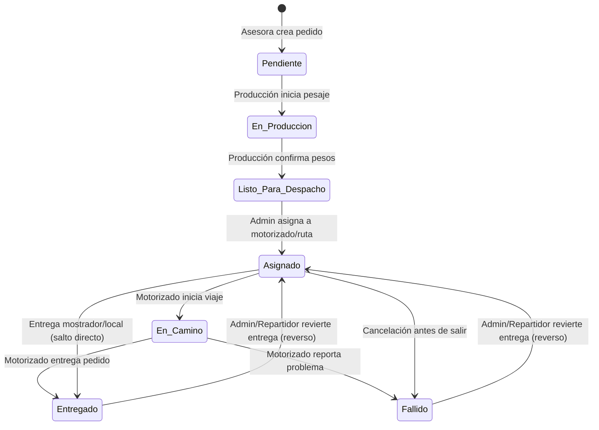

# 04 — Máquina de Estados del Pedido

> **Última verificación contra código:** 2026-06-28
> **Commit del proyecto:** `9f29f5a`
> **Archivos clave:** `src/lib/types.ts` (`EstadoPedido`), `src/app/api/pedidos/[id]/route.ts`, `src/app/api/pedidos/[id]/entregar/route.ts`

Este documento detalla los estados por los que transita un pedido, las reglas de negocio de cada cambio de estado y sus efectos colaterales en la base de datos.

---

## 1. Diagrama de Estados y Transiciones

El ciclo de vida del pedido se compone de **7 estados** (PascalCase con guión bajo):



---

## 2. Definición de los 7 Estados

1. **`Pendiente`**: El pedido ha sido registrado por la asesora en preventa. Aún no se prepara ni pesa.
2. **`En_Produccion`**: El personal de planta ha tomado el pedido para pesarlo en balanza física.
3. **`Listo_Para_Despacho`**: Se han ingresado los pesos reales e importes finales. El pedido espera en almacén.
4. **`Asignado`**: El pedido está asociado a un motorizado y a una secuencia de ruta de entrega (`orden_ruta`).
5. **`En_Camino`**: El motorizado ha iniciado el viaje de entrega. Se habilita el seguimiento GPS obligatorio y el cálculo dinámico de ETA.
6. **`Entregado`**: El pedido fue entregado satisfactoriamente al cliente. Se captura el nombre del entregador, firma digital del cliente y foto del ticket.
7. **`Fallido`**: La entrega no se pudo realizar. Requiere almacenar una razón obligatoria.

---

## 3. Reglas de Negocio de Transiciones

### 3.1 Transiciones Directas (Saltos)
Aunque el flujo ideal es lineal, la máquina de estados permite saltos directos por practicidad:
- **`Asignado` $\rightarrow$ `Entregado` / `Fallido`**: Permite registrar entregas de tipo "venta mostrador" (donde el cliente recoge el pedido en el almacén), ahorrando al motorizado tener que presionar "Iniciar viaje" y luego "Entregar".

### 3.2 Reverso Completo (Volver a Asignado)
Si un repartidor o admin marca un pedido como completado por error, la ruta `PATCH /api/pedidos/[id]/entregar` (sin body) actúa como reversión:
- Limpia los campos: `entregado_por`, `entregado_at`, `razon_fallo`, `inicio_viaje_at`, `hora_llegada_estimada`.
- Sincroniza `entregado = FALSE`.
- Cambia el estado del pedido de vuelta a `Asignado`.

### 3.3 Requisito de Fallido
El estado `Fallido` requiere que se envíe un campo `razon_fallo` (mínimo 5 caracteres) para auditoría del admin, lo cual es validado mediante Zod antes de actualizar la base de datos.

---

## 4. Efectos Colaterales Técnicos (Sync Legacy)

### 4.1 Gotcha del Campo `entregado` (Sincronización Múltiple)
El sistema contiene una columna legacy `entregado` (booleano) y las modernas `estado` (varchar) y `entregado_por` / `entregado_at`. El backend de actualización (`src/app/api/pedidos/[id]/route.ts`) mantiene sincronizados ambos esquemas para evitar romper reportes antiguos:

```typescript
// Al actualizar a Entregado:
if (estado === "Entregado") {
  entregado = true;
  entregado_at = new Date().toISOString();
  entregado_por = session.user.name; // Persona que ejecuta la acción
}

// Al actualizar a Fallido o revertir a Asignado:
if (estado !== "Entregado") {
  entregado = false;
  entregado_at = null;
  entregado_por = null;
}
```

### 4.2 Congelamiento de Distancia
Cuando un pedido pasa al estado `Asignado`, el backend calcula la distancia kilométrica lineal o vía Google Directions entre la ubicación base y el cliente, y la escribe en `distancia_km`. **Esta distancia se congela** y no se recalcula ni modifica durante la optimización de rutas (evita distorsionar el costo original de asignación del cliente).
