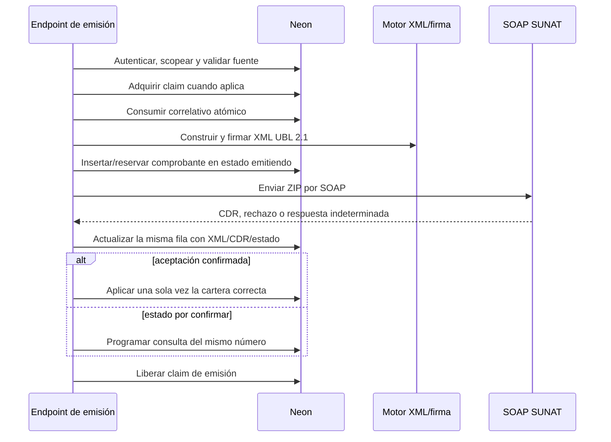

# 11 — Módulo de Facturación y SUNAT (CPE)

> **Última verificación contra código:** 2026-07-20
> **Estado:** motor y reconciliación 01/03 desplegados en producción; migración aplicada/verificada el 20 jul. Siguen pendientes las cuatro credenciales de Consulta Integrada para boletas
> **Archivos clave:** `src/lib/sunat/index.ts`, `xml-builder.ts`, `xml-signer.ts`, `soap-client.ts`, `consulta-integrada-client.ts`, `reconciliacion-cpe.ts`, `efectos-aceptacion-cpe.ts`, `parse-cpe-items.ts`, `fechas.ts`, `src/app/api/comprobantes/`, `src/app/api/cron/reconciliar-cpe-sunat/`

Este documento describe la emisión de facturas (01), boletas (03) y Notas de Crédito (07), incluida la concurrencia, los reintentos y la relación con las tres operaciones de venta.

---

## 1. Empresa emisora y operación de venta

Son conceptos independientes:

- **Empresa:** Transavic o Avícola de Tony. Determina RUC, serie, credenciales SOL, certificado, domicilio fiscal y logo.
- **Operación:** Ejecutivas, Campo o Planta. Determina venta fuente, cartera, permisos, vistas y reportes.

`getSunatConfig(empresa)` en `config-transavic.ts` resuelve la configuración tributaria. La operación se deriva así:

1. `comprobantes.venta_avicola_id` o el del CPE referenciado → Campo.
2. Pedido con `origen='pos_planta'` → Planta.
3. Resto → Ejecutivas.

Consulta el mapa completo en [22-operaciones-ventas-facturacion.md](./22-operaciones-ventas-facturacion.md).

---

## 2. Entradas al motor compartido

| Flujo | Endpoint | Venta fuente |
|---|---|---|
| Desde pedido de Ejecutiva/Planta | `/api/comprobantes/emitir` | `pedidos` + `pedido_items` |
| Emisión manual | `/api/comprobantes/emitir-manual` | datos validados del formulario |
| Campo | `/api/comprobantes/emitir-manual` con `ventaAvicolaId` | `ventas_avicola` + `venta_avicola_items` |
| Autoemisión al entregar | `/api/pedidos/[id]/entregar` | pedido entregado; controlado por flag |
| Nota de Crédito | `/api/comprobantes/[id]/nota-credito` | XML del CPE base |
| Reintento | `/api/comprobantes/[id]/reintentar` | misma fila/XML o `items_json` |

Campo reutiliza el formulario y motor, pero el servidor vuelve a leer la venta, sus ítems y el cliente. No confía en peso, precio, total, empresa ni receptor enviados por el navegador.

---

## 3. Ciclo de emisión y reserva previa

La fila `emitiendo` existe **antes** de la llamada externa. Esto evita que un doble clic consuma dos correlativos o cree dos documentos mientras SUNAT tarda. En factura/boleta, una reserva atascada con más de 15 minutos ya no se presume fallida: pasa a `por_confirmar` y se consulta por su mismo RUC, tipo, serie y número. La reserva atascada de una NC conserva su tratamiento propio.

Los errores de unicidad se traducen a conflictos de dominio (409), no a un 500 genérico.

---

## 4. Claims e índices de concurrencia

### Campo

- `ventas_avicola.facturacion_claim_token/at` serializa desde antes de leer/validar la venta hasta que la fila CPE queda reservada.
- Editar o anular la venta durante el claim devuelve conflicto.
- `ux_comprobantes_venta_avicola_cpe` impide dos CPE 01/03 activos para una venta.
- El token garantiza que una solicitud antigua no libere el claim de otra.

### Nota de Crédito

- `comprobantes.nota_credito_claim_token/at` se adquiere en el CPE base antes de consumir el correlativo.
- `ux_comprobantes_nc_referencia_activa` permite una sola NC activa por CPE base.
- Una NC `error` **con XML firmado** ocupa el cupo hasta reintentar la misma fila/correlativo. Un error
  anterior a tener XML o una NC `rechazado` puede liberar una emisión corregida; la fila anterior
  conserva auditoría.

Los claims vencen tras 15 minutos. El índice es la barrera definitiva; el claim cierra la ventana de negocio antes de insertar.

### Factura/boleta desde pedido

- `pedidos.facturacion_cpe_claim_token/at` serializa la emisión 01/03 desde antes de consumir el correlativo.
- El servidor vuelve a comprobar, dentro del mismo `UPDATE`, que el pedido no tenga otro CPE activo.
- `emitiendo`, `pendiente` y `por_confirmar` son estados bloqueantes: una segunda solicitud recibe 409 y no llama a SUNAT.
- La confirmación manual de un posible duplicado no puede saltarse este bloqueo. Mientras SUNAT no dé un resultado definitivo, **jamás se crea otro correlativo para reemplazarlo**.

### Defensa final de la deuda

La migración agrega dos índices únicos en `facturas`, además de los claims de emisión/postproceso:

- `uq_facturas_comprobante_id_cpe` impide más de una deuda con el mismo `comprobante_id`.
- `uq_facturas_pedido_serie_cpe` impide repetir el mismo pedido + serie-número (`pedido_id`, `numero_comprobante`).

Estos índices protegen incluso si una función muere después del `INSERT` y otro runtime recupera el postproceso. No limpian datos en silencio: si encuentran duplicados históricos, la migración falla y obliga a auditarlos antes de continuar.

---

## 5. Construcción, unidades, IGV y fecha

1. El XML UBL 2.1 se construye en `xml-builder.ts`.
2. Se firma con el certificado `.p12` en `xml-signer.ts`.
3. Se comprime y envía por SOAP mediante `soap-client.ts`.

Reglas:

- Los precios de `productos`, `pedido_items` y Campo se interpretan **con IGV incluido**.
- Por línea: `bruto = round2(precioConIgv * cantidad)`, `base = round2(bruto / 1.18)`, `IGV = bruto - base`. El total queda anclado al precio cobrado.
- Las unidades legales son `KGM` y `NIU`; el helper compartido no debe degradar `KGM` a `NIU`.
- `IssueDate` usa `fechaHoyLima()`; nunca `toISOString()` para definir el día tributario.
- `CitySubdivisionName` se omite si urbanización está vacía; emitirla vacía genera observación 4095.

---

## 6. Respuesta SUNAT, estado indeterminado y reconciliación

`soap-client.ts` descomprime el CDR con `fflate`. La clasificación de factura/boleta es fail-safe:

- CDR legible y aceptación → `aceptado` u `observado`.
- Rechazo tributario concluyente → `rechazado`.
- Reserva en curso → `emitiendo`.
- SOAP Fault **0140** (`Existe un Documento igual en Proceso`), timeout, corte de red, HTTP 5xx, respuesta vacía o CDR ilegible → `por_confirmar`; ninguno prueba rechazo ni autoriza otro correlativo.
- Dos evidencias de ausencia separadas después de la espera inicial —`0011` SOAP para factura o `estadoCp=0` REST normalizado a `0011` para boleta— → `no_registrado`; recién entonces el reintento seguro puede reutilizar la misma fila, XML y número.

`por_confirmar` significa exactamente: **SUNAT pudo haber recibido el comprobante, pero todavía no confirmó su estado final**. La UI lo muestra en ámbar, bloquea “emitir otro”, ofrece **Verificar ahora** y refresca la lista visible cada 60 segundos.

### Matriz operativa de estados

| Estado | Evidencia | Qué debe hacer la asesora/admin |
|---|---|---|
| `aceptado` / `observado` | CDR legible o consulta oficial definitiva (`0001`/`estadoCp=1`) | Es un CPE válido. No emitir otro. Si falta CDR, conservar el estado: en factura F se reintenta recuperar la constancia; una boleta confirmada por Consulta Integrada puede permanecer aceptada sin CDR. |
| `por_confirmar` | `0140`, timeout, HTTP 5xx, respuesta vacía, corte de red o CDR ilegible | No es rechazo. No reenviar ni consumir otro correlativo; cron/**Verificar ahora** consultan el mismo número. |
| `rechazado` | Respuesta tributaria concluyente del CDR o `getStatus=0002` | Corregir la causa. No reintentar ciegamente el mismo XML como si fuera una caída temporal. |
| `no_registrado` | Dos evidencias oficiales de ausencia separadas tras la espera | Reintentar la misma fila, XML y correlativo; nunca crear otro número para la misma venta. |

El XML firmado demuestra qué se generó y envió, pero **no demuestra aceptación**.
Del mismo modo, que no exista un CDR descargable **no demuestra rechazo**. La
aceptación y la disponibilidad de la constancia son dos hechos distintos.

La consulta posterior se separa por tipo; no existe un único servicio válido para ambos:

| CPE | Fuente oficial de verificación | Datos de búsqueda | Resultado utilizable |
|---|---|---|---|
| Factura `01`, serie F | SOAP `billConsultService.getStatus`; después `getStatusCdr` | RUC emisor, tipo, serie y número | `0001` aceptado, `0002` rechazado, `0003` anulado, `0011` no encontrado; puede recuperar CDR |
| Boleta `03`, serie B | API REST **Consulta Integrada de Comprobantes de Pago** | RUC emisor, tipo, serie, número, fecha de emisión y monto exacto | `estadoCp=1` aceptado, `estadoCp=2` anulado, `estadoCp=0` no encontrado; no devuelve CDR ni rechazo |

`billConsultService` oficialmente admite factura, Nota de Crédito y Nota de Débito **con serie F**; no admite boletas. Aunque SUNAT permite consultar 07/08 allí, este reconciliador sigue acotado a `01`/`03`: la NC `07` conserva su flujo estabilizado.

Para factura, `getStatus=0001` confirma la aceptación y `getStatusCdr` intenta recuperar la constancia. Si el CDR aún no está disponible, la factura permanece aceptada y solo se reprograma la recuperación del ZIP.

El caso real F002-412 validó esta frontera: `getStatus` devolvió `0001`, por lo que
la factura quedó aceptada, mientras `getStatusCdr` no entregó ZIP y
`sunat_cdr_legible` permaneció falso. El sistema no ofrece descargar un CDR vacío ni
inventa una constancia. F002-413, en cambio, quedó aceptada con CDR legible.

Para boleta, `estadoCp=0` se normaliza internamente como evidencia `0011`: deben existir dos consultas independientes después de la espera antes de pasar a `no_registrado`. Como Consulta Integrada no informa rechazo ni entrega CDR, una boleta aceptada por esta vía queda `aceptado` con `tieneCdr=false` sin iniciar un recuperador de CDR. Un rechazo concluyente de 03 solo puede venir del CDR recibido durante `sendBill`, no de esta consulta REST.

La transición tardía a aceptado/observado ejecuta con claim de postproceso los efectos internos de la operación. Si el proceso muere en `aplicando`, el cron puede reclamarlo después y los índices únicos de deuda impiden duplicados.

### Credenciales REST de boletas

Cada RUC necesita una aplicación propia de **Consulta de Validez de Comprobantes** y estas variables nuevas:

- `SUNAT_TRA_CONSULTA_CLIENT_ID` / `SUNAT_TRA_CONSULTA_CLIENT_SECRET`.
- `SUNAT_AVI_CONSULTA_CLIENT_ID` / `SUNAT_AVI_CONSULTA_CLIENT_SECRET`.

Son credenciales OAuth distintas de `SUNAT_TRA_CLIENT_ID/SECRET` y `SUNAT_AVI_CLIENT_ID/SECRET`, que pertenecen a GRE. `getSunatConfig()` no hace fallback entre ellas. **Nunca reutilices, reemplaces ni rotes las credenciales GRE para habilitar la consulta de boletas.**

Si falta fecha/monto o las credenciales REST de la empresa, la boleta conserva `por_confirmar`, marca `sunat_requiere_revision`, muestra que requiere configuración y sigue bloqueando cualquier duplicado; no se presume aceptada, rechazada ni no registrada.

**Límite de ambiente:** ambos mecanismos de consulta se usan solo en producción. En local/BETA con `dev-hugo` no se consulta ningún endpoint productivo ni se cruzan RUC, correlativos o estados. La migración/queries SQL se validan en `dev-hugo`; los contratos SOAP 01 y REST 03 se prueban con mocks mediante `npm run test:reconciliacion-sunat`. No existe E2E de consulta en BETA y, por ahora, tampoco E2E REST 03 porque aún no se han creado las cuatro credenciales nuevas.

El cron `GET /api/cron/reconciliar-cpe-sunat`, protegido por `CRON_SECRET`, corre cada 5 minutos y procesa un lote pequeño en secuencia. Selecciona SOAP para 01 o REST para 03 y **nunca reenvía el CPE**. El endpoint manual `POST /api/comprobantes/[id]/verificar-sunat` aplica el mismo scoping admin/asesora y el mismo claim, por lo que cron y botón no duplican trabajo.

`mensaje_sunat`, los códigos/mensajes de envío y consulta, sus timestamps, `cdr_base64` y la marca `sunat_cdr_legible` se conservan para auditoría. El ZIP CDR se descarga crudo; no se reconstruye con un parser ZIP casero ni se muestra como disponible hasta haberlo validado.

La presencia de base64 o de bytes no basta: un CDR válido debe ser un ZIP
descomprimible, contener una `ApplicationResponse` y exponer un `ResponseCode`
interpretable. Si cualquiera de esas condiciones falla, la clasificación es
fail-safe y nunca presume aceptación por defecto. El backfill de la migración no
reclasificó respuestas históricas: solo mantuvo descargables los CDR ya conservados.

### Límite deliberado del cambio

- Aplica únicamente al postenvío de factura `01` y boleta `03`; la emisión original de ambas sigue por `sendBill`, pero su verificación posterior usa SOAP 01 o REST 03 según corresponda.
- La NC `07` conserva su clasificación, claim, reintento y reglas de cartera actuales.
- La GRE `09` conserva por completo su flujo REST/OAuth/ticket en `comprobantes_guias`.
- No cambia XML UBL, firma, ítems, IGV, redondeos, totales, correlativos, Resumen Diario ni Comunicación de Baja.

---

## 7. Cartera después de emitir

| Operación | Efecto de un CPE 01/03 aceptado/observado |
|---|---|
| Ejecutivas | crea o enlaza `facturas` una sola vez |
| Campo | **no crea `facturas`**; la deuda ya vive en saldo Avícola |
| Planta | usa/enlaza `cobranzas_planta`; no crea `facturas` |

El mismo criterio se aplica al reintento. Es insuficiente verificar solo `venta_avicola_id`: también debe leerse `pedido.origen` para no contaminar la cartera de Ejecutivas con un POS.

Una NC total aceptada anula la deuda activa en la cartera correspondiente. En Planta, las cobranzas ya pagadas no se anulan automáticamente porque requieren una devolución de dinero controlada.

Detalle de carteras: [13-cobranzas-facturas.md](./13-cobranzas-facturas.md).

---

## 8. Reintentos

Un CPE 01/03 en `por_confirmar` **no se reenvía**: el botón, el cron y cualquier preflight consultan primero su mismo número por el mecanismo correcto. Si una boleta no tiene credenciales REST, permanece bloqueada y en revisión; esa falta de configuración nunca autoriza otro correlativo.

Cuando la consulta concluye `no_registrado`, el reintento opera sobre la **misma fila y el mismo correlativo**:

1. Si existe `xml_firmado_base64`, reenvía exactamente ese XML.
2. Si no existe, reconstruye desde `items_json`.
3. Si tampoco hay `items_json`/fuente confiable, aborta; nunca fabrica una línea genérica.
4. Al aceptar SUNAT, crea/enlaza solo la cartera que corresponde a la operación.

El camino legacy de un `error` 01/03 con XML también hace una consulta previa antes de reenviar, porque un error de transporte histórico pudo ocultar un CPE ya registrado. Un timeout de esa consulta vuelve a `por_confirmar`; no abre la puerta a un documento nuevo.

Un CPE rechazado por SUNAT no se reenvía ciegamente como si fuera un error de red. Para una
factura/boleta 01/03 de **Campo**, se conserva XML/CDR y se emite otro correlativo enlazado mediante
`reemplaza_comprobante_id`. Esa cadena no se usa en Ejecutivas, Planta ni NC. Una NC 07 rechazada
conserva su fila y permite emitir otra NC corregida contra el mismo `referencia_comprobante_id`.

---

## 9. Notas de Crédito

La NC:

- toma receptor, moneda e ítems desde el XML firmado del CPE base;
- usa `referencia_comprobante_id` exclusivamente para la relación tributaria CPE→NC;
- hereda `venta_avicola_id` cuando el CPE base es Campo;
- hereda la operación en lista, filtro, Excel y cartera;
- adquiere claim y reserva `emitiendo` antes del SOAP;
- si es total y SUNAT la acepta con código `01`, `02` o `06`, anula automáticamente la venta de
  Campo y la retira de su cartera; el endpoint de anulación también reconoce esa NC como evidencia.

La versión actual acredita el XML completo y por eso solo admite los códigos totales `01`
(anulación), `02` (anulación por RUC) y `06` (devolución total). Los códigos parciales no se
habilitan hasta modelar ítems/montos y el ajuste proporcional de cada cartera.

No reutilices `referencia_comprobante_id` para representar el reemplazo de un CPE rechazado; es una relación distinta.

Una NC en `error` que ya tiene XML firmado **no libera el cupo** para crear otra NC: debe reintentarse
la misma fila y correlativo. Solo un error anterior a firmar/reservar XML puede dar paso a una emisión
nueva. Esta regla vive también en `ux_comprobantes_nc_referencia_activa`.

### Duplicados que SUNAT terminó aceptando

Si dos CPE del mismo pedido quedan definitivamente aceptados, ninguno se transforma
artificialmente en `rechazado`: ambos existen ante SUNAT. Se elige cuál conservar y
se emite **una NC total código `01`** contra el duplicado. La fila original conserva
estado `aceptado` y auditoría; la lista la marca `Corregida con <serie-número de la NC>`
mediante la relación `referencia_comprobante_id`, permite abrir esa NC y oculta la
opción de emitir otra.

No se emite la NC mientras el supuesto duplicado siga `por_confirmar`. Primero debe
existir evidencia definitiva de aceptación. Antes de emitirla se verifica qué CPE y
qué deuda permanecerán vigentes. Los índices financieros evitan repetir una deuda
de Ejecutivas, pero no eligen el documento ganador ni sustituyen la revisión de
Campo/Planta.

La lista distingue `tiene_nc` (NC ya aceptada/observada) de
`tiene_nc_bloqueante` (NC reservada, en curso o en `error` con XML firmado). En ambos
casos oculta la acción de emitir otra; el endpoint mantiene el 409 como defensa final.
Para NC anteriores al vínculo estructurado, replica el fallback del backend: extrae
la serie aceptada de `observaciones` y localiza la NC dentro de la misma empresa.

En el incidente real se conservó F002-413 y se acreditó F002-412 con
FC02-00000028, motivo `01`, por S/1,593.27. SUNAT aceptó la NC, su CDR fue legible y
las tres líneas/neto/IGV/total coincidieron exactamente con F002-412. El resultado
financiero fue una sola deuda, asociada a F002-413.

---

## 10. PDF, correo, XML, CDR y Excel

El XML firmado es la fuente legal inmutable:

- `parseCpeItems(xml_firmado_base64)` alimenta PDF y correo.
- Los CPE manuales no dependen de que exista `pedido_items`.
- El PDF no debe reconstruir líneas desde una venta que luego pudo cambiar.
- La exportación usa `fecha_emision` con fallback legacy a `created_at` y deriva la operación también desde el CPE referenciado.
- Las vistas fijas de Campo/Ejecutivas reutilizan `ComprobantesClient`; el backend sigue aplicando el filtro y el scoping.

---

## 11. Comunicación de Baja y Resumen Diario

- **Baja RA:** anulación de facturas dentro de las reglas SUNAT, con ticket de consulta.
- **Resumen Diario RC:** agrupa boletas y se ejecuta por `/api/cron/resumen-diario-sunat`.
- Ambos deben conservar fecha Lima, empresa y estado de auditoría.

La existencia de una NC no equivale por sí sola a borrar el CPE original: el documento base y su relación permanecen.

---

## 12. Impacto de cambios y pruebas

Si cambias emisión, revisa siempre:

- los dos endpoints de emisión, autoemisión y reintento;
- Campo, POS y Ejecutivas;
- NC, GRE y CPE de referencia;
- claims, índices, correlativos y recuperación de `emitiendo`;
- cartera correcta y no duplicada;
- PDF/correo/Excel;
- metas y `ventas_facturadas`;
- roles/scoping;
- migración, rollback y orden de despliegue.

Para reconciliación 01/03 agrega obligatoriamente:

- 0140 y fallos de transporte → `por_confirmar`, nunca `rechazado`;
- factura 01: `getStatus` 0001/0002/0003/0011 y recuperación posterior con `getStatusCdr`;
- boleta 03: Consulta Integrada con fecha+monto, `estadoCp` 1/2/0, sin CDR ni estado de rechazo;
- ausencia de credenciales REST → revisión + bloqueo, nunca fallback a credenciales GRE;
- concurrencia entre cron, **Verificar ahora** y otra solicitud de emisión;
- ninguna llamada a `sendBill` mientras siga `por_confirmar`;
- efectos de aceptación tardía idempotentes en Ejecutivas, Campo y Planta;
- regresión explícita de NC 07, GRE 09 y Resumen Diario sin cambios.

La migración aditiva es `scripts/migrate-reconciliacion-cpe-sunat-2026-07-20.sql` y su reversa es `scripts/rollback-reconciliacion-cpe-sunat-2026-07-20.sql`. Primero se validó en `dev-hugo` (`br-tiny-frost-aduw14pu`) y el 20 de julio se aplicó a producción mediante `psql -1 -v ON_ERROR_STOP=1`: conservó los 1,585 CPE, instaló 15 columnas en `comprobantes`, 2 en `pedidos` y 6 índices, marcó 1,554 CDR históricos y reclasificó los 6 casos exactos 0140. El cron ejecutó después con HTTP 200 y sin nuevos `42703`; el despliegue Git correctivo quedó activo desde `main` (`4974e92`). Los contratos SOAP 01/REST 03 siguen cubiertos con mocks y aún faltan las cuatro credenciales REST, por lo que las boletas ambiguas permanecen protegidas en `por_confirmar` + revisión.

Ejecuta el runbook de [24-pruebas-regresion-despliegue.md](./24-pruebas-regresion-despliegue.md).
