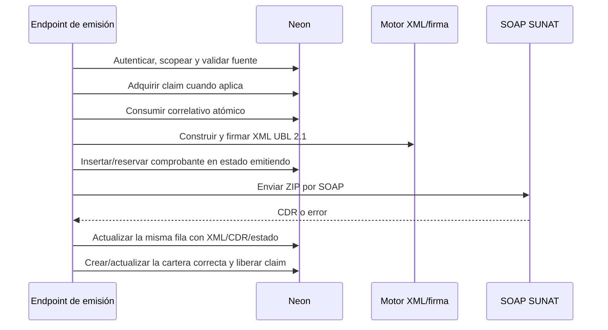

# 11 — Módulo de Facturación y SUNAT (CPE)

> **Última verificación contra código:** 2026-07-13
> **Estado:** código y esquema de facturación de Campo en producción; no existían CPE de Campo emitidos al corte de la verificación
> **Archivos clave:** `src/lib/sunat/index.ts`, `xml-builder.ts`, `xml-signer.ts`, `soap-client.ts`, `parse-cpe-items.ts`, `fechas.ts`, `src/app/api/comprobantes/`

Este documento describe la emisión de facturas (01), boletas (03) y Notas de Crédito (07), incluida la concurrencia, los reintentos y la relación con las tres operaciones de venta.

---

## 1. Empresa emisora y operación de venta

Son conceptos independientes:

- **Empresa:** Transavic o Avícola de Tony. Determina RUC, serie, credenciales SOL, certificado, domicilio fiscal y logo.
- **Operación:** Ejecutivas, Campo o Planta. Determina venta fuente, cartera, permisos, vistas y reportes.

`getSunatConfig(empresa)` en `config-transavic.ts` resuelve la configuración tributaria. La operación se deriva así:

1. `comprobantes.venta_avicola_id` o el del CPE referenciado → Campo.
2. Pedido con `origen='pos_planta'` → Planta.
3. Resto → Ejecutivas.

Consulta el mapa completo en [22-operaciones-ventas-facturacion.md](./22-operaciones-ventas-facturacion.md).

---

## 2. Entradas al motor compartido

| Flujo | Endpoint | Venta fuente |
|---|---|---|
| Desde pedido de Ejecutiva/Planta | `/api/comprobantes/emitir` | `pedidos` + `pedido_items` |
| Emisión manual | `/api/comprobantes/emitir-manual` | datos validados del formulario |
| Campo | `/api/comprobantes/emitir-manual` con `ventaAvicolaId` | `ventas_avicola` + `venta_avicola_items` |
| Autoemisión al entregar | `/api/pedidos/[id]/entregar` | pedido entregado; controlado por flag |
| Nota de Crédito | `/api/comprobantes/[id]/nota-credito` | XML del CPE base |
| Reintento | `/api/comprobantes/[id]/reintentar` | misma fila/XML o `items_json` |

Campo reutiliza el formulario y motor, pero el servidor vuelve a leer la venta, sus ítems y el cliente. No confía en peso, precio, total, empresa ni receptor enviados por el navegador.

---

## 3. Ciclo de emisión y reserva previa

La fila `emitiendo` existe **antes** de la llamada externa. Esto evita que un doble clic consuma dos correlativos o cree dos documentos mientras SUNAT tarda. La lista sanea reservas atascadas con más de 15 minutos y las convierte en error recuperable.

Los errores de unicidad se traducen a conflictos de dominio (409), no a un 500 genérico.

---

## 4. Claims e índices de concurrencia

### Campo

- `ventas_avicola.facturacion_claim_token/at` serializa desde antes de leer/validar la venta hasta que la fila CPE queda reservada.
- Editar o anular la venta durante el claim devuelve conflicto.
- `ux_comprobantes_venta_avicola_cpe` impide dos CPE 01/03 activos para una venta.
- El token garantiza que una solicitud antigua no libere el claim de otra.

### Nota de Crédito

- `comprobantes.nota_credito_claim_token/at` se adquiere en el CPE base antes de consumir el correlativo.
- `ux_comprobantes_nc_referencia_activa` permite una sola NC activa por CPE base.
- Una NC `error` **con XML firmado** ocupa el cupo hasta reintentar la misma fila/correlativo. Un error
  anterior a tener XML o una NC `rechazado` puede liberar una emisión corregida; la fila anterior
  conserva auditoría.

Los claims vencen tras 15 minutos. El índice es la barrera definitiva; el claim cierra la ventana de negocio antes de insertar.

---

## 5. Construcción, unidades, IGV y fecha

1. El XML UBL 2.1 se construye en `xml-builder.ts`.
2. Se firma con el certificado `.p12` en `xml-signer.ts`.
3. Se comprime y envía por SOAP mediante `soap-client.ts`.

Reglas:

- Los precios de `productos`, `pedido_items` y Campo se interpretan **con IGV incluido**.
- Por línea: `bruto = round2(precioConIgv * cantidad)`, `base = round2(bruto / 1.18)`, `IGV = bruto - base`. El total queda anclado al precio cobrado.
- Las unidades legales son `KGM` y `NIU`; el helper compartido no debe degradar `KGM` a `NIU`.
- `IssueDate` usa `fechaHoyLima()`; nunca `toISOString()` para definir el día tributario.
- `CitySubdivisionName` se omite si urbanización está vacía; emitirla vacía genera observación 4095.

---

## 6. Respuesta SUNAT y estados internos

`soap-client.ts` descomprime el CDR con `fflate`. La clasificación es fail-safe:

- CDR legible y aceptación → `aceptado` u `observado`.
- Código de rechazo → `rechazado`.
- CDR/SOAP ilegible o transporte incierto → `error`, nunca aceptado por defecto.
- Reserva en curso → `emitiendo`.

`mensaje_sunat` y `cdr_base64` se conservan para auditoría. El ZIP CDR se descarga crudo; no se reconstruye con un parser ZIP casero.

---

## 7. Cartera después de emitir

| Operación | Efecto de un CPE 01/03 aceptado/observado |
|---|---|
| Ejecutivas | crea o enlaza `facturas` una sola vez |
| Campo | **no crea `facturas`**; la deuda ya vive en saldo Avícola |
| Planta | usa/enlaza `cobranzas_planta`; no crea `facturas` |

El mismo criterio se aplica al reintento. Es insuficiente verificar solo `venta_avicola_id`: también debe leerse `pedido.origen` para no contaminar la cartera de Ejecutivas con un POS.

Una NC total aceptada anula la deuda activa en la cartera correspondiente. En Planta, las cobranzas ya pagadas no se anulan automáticamente porque requieren una devolución de dinero controlada.

Detalle de carteras: [13-cobranzas-facturas.md](./13-cobranzas-facturas.md).

---

## 8. Reintentos

El reintento opera sobre la **misma fila y el mismo correlativo** cuando el estado es `error`:

1. Si existe `xml_firmado_base64`, reenvía exactamente ese XML.
2. Si no existe, reconstruye desde `items_json`.
3. Si tampoco hay `items_json`/fuente confiable, aborta; nunca fabrica una línea genérica.
4. Al aceptar SUNAT, crea/enlaza solo la cartera que corresponde a la operación.

Un CPE rechazado por SUNAT no se reenvía ciegamente como si fuera un error de red. Para una
factura/boleta 01/03 de **Campo**, se conserva XML/CDR y se emite otro correlativo enlazado mediante
`reemplaza_comprobante_id`. Esa cadena no se usa en Ejecutivas, Planta ni NC. Una NC 07 rechazada
conserva su fila y permite emitir otra NC corregida contra el mismo `referencia_comprobante_id`.

---

## 9. Notas de Crédito

La NC:

- toma receptor, moneda e ítems desde el XML firmado del CPE base;
- usa `referencia_comprobante_id` exclusivamente para la relación tributaria CPE→NC;
- hereda `venta_avicola_id` cuando el CPE base es Campo;
- hereda la operación en lista, filtro, Excel y cartera;
- adquiere claim y reserva `emitiendo` antes del SOAP;
- si es total y SUNAT la acepta con código `01`, `02` o `06`, anula automáticamente la venta de
  Campo y la retira de su cartera; el endpoint de anulación también reconoce esa NC como evidencia.

La versión actual acredita el XML completo y por eso solo admite los códigos totales `01`
(anulación), `02` (anulación por RUC) y `06` (devolución total). Los códigos parciales no se
habilitan hasta modelar ítems/montos y el ajuste proporcional de cada cartera.

No reutilices `referencia_comprobante_id` para representar el reemplazo de un CPE rechazado; es una relación distinta.

Una NC en `error` que ya tiene XML firmado **no libera el cupo** para crear otra NC: debe reintentarse
la misma fila y correlativo. Solo un error anterior a firmar/reservar XML puede dar paso a una emisión
nueva. Esta regla vive también en `ux_comprobantes_nc_referencia_activa`.

---

## 10. PDF, correo, XML, CDR y Excel

El XML firmado es la fuente legal inmutable:

- `parseCpeItems(xml_firmado_base64)` alimenta PDF y correo.
- Los CPE manuales no dependen de que exista `pedido_items`.
- El PDF no debe reconstruir líneas desde una venta que luego pudo cambiar.
- La exportación usa `fecha_emision` con fallback legacy a `created_at` y deriva la operación también desde el CPE referenciado.
- Las vistas fijas de Campo/Ejecutivas reutilizan `ComprobantesClient`; el backend sigue aplicando el filtro y el scoping.

---

## 11. Comunicación de Baja y Resumen Diario

- **Baja RA:** anulación de facturas dentro de las reglas SUNAT, con ticket de consulta.
- **Resumen Diario RC:** agrupa boletas y se ejecuta por `/api/cron/resumen-diario-sunat`.
- Ambos deben conservar fecha Lima, empresa y estado de auditoría.

La existencia de una NC no equivale por sí sola a borrar el CPE original: el documento base y su relación permanecen.

---

## 12. Impacto de cambios y pruebas

Si cambias emisión, revisa siempre:

- los dos endpoints de emisión, autoemisión y reintento;
- Campo, POS y Ejecutivas;
- NC, GRE y CPE de referencia;
- claims, índices, correlativos y recuperación de `emitiendo`;
- cartera correcta y no duplicada;
- PDF/correo/Excel;
- metas y `ventas_facturadas`;
- roles/scoping;
- migración, rollback y orden de despliegue.

Ejecuta el runbook de [24-pruebas-regresion-despliegue.md](./24-pruebas-regresion-despliegue.md).
