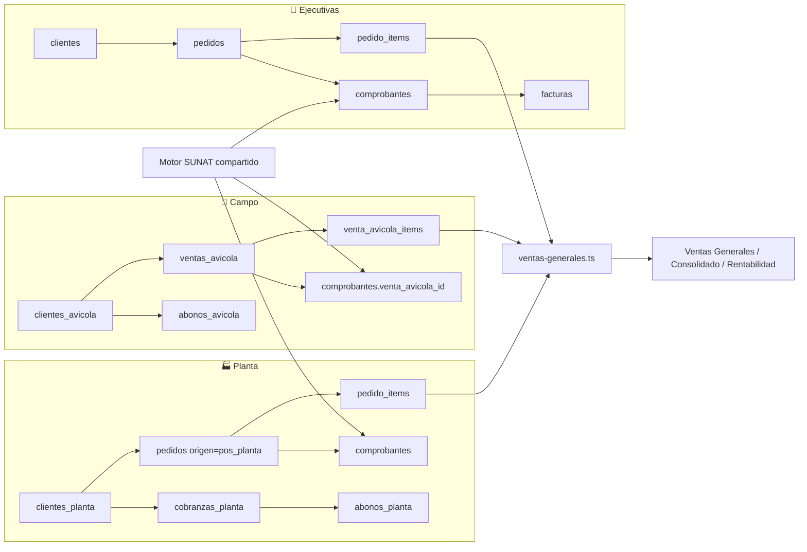
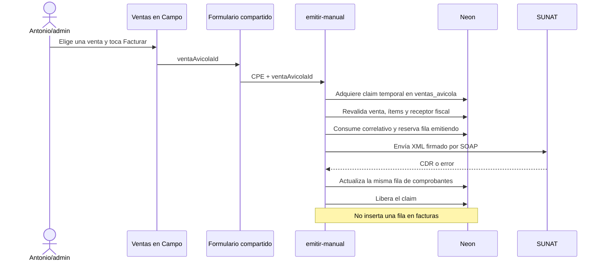

# 22 — Operaciones de Venta, Facturación y Vistas Generales

> **Última verificación contra código:** 2026-07-20
> **Estado:** separación y facturación de Campo en `main`/producción; conciliación de Ejecutivas del doc 27 en rama, aún no desplegada
> **Archivos clave:** `src/lib/operaciones-venta.ts`, `src/lib/ventas-generales.ts`, `src/lib/sunat/index.ts`, `src/app/api/comprobantes/`, `src/app/api/ventas-generales/route.ts`, `src/components/DashboardLayout.tsx`

Este documento es la vista transversal de las **tres operaciones de venta**. Explica qué datos comparten, qué datos deben permanecer separados, cómo se clasifica un comprobante y qué reportes se afectan al modificar una operación.

---

## 1. Regla de arquitectura

Transavic tiene tres operaciones comerciales independientes. Comparten catálogo, empresas emisoras y el motor SUNAT, pero **no comparten necesariamente clientes, deuda ni pagos**.

| Operación | Venta y detalle | Clientes | Deuda y pagos | Vista de ventas | Vista de comprobantes |
|---|---|---|---|---|---|
| **🛵 Ejecutivas** | `pedidos` + `pedido_items`, con `origen` distinto de `pos_planta` | `clientes` | `facturas` y `/dashboard/cobranzas` | `/dashboard` | `/dashboard/comprobantes/ejecutivas` |
| **🏪 Campo** | `ventas_avicola` + `venta_avicola_items` | `clientes_avicola` | saldo derivado + `abonos_avicola`; **no crea `facturas`** | `/dashboard/clientes-avicola/ventas` | `/dashboard/clientes-avicola/comprobantes` |
| **🏭 Planta** | `pedidos` + `pedido_items`, con `origen='pos_planta'` | `clientes_planta` en ventas a crédito | `cobranzas_planta` + `abonos_planta` | `/dashboard/pos-planta` | se consulta desde `/dashboard/comprobantes?operacion=planta` |

Vistas transversales:

- `/dashboard/ventas-generales`: ventas de las tres operaciones para una fecha.
- `/dashboard/comprobantes`: facturación general, con filtro por operación.
- `/dashboard/consolidado`: resumen gerencial; incluye ventas de las tres operaciones y cartera de Campo.
- `/dashboard/rentabilidad`: comparativo Hoy/Ayer basado en la misma fuente de ventas generales.

> [!IMPORTANT]
> **Operación y empresa son dimensiones distintas.** Una venta de Campo puede pertenecer a Transavic o Avícola de Tony. La empresa determina RUC, serie, certificado y logo; la operación determina flujo, cartera, permisos y reportes.

---

## 2. Mapa de relaciones

La columna `comprobantes.venta_avicola_id` es el **único nexo** entre Campo y el motor tributario compartido. No convierte la venta de Campo en pedido ni en cobranza de Ejecutivas.

---

## 3. Cómo se determina la operación

La clasificación canónica vive en `src/lib/operaciones-venta.ts`:

1. Si el comprobante o su CPE de referencia tiene `venta_avicola_id`, es **Campo**.
2. Si no es Campo y el pedido tiene `origen='pos_planta'`, es **Planta**.
3. El resto es **Ejecutivas**. Esto incluye comprobantes manuales sin pedido.

Las Notas de Crédito requieren una precaución adicional: el listado y el Excel usan `COALESCE(c.venta_avicola_id, ref.venta_avicola_id)` para heredar la operación del comprobante base. Si se omite el CPE de referencia, una NC de Campo se clasificaría erróneamente como Ejecutivas.

Los colores también se centralizan en `OPERACIONES`:

| Operación | Color | Usos |
|---|---|---|
| Ejecutivas | azul | grupo del sidebar, chips y tarjetas |
| Campo | ámbar | grupo del sidebar, chips y tarjetas |
| Planta | violeta | grupo del sidebar, chips y tarjetas |

No dupliques estas clases Tailwind en cada pantalla. Cambiar `operaciones-venta.ts` afecta la lista de comprobantes, Ventas Generales y los puntos de los grupos del sidebar.

---

## 4. Flujo de facturación de Campo

Invariantes:

- Los ítems se precargan como `KGM`; `peso_kg` es cantidad y `precio_kg` es precio con IGV.
- Para factura se vuelve a consultar el RUC en el servidor. La razón social informal del puesto no reemplaza los datos fiscales.
- El índice `ux_comprobantes_venta_avicola_cpe` permite un solo CPE 01/03 **no rechazado** por venta. Un rechazado queda como auditoría y libera el cupo para un reemplazo enlazado.
- El claim `ventas_avicola.facturacion_claim_*` cubre la ventana anterior a crear la fila CPE. Mientras existe, no se puede editar ni anular la venta.
- La fila `emitiendo` se reserva antes de llamar a SUNAT. En factura/boleta
  `01`/`03`, una interrupción no prueba rechazo: pasa a `por_confirmar`, conserva
  fila, XML y correlativo, y se consulta. Solo `no_registrado`, obtenido tras las
  verificaciones previstas, permite reenviar el mismo XML y número.
- `esCampo` impide crear una cobranza en `facturas`: el saldo ya se calcula con `ventas_avicola - abonos_avicola`.
- Un CPE `emitiendo`, pendiente, `error`, aceptado u observado vuelve inmutable la venta. Si todos los
  CPE 01/03 fueron rechazados, Campo permite corregirla y emitir un reemplazo enlazado con otro
  correlativo. Una NC total aceptada (`01`, `02` o `06`) anula la venta de Campo y la retira de su saldo.

Estas reglas requieren, en orden, `migrate-facturacion-campo-2026-07-12.sql`,
`migrate-reemision-cpe-campo-rechazado-2026-07-12.sql` y
`migrate-nc-error-reintento-unico-2026-07-12.sql`. Los rollbacks pueden retirar trazabilidad o
guardas concurrentes y no deben aplicarse si ya existen comprobantes de Campo sin evaluar el impacto.

---

## 5. Nota de Crédito, reintento y GRE

- **Nota de Crédito:** adquiere `nota_credito_claim_*` en el comprobante base antes de consumir correlativo. El índice `ux_comprobantes_nc_referencia_activa` impide dos NC activas para el mismo CPE aun con dos pestañas.
- **Reintento:** para estado `error`, reutiliza fila, serie, correlativo, XML original o `items_json`;
  nunca crea un CPE paralelo. Solo una factura/boleta 01/03 rechazada de Campo usa un nuevo
  correlativo con `reemplaza_comprobante_id`. Una NC rechazada permite otra NC corregida con la
  misma referencia tributaria; Ejecutivas/Planta no usan la cadena de reemplazo de Campo.
- **GRE:** reutiliza el flujo legal existente. En Campo, los datos de dirección se obtienen del comprobante/XML, no de un pedido inexistente.
- **PDF/XML/CDR:** pertenecen a `comprobantes`, por lo que las tres operaciones usan las mismas descargas y el PDF sigue leyendo los ítems del XML firmado.

La reconciliación automática de `01`/`03` corre cada cinco minutos. Solo consulta
el mismo RUC, tipo, serie y número; **nunca llama a `sendBill`**, no crea otro XML
y no consume correlativos. `por_confirmar` es bloqueante para cualquier segunda
emisión de la venta, incluso si la persona intenta confirmar un posible
duplicado desde la interfaz.

Cuando una aceptación llega tarde, el postproceso con claim deriva la operación y
crea o enlaza la deuda una sola vez. Si el pedido ya tiene otro CPE aceptado o su
deuda está vinculada, no reemplaza cartera: deja el caso en revisión para elegir
cuál comprobante se neutralizará.

La referencia tributaria de una NC apunta **solo** al CPE guardado en
`referencia_comprobante_id`. No se debe confundir esa regla legal con una garantía
ya implementada en todas las carteras: Planta conserva un fallback histórico por
`pedido_id`, por lo que los duplicados aceptados exigen verificar la deuda antes de
la NC. En el caso Ejecutivas F002-412/F002-413, esa verificación confirmó que
FC02-00000028 corrige F002-412 y F002-413 continúa con la única deuda. La F002-412
conserva `aceptado` como hecho histórico, pero se muestra corregida mediante esa NC.

No se desplegó un relink genérico de cartera entre CPE hermanos: hacerlo solo para
Planta o solo para un orden de aceptación dejaría inconsistencias en Ejecutivas/Campo
y podría reactivar anulaciones manuales. Hasta modelar la procedencia de la anulación,
dos CPE aceptados continúan siendo un caso de revisión administrada; antes de la NC se
verifica cuál documento y deuda permanecerán vigentes.

XML y CDR tampoco son sinónimos de estado: tener XML no prueba aceptación y no
tener CDR descargable no prueba rechazo. Si la consulta oficial confirma
`aceptado`, **no se emite una NC solo por falta de CDR**. Consulta la matriz de
[estados-comprobantes-sunat.md](../soporte/estados-comprobantes-sunat.md).

Cuando se agregue una operación nueva, no basta con crear un filtro visual: hay que propagar el origen por CPE, NC, reintentos, exportación y GRE.

---

## 6. Ventas generales y definición temporal

`src/lib/ventas-generales.ts:resumenVentasGeneralesPorFecha()` es la fuente compartida por `/api/ventas-generales`, Consolidado y el comparativo de Rentabilidad.

| Operación | Fecha de venta | Monto | Exclusión |
|---|---|---|---|
| Ejecutivas | `(pedidos.created_at AT TIME ZONE 'America/Lima')::date` | `SUM(subtotal_real)` solo si todos los ítems del pedido están valorizados | `estado='Fallido'`, `anulada=true` u origen distinto de `asesor|NULL` |
| Campo | `ventas_avicola.fecha` | `ventas_avicola.total` | `anulada=true` |
| Planta | `pedidos.created_at` en Lima | `SUM(COALESCE(subtotal_real, subtotal, 0))`, preagrupado por pedido | `estado='Fallido'` o `anulada=true`; requiere `origen='pos_planta'` |

Esta métrica responde **cuánto se vendió/registró en el día**. No es lo mismo que:

- facturación SUNAT, que usa fecha/estado de `comprobantes`;
- entrega programada, que usa `pedidos.fecha_pedido`;
- metas confirmadas, que pueden exigir `estado='Entregado'`;
- caja o bancos, que miden movimientos de dinero.

Cambiar la definición del día en un solo reporte genera cifras contradictorias. Modifica primero `ventas-generales.ts` y valida sus tres consumidores.

---

## 7. Cobranzas y estados de cuenta separados

| Operación | Fuente de deuda | Fuente de pago | Regla crítica |
|---|---|---|---|
| Ejecutivas | `facturas.monto` | datos de pago en `facturas` | solo deuda activa `Pendiente`/`Vencida` |
| Campo | `saldo_anterior + ventas - abonos` | `abonos_avicola` | el saldo no se persiste; un CPE no crea `facturas` |
| Planta | `cobranzas_planta` | `abonos_planta` | no mezclar con `facturas` ni con abonos de Campo |

En Campo, `src/lib/avicola/estado-cuenta.ts` conserva cada abono como movimiento individual. Si un cliente realiza tres abonos el mismo día, pantalla y PDF muestran tres filas con hora Lima, medio, monto, nota y saldo posterior. El agregado diario solo se usa para aritmética; nunca debe reemplazar el detalle entregado al cliente.

La aceptación tardía no duplica cartera. Los claims serializan el postproceso y
los índices únicos de `facturas` impiden una segunda deuda por el mismo CPE o por
el mismo pedido y número, incluso si dos ejecuciones compiten.

---

## 8. Permisos y navegación

| Recurso | Roles |
|---|---|
| Ventas/comprobantes/estado de cuenta de Campo | `admin` |
| Comprobantes de Ejecutivas | `admin`, `asesor`; la API aplica scoping por asesora |
| POS, clientes y cobranzas de Planta | `admin`, `produccion` |
| Ventas Generales, Consolidado y Rentabilidad | `admin` |
| Comprobantes generales | `admin`, `asesor`; el resultado de la asesora sigue scopeado |

La seguridad se aplica en las páginas y nuevamente en cada API. El sidebar solo controla visibilidad; **no es una barrera de autorización**.

---

## 9. Matriz de impacto rápida

| Si cambias… | Revisa también… |
|---|---|
| `pedidos.origen` o agregas otra operación | `operaciones-venta.ts`, `ventas-generales.ts`, `/api/comprobantes`, Excel, metas, sidebar y docs 10/14 |
| `comprobantes.venta_avicola_id` | emitir/reintentar/NC/GRE, filtro de operación, índices, `ventas_facturadas` y rollback |
| la creación de `facturas` | Ejecutivas vs Campo vs POS; evita duplicar carteras |
| fecha o estado que define una venta | Ventas Generales, Consolidado, Rentabilidad y metas; prueba Lima/UTC |
| precios/unidades | XML, `items_json`, PDF, montos de ventas y rentabilidad; precios siguen con IGV |
| abonos de Campo | saldo, historial, guía, modal y PDF; conserva movimientos individuales |
| permisos de una vista | page guard, API, sidebar y scoping SQL |
| NC o reintentos | claims, índices, correlativos, estados `emitiendo/error/rechazado` y CPE de referencia |

El catálogo completo de dependencias y el procedimiento para evaluar cambios está en [23-mapa-dependencias-impacto.md](./23-mapa-dependencias-impacto.md).

---

## 10. Verificación mínima antes de desplegar

1. Aplicar por `psql`, en este orden, la migración base de Campo, la de reemisión de rechazados y
   la de reintento único de NC en error, en la base correcta **antes** del código.
2. Confirmar columnas, índices y definición de `ventas_facturadas`.
3. Ejecutar `npx tsc --noEmit`, lint y las pruebas de observaciones/estado de cuenta.
4. Probar una venta de cada operación en Ventas Generales.
5. Verificar filtros Campo/Ejecutivas/Planta y una NC en la lista y en el Excel.
6. Probar doble clic/doble pestaña en Campo y NC: debe existir un solo correlativo y un solo CPE activo.
7. Generar un PDF de Campo con varios abonos del mismo día y confirmar que aparecen separados.
8. En producción, validar primero con un caso real controlado que `precio_kg` incluye IGV.
9. Simular `por_confirmar`: el cron y **Verificar ahora** solo deben consultar; no
   pueden ejecutar `sendBill` ni crear otro correlativo.
10. Confirmar que una NC sobre un CPE duplicado neutraliza solo esa referencia y
    deja intacto el otro CPE aceptado y su deuda.

## 12. Corrección de Ventas Generales (13 jul 2026)

Ejecutivas se clasifica de forma positiva con
`COALESCE(pedidos.origen,'asesor')='asesor'`; ya no se define como “todo lo que no
sea Planta”. La venta pertenece al día de `created_at` Lima y solo aporta importe
cuando todos sus ítems tienen `subtotal_real`. Campo mantiene `ventas_avicola.total`
y Planta su subtotal definitivo.

Facturas, boletas, NC y cambios de estado no agregan una segunda venta. El detalle
conciliable nace de la misma consulta que la tarjeta. La definición completa,
evidencia de 12/13 julio y límite con Incentivos están en el [doc 27](./27-conciliacion-ventas-ejecutivas.md).

El costo histórico de Planta es otra dimensión: se congela en
`pedido_items.costo_unitario_snapshot`, no cambia el ingreso vendido y no se expone
a Ejecutivas.
