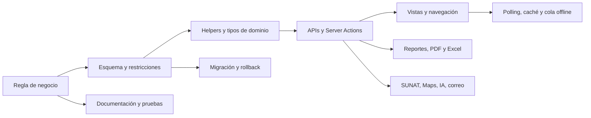
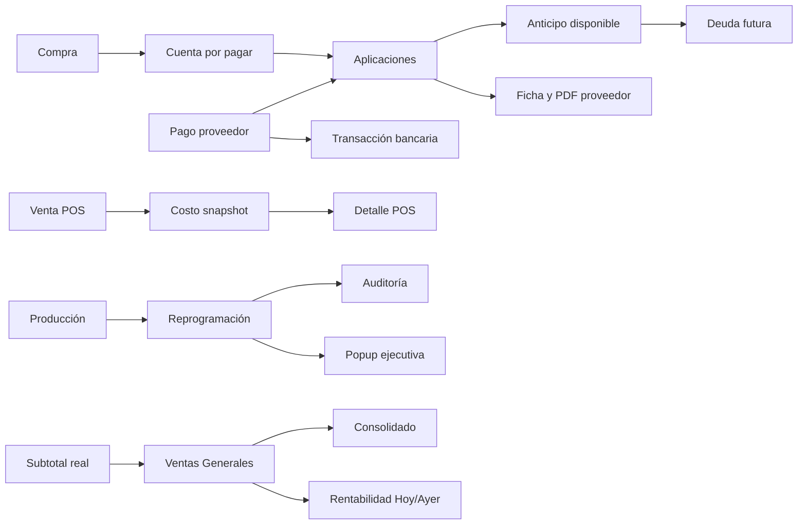

# 23 — Mapa de Dependencias e Impacto de Cambios

> **Última verificación:** 2026-07-13 · **Estado:** incluye dependencias de `codex/cambios-operativos-julio`, aún no desplegadas
> **Objetivo:** impedir cambios locales que rompan silenciosamente otro flujo, reporte, rol, documento o integración.

Este documento no sustituye los documentos temáticos. Es el índice transversal que indica **qué revisar cuando cambia una fuente de verdad**.

---

## 1. Cadena de impacto del sistema

Una tarea no está completa solo porque compila. Debe conservar la regla de negocio a través de las capas que realmente la consumen.

---

## 2. Fuentes de verdad y consumidores

| Fuente de verdad | Consumidores directos | Efectos secundarios frecuentes |
|---|---|---|
| `pedidos.estado` | APIs de transición, despacho, producción, mi-ruta | `entregado` legacy, timestamps, inventario/kardex, notificaciones, metas |
| `pedidos.created_at` | ventas de Ejecutivas/Planta, metas, rachas | zona Lima; no confundir con `fecha_pedido` |
| `pedidos.fecha_pedido` | entrega, producción, despacho | no representa fecha comercial |
| `pedidos.origen` | POS, ventas generales, metas, clasificación de CPE | Ejecutivas usa inclusión positiva `asesor`/`NULL`; un origen nuevo queda fuera hasta clasificarlo |
| `pedido_items` | montos comerciales, producción, inventario, emisión | unidad real, precio con IGV, peso real/estimado |
| `ventas_avicola` | saldo Campo, liquidación, ventas generales, CPE Campo | edición/anulación bloqueada al existir CPE |
| `abonos_avicola` | saldo, estado de cuenta, guía y PDF | debe conservar cada pago individual, aun el mismo día |
| `comprobantes` + XML firmado | PDF, correo, Excel, NC, GRE, reintentos | documento legal: no reconstruirlo desde datos mutables |
| `facturas` | cobranzas de Ejecutivas, aging, cron | no recibe CPE de Campo ni deuda propia de Planta |
| `cobranzas_planta` / `abonos_planta` | cartera de Planta | sistema independiente de `facturas` y Campo |
| `inventario_lotes` + `inventario_movimientos` | stock, kardex, rentabilidad | idempotencia al entregar/revertir; inventario flexible |
| `transacciones` + `cuentas_bancarias` | caja, gastos, CxP, POS contado | pagar cobranzas no toca tesorería por decisión vigente |
| `settings` | incentivos, ubicación, configuración | validar claves y fallback; puede afectar crons y UI |
| `src/lib/roles.ts` | guards y navegación | el sidebar no reemplaza autorización ni scoping SQL |
| `src/lib/ventas-generales.ts` | Ventas Generales, Consolidado, Rentabilidad | cambiarlo altera varias cifras gerenciales a la vez |
| `src/lib/operaciones-venta.ts` | chips/filtros/estilos por operación | operación no equivale a empresa emisora |

---

## 3. Catálogo de cambios transversales

### 3.1 Agregar una tabla, columna, índice o estado

Revisar:

1. migración nueva, idempotente y aditiva;
2. rollback y advertencia si destruye datos o trazabilidad;
3. tipos TypeScript y SELECT/INSERT/UPDATE relacionados;
4. zod de todos los endpoints que reciben el dato;
5. permisos y scoping;
6. vistas SQL, reportes, exportaciones y crons;
7. orden de despliegue: base de datos antes del código;
8. docs 02, 20 y el documento temático.

Un índice único usado como guard concurrente es parte de la regla de negocio, no solo una optimización. Ejemplos: una caja abierta, un CPE de Campo y una NC activa.

### 3.2 Cambiar estados del pedido

Revisar docs 04, 06, 07, 08 y 09. En código, busca el estado en:

- validaciones zod y transiciones;
- columnas del kanban y filtros;
- sincronización de `entregado` y timestamps legacy;
- descuento/reversión de inventario;
- cola offline e idempotencia;
- metas, ventas generales y reportes;
- notificaciones.

### 3.3 Cambiar producto, cantidad, unidad o precio

Revisar:

- `productos`, `pedido_items`, `venta_avicola_items` y líneas POS;
- `cantidad_real` frente a cantidad solicitada;
- normalización SUNAT `KGM`/`NIU`;
- convención de precio **con IGV**;
- cálculo anclado de base/IGV/total;
- inventario y kardex;
- Ventas Generales, metas y rentabilidad;
- XML firmado, `items_json`, PDF y Excel.

No corrijas un CPE aceptado releyendo una tabla mutable: el PDF y correo deben representar el XML legal.

### 3.4 Agregar o cambiar una operación de venta

Lee primero [22-operaciones-ventas-facturacion.md](./22-operaciones-ventas-facturacion.md). Define explícitamente:

- tabla de venta y detalle;
- directorio de clientes;
- cartera y pagos;
- fecha comercial y estados excluidos;
- vínculo con `comprobantes`;
- creación o exclusión de cobranza;
- clasificación de NC y reintentos;
- Ventas Generales, Consolidado y Rentabilidad;
- permisos, sidebar y vistas dedicadas/general;
- inventario/caja y si deben moverse.

Sin esta definición, el comportamiento por defecto puede contaminar metas de Ejecutivas o duplicar una deuda.

### 3.5 Cambiar facturación SUNAT

Revisar docs 11, 12, 13 y 22, además de:

- empresa/serie/correlativo;
- datos oficiales del receptor;
- XML UBL, firma, ZIP y SOAP/REST;
- reserva `emitiendo`, claims, índices y reintentos;
- CDR y estados aceptado/observado/rechazado/error;
- NC, Comunicación de Baja y Resumen Diario;
- `venta_avicola_id`, `pedido_id` y CPE de referencia;
- generación de cobranza según la operación;
- PDF, correo, XML/CDR y Excel;
- observaciones y fecha Lima.

Un cambio fiscal requiere prueba de comportamiento, no solo typecheck.

### 3.6 Cambiar deuda, pago o anulación

Primero identifica la operación:

- Ejecutivas: `facturas`;
- Campo: saldo derivado + `abonos_avicola`;
- Planta: `cobranzas_planta` + `abonos_planta`.
- Proveedores: `pagos_proveedores` + aplicaciones activas; `monto_pagado` es caché.

Luego revisa saldo, estado de cuenta, aging, vouchers, anulación, NC, caja/tesorería y PDF. No uses `estado <> 'Pagada'` para deuda de Ejecutivas; usa estados activos explícitos. No agrupes abonos de Campo ni pagos de proveedores: cada movimiento debe conservar su fila y trazabilidad.

### 3.7 Cambiar una fecha

Documenta qué evento representa y qué zona usa:

| Campo | Significado |
|---|---|
| `pedidos.created_at` | registro de la venta de Ejecutivas/Planta |
| `pedidos.fecha_pedido` | fecha programada de entrega |
| `ventas_avicola.fecha` | fecha comercial seleccionada de Campo |
| `comprobantes.created_at` / fecha XML | emisión tributaria |
| fechas de pago | movimiento de cobranza o tesorería |

Para el día operativo usa `America/Lima`; evita `toISOString()` como fuente de "hoy".

### 3.8 Cambiar roles, permisos o navegación

Revisar cuatro capas:

1. guard de página;
2. auth, rol y scoping en API/SQL;
3. permiso declarado en `roles.ts` cuando corresponda;
4. visibilidad y grupo en `DashboardLayout.tsx`.

Prueba al menos admin, un rol permitido y un rol prohibido. Ocultar un enlace no protege el endpoint.

### 3.9 Cambiar reportes o métricas

Escribe primero la definición: entidad, fecha, estado, monto, origen y zona horaria. Luego verifica consumidores compartidos.

| Métrica | Fuente canónica |
|---|---|
| Ventas generales por operación | `src/lib/ventas-generales.ts` |
| Metas/racha/ranking de asesoras | `src/lib/ventas-metricas.ts` |
| Facturación legal | `comprobantes`/XML y `ventas_facturadas` según reporte |
| Saldo de Campo | `src/lib/avicola/saldos.ts` |
| Estado de cuenta detallado Campo | `src/lib/avicola/estado-cuenta.ts` |
| Stock/kardex | `inventario_lotes` + `inventario_movimientos` |

Nombres parecidos no significan que las cifras deban coincidir.

### 3.10 Cambiar una integración externa

| Integración | Efectos a revisar |
|---|---|
| SUNAT | credenciales/certificados, XML, correlativos, CDR, reintentos y auditoría |
| API Perú | RUC/DNI, datos oficiales del receptor, manejo de caídas y manipulación del payload |
| Google Maps | clave server/cliente, fallback Haversine, costos, rutas y coordenadas |
| Gemini/Groq | anonimizado, caché por scope, fallback y cuota |
| Brevo/SMTP | remitente verificado, adjuntos, fallback y errores no bloqueantes |
| Capacitor/GPS | permisos nativos, offline, batería, tracking y VersionChecker |

---

## 4. Checklist de implementación y revisión

Antes de editar:

- [ ] Identificar la regla de negocio y su fuente de verdad.
- [ ] Leer el documento temático y este mapa.
- [ ] Buscar el campo/estado/ruta con `rg` en `src`, `scripts` y `docs`.
- [ ] Identificar datos de producción, `dev-hugo` y cambios locales pendientes.

Durante el cambio:

- [ ] Mantener validación, autorización y scoping en backend.
- [ ] Proteger doble clic, reintentos y concurrencia cuando hay efectos externos.
- [ ] Mantener fecha Lima y precios con IGV donde corresponda.
- [ ] Crear migración/rollback nuevos; no editar migraciones ya aplicadas.
- [ ] Actualizar tipos, helpers compartidos, reportes y documentación.

Antes de entregar:

- [ ] `npx tsc --noEmit`.
- [ ] `npm run lint` y distinguir warnings preexistentes de regresiones.
- [ ] `git diff --check`.
- [ ] Pruebas dirigidas del módulo y de al menos un consumidor indirecto.
- [ ] Revisar roles permitido/prohibido.
- [ ] Si hay PDF/imagen, renderizar y revisar visualmente.
- [ ] Si hay SUNAT, comprobar XML/CDR, reintento y concurrencia.
- [ ] Verificar links Markdown y actualizar el índice de arquitectura.
- [ ] Documentar si la migración está solo en desarrollo o ya en producción.

---

## 5. Mantenimiento de esta documentación

| Cambio | Documentos mínimos |
|---|---|
| esquema o migración | 02, 20, documento temático, historial |
| rol/scoping | 03, documento temático |
| estado de pedido | 04 y módulos consumidores |
| operación de venta/facturación | 11, 13, 22, historial |
| Campo | 21 y 22 |
| POS/Planta | 10 y 22 |
| métrica gerencial | 14 o 22 según definición, más consumidores |
| despliegue | 20 y estado real del plan 18 |

Si un documento contiene fecha de verificación o estado de despliegue, actualízalo solo con evidencia. No describas cambios locales como si ya estuvieran en producción.

## 6. Dependencias incorporadas el 13 jul 2026

| Cambio | Impacto obligatorio |
|---|---|
| pago/aplicación de proveedor | CxP, cuenta bancaria, compra futura, Consolidado, ficha/PDF, anulación |
| costo POS | alta POS, resumen, historial y permisos; nunca catálogo retroactivo. Integrarlo a Rentabilidad completa queda como trabajo futuro explícito |
| reprogramación | cola de Producción, estado/ruta, auditoría, destinatario, campana/popup, deep link |
| `subtotal_real` o canal asesor | Ventas Generales, Consolidado, Rentabilidad y doc 27; no Metas sin aprobación |
| idempotencia de pedidos | formulario, PK, ítems, notificación y diagnóstico de duplicados |

Los documentos temáticos nuevos son [26](./26-proveedores-cuentas-por-pagar.md) y
[27](./27-conciliacion-ventas-ejecutivas.md).
