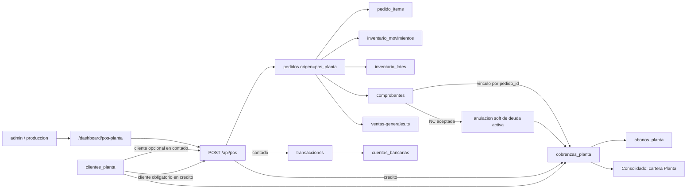
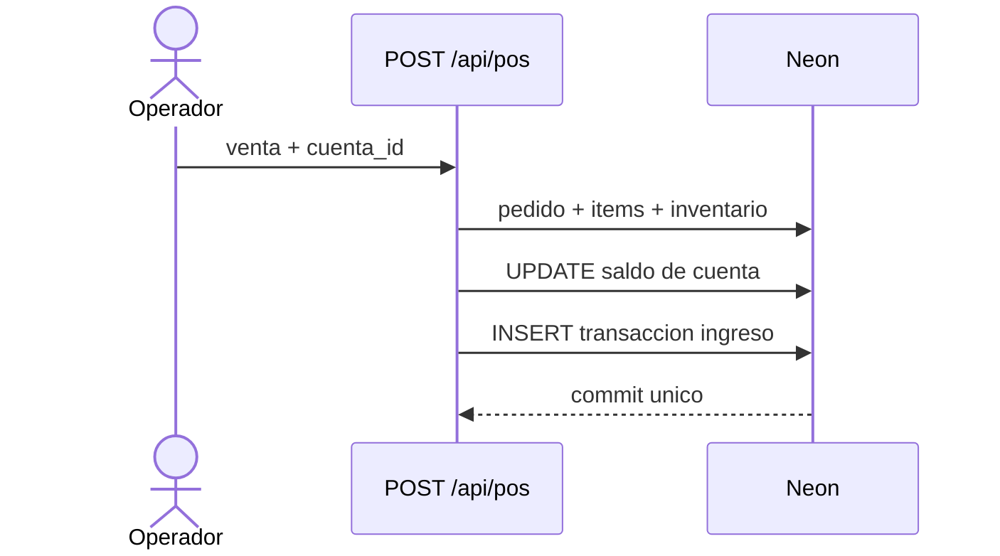

# 25 — Clientes y Cobranzas de Planta

> **Última verificación contra código:** 2026-07-13
> **Estado:** núcleo, anulación integral y cambios del 12 jul desplegados; detalle/costo histórico POS en rama y pendiente de migración/despliegue
> **Archivos clave:** `src/app/api/pos/route.ts`, `src/app/api/clientes-planta/`, `src/app/api/cobranzas-planta/`, `src/lib/planta/types.ts`, `src/lib/planta/saldos.ts`, `src/app/dashboard/pos-planta/`, `src/app/dashboard/clientes-planta/`, `src/app/dashboard/cobranzas-planta/`, `scripts/migrate-planta-clientes-cobranzas-2026-07-08.sql`

Este documento describe la operación **Venta en Planta**: su directorio de clientes, la cartera de ventas a crédito, los abonos parciales y sus relaciones con el POS, SUNAT, inventario, caja, tesorería y reportes. Es el documento de referencia para evitar que un cambio vuelva a mezclar Planta con las cobranzas de Ejecutivas o con las ventas de Campo.

---

## 1. Límite de la operación

Planta comparte con Ejecutivas las tablas `pedidos` y `pedido_items`, pero se distingue por `pedidos.origen='pos_planta'`. Sus clientes y su cartera son propios.

| Concepto | Planta | No debe usarse para Planta |
|---|---|---|
| Venta | `pedidos` + `pedido_items`, con `origen='pos_planta'` | `ventas_avicola` |
| Cliente | `clientes_planta` | `clientes`, `clientes_avicola` |
| Deuda | `cobranzas_planta` | `facturas` |
| Pago parcial | `abonos_planta` | pago embebido en `facturas`, `abonos_avicola` |
| Facturación legal | `comprobantes`, enlazado por `pedido_id` | una tabla CPE exclusiva de Planta |
| Venta general | rama Planta de `src/lib/ventas-generales.ts` | metas o ranking de asesoras |

La separación es intencional:

- una venta POS no pertenece a una asesora ni pasa por reparto;
- una venta POS al contado ya mueve dinero en tesorería y no crea deuda;
- una venta POS a crédito crea una deuda en `cobranzas_planta`, incluso antes de emitir un CPE;
- emitir una factura o boleta de Planta **no crea una fila en `facturas`**;
- los abonos de Planta no modifican caja, bancos ni `transacciones`.

Para la comparación completa con Ejecutivas y Campo, ver [22-operaciones-ventas-facturacion.md](./22-operaciones-ventas-facturacion.md).

---

## 2. Mapa de relaciones



Relaciones importantes:

- `pedidos.cliente_id` queda en `NULL`: esa FK apunta a `clientes` de Ejecutivas, no a `clientes_planta`.
- El nombre, razón social y documento se copian al pedido para preservar el historial y permitir facturar.
- `cobranzas_planta.pedido_id` permite llegar desde la deuda a la venta POS.
- `cobranzas_planta.comprobante_id` se completa al emitir o reintentar el CPE de un pedido POS.
- `abonos_planta.cobranza_id` es la relación contable; el saldo nunca se almacena como columna independiente.

---

## 3. Modelo de datos

La migración canónica es `scripts/migrate-planta-clientes-cobranzas-2026-07-08.sql`. Es aditiva e idempotente y se aplica por `psql`.

### 3.1 `clientes_planta`

Directorio compartido por quienes operan la planta; no tiene `asesor_id` ni scoping por vendedora.

| Columna | Regla / consumidor |
|---|---|
| `id` | UUID generado por el cliente; permite reintentar el alta sin duplicarla |
| `nombre` | nombre operativo del cliente; obligatorio |
| `razon_social` | receptor fiscal cuando tiene RUC; se denormaliza al pedido POS |
| `ruc_dni` | documento opcional; índice único parcial si no está vacío |
| `telefono`, `direccion` | contacto y ficha |
| `plazo_pago_dias` | define `fecha_vencimiento` al vender a crédito |
| `activo` | estado administrativo de la ficha |
| `empresa` | `Transavic` o `Avícola de Tony`; valor por defecto del cliente |
| `created_by`, timestamps | auditoría |

El índice `ux_clientes_planta_ruc` evita dos clientes con el mismo documento no vacío. Se permiten varios clientes sin documento.

### 3.2 `cobranzas_planta`

Cada fila representa la deuda de una venta POS a crédito.

| Columna | Regla / consumidor |
|---|---|
| `pedido_id` | venta POS que originó la deuda; `ON DELETE SET NULL` |
| `cliente_planta_id` | cliente de Planta; obligatorio |
| `cliente_nombre` | copia histórica para que un cambio de nombre no reescriba la deuda |
| `monto` | total comercial de la venta, con IGV incluido |
| `plazo_dias`, `fecha_emision`, `fecha_vencimiento` | calendario de cobro en zona Lima |
| `estado` | `Pendiente`, `Parcial`, `Vencida`, `Pagada` o `Anulada` |
| `comprobante_id` | factura/boleta legal asociada, si el vínculo fue completado |
| `empresa` | empresa de la venta |
| `anulada*` | soft delete con usuario, fecha y motivo |

No existe un índice `UNIQUE` sobre `pedido_id`. La garantía de una sola deuda depende hoy de que `POST /api/pos` cree pedido y deuda juntos, y de la idempotencia del UUID del pedido. Si otro flujo empieza a insertar cobranzas de Planta, debe agregar su propia barrera o reforzar el esquema.

### 3.3 `abonos_planta`

Un pago parcial es una fila independiente. Nunca se consolida por día.

| Columna | Regla / consumidor |
|---|---|
| `id` | UUID generado una vez en el modal; barrera de idempotencia |
| `cobranza_id` | deuda afectada |
| `monto` | positivo; se permite sobrepago |
| `medio_pago` | `efectivo`, `transferencia`, `yape`, `plin`, `otro` |
| `fecha` | por defecto hoy en Lima; el API rechaza fechas futuras |
| `observaciones` | detalle libre |
| `comprobante_data`, `comprobante_mime` | foto opcional del pago en base64 |
| `anulado*` | soft delete; conserva también la foto para auditoría |

Cada abono permanece separado aunque existan varios el mismo día. Esta regla permite auditar pagos, corregir uno sin alterar los demás y recalcular el saldo con exactitud.

### 3.4 Aritmética canónica

`src/lib/planta/saldos.ts` es la fuente central:

```text
total_abonado_deuda = SUM(abonos_planta.monto WHERE NOT anulado)
saldo_deuda         = cobranza.monto - total_abonado_deuda
saldo_cliente       = SUM(saldo_deuda WHERE cobranza NOT anulada)
```

Reglas derivadas:

- `saldo > 0.01`: deuda pendiente;
- saldo entre aproximadamente cero y S/ 0.01: pagada;
- saldo negativo: saldo a favor por sobrepago;
- una deuda anulada no participa en el saldo del cliente;
- un abono anulado no participa en ningún total.

Los `NUMERIC` de Neon se convierten con `::float8` antes de llegar a TypeScript. No dupliques esta aritmética en una pantalla o reporte; reutiliza `listaClientesPlantaConSaldo()` o `listaCobranzasPlanta()`.

---

## 4. Flujo POS: contado y crédito

`POST /api/pos` exige `admin` o `produccion` y valida el body con zod:

- contado requiere `cuenta_id`;
- crédito requiere `cliente_planta_id`;
- siempre exige al menos un ítem;
- cantidades deben ser positivas y precios no negativos.

El navegador genera `pedido_id` antes del POST. Si la venta queda offline, el mismo UUID viaja en cada reintento. El endpoint devuelve 200 si ya existe y no repite inventario, cobro ni deuda.

### 4.1 Efectos comunes

Todos los efectos se envían como un batch `sql.transaction([...])`:

1. crea `pedidos` con `origen='pos_planta'`, estado `Entregado`, fecha Lima y `cliente_id=NULL`;
2. crea `pedido_items` con subtotal y subtotal real definitivos;
3. descuenta cada producto mediante upsert en `inventario_lotes`; puede quedar negativo por la política de inventario flexible;
4. registra cada descuento en `inventario_movimientos` con `tipo='venta_pos'` y `referencia_id=pedido_id`;
5. agrega el efecto de contado o crédito al mismo batch.

Por tanto, un error de DB no debe dejar una venta sin stock descontado o una deuda sin pedido.

### 4.2 Contado



El CTE actualiza `cuentas_bancarias.saldo` y crea `transacciones` con:

- `tipo='ingreso'`;
- concepto `Venta Rápida - Pedido <uuid>`;
- `referencia_id=pedido_id`.

No crea `cobranzas_planta`. Un cliente puede seleccionarse para identificar la venta, pero no es obligatorio.

### 4.3 Crédito

La venta exige un cliente de Planta. En el mismo batch crea `cobranzas_planta` con:

- monto igual a la suma `cantidad * precioUnitario`;
- `fecha_emision` igual a hoy Lima;
- `fecha_vencimiento = hoy Lima + clientes_planta.plazo_pago_dias`;
- estado inicial `Pendiente`.

No toca `cuentas_bancarias`, `transacciones` ni caja. El dinero solo queda registrado como abono cuando se cobre, y aun ese abono permanece fuera de tesorería por la decisión actual descrita en la sección 8.

### 4.4 Cola offline

El POS usa `transavic_offline_queue`, tipo `pos-venta`:

- conserva el UUID del pedido para no duplicar;
- reintenta en orden;
- elimina respuestas 2xx;
- descarta 400/409 como venta inválida o duplicada;
- conserva errores 5xx para otro intento.

Una venta sincronizada desde la cola no abre el panel postventa. Por eso no ofrece inmediatamente imprimir ni emitir CPE; el pedido ya existe y debe localizarse después desde un flujo administrativo.

---

## 5. Clientes: UI, API y scoping

### Vistas

| Ruta | Uso |
|---|---|
| `/dashboard/clientes-planta` | directorio, búsqueda, alta y saldo por cliente |
| `/dashboard/clientes-planta/[id]` | identidad, contacto, edición y lista de deudas |
| `/dashboard/pos-planta` | selector y alta rápida de cliente durante una venta |

### Endpoints

| Endpoint | Método | Efecto |
|---|---|---|
| `/api/clientes-planta` | GET | lista con saldo; admite `q`, `activo` y `con_deuda` |
| `/api/clientes-planta` | POST | alta idempotente por UUID; 409 por documento duplicado |
| `/api/clientes-planta/[id]` | GET | ficha + cobranzas de ese cliente |
| `/api/clientes-planta/[id]` | PATCH | edición parcial; `null` explícito limpia campos opcionales |

Todos exigen `admin` o `produccion`. No existe scoping por usuario: ambos roles ven el mismo directorio y la misma cartera de Planta.

La búsqueda del GET se hace en TypeScript porque el volumen esperado es de decenas de clientes. Si el volumen crece, mover filtros a SQL debe conservar la normalización sin tildes y la comparación de solo dígitos para teléfono/RUC.

---

## 6. Cobranzas y abonos: UI, API y estados

### Vistas

| Ruta | Uso actual |
|---|---|
| `/dashboard/cobranzas-planta` | KPIs, búsqueda, filtros de estado, registrar abono y anular deuda |
| `/dashboard/clientes-planta/[id]` | saldo general y deudas del cliente; enlaza al módulo de cobranzas |

La pantalla de cobranzas muestra deuda, total abonado y saldo. Las deudas anuladas siguen visibles para auditoría.

### Endpoints

| Endpoint | Método | Efecto |
|---|---|---|
| `/api/cobranzas-planta?cliente_id=` | GET | deudas con saldos + resumen de clientes |
| `/api/cobranzas-planta/[id]/abono` | POST | crea un abono idempotente y recalcula el estado |
| `/api/cobranzas-planta/[id]/anular` | POST | anula la deuda; exige motivo de 5 caracteres |
| `/api/cobranzas-planta/abonos/[id]` | PATCH | corrige monto, medio u observación; bloquea filas anuladas |
| `/api/cobranzas-planta/abonos/[id]/anular` | POST | anula el abono y recalcula la deuda |
| `/api/cobranzas-planta/abonos/[id]/comprobante` | GET | sirve la foto binaria del pago |

Todos exigen `admin` o `produccion`.

`recalcularEstadoCobranza()` aplica:

1. `Pagada` si abonos + tolerancia cubren el monto;
2. `Parcial` si hay algún abono;
3. sin abonos, `Vencida` si ya pasó `fecha_vencimiento` en Lima;
4. en caso contrario, `Pendiente`.

Además, `listaCobranzasPlanta()` presenta como `Vencida` una deuda `Pendiente` cuya fecha ya
pasó, aunque todavía no haya existido otro movimiento que persista el cambio.

La anulación es siempre soft: conserva deuda, abonos, fotos y rastro de auditoría.

---

## 7. Comprobantes y Nota de Crédito

### 7.1 Emisión de factura o boleta

El POS crea primero el pedido. Tras una venta online, el panel ofrece:

- imprimir la orden a través de `/pedidos/[id]/guia`;
- si el usuario es `admin`, abrir `/dashboard/comprobantes/nuevo?pedido=<id>`.

El rol `produccion` puede vender, administrar clientes y cobrar, pero **no puede emitir CPE ni Notas de Crédito**. Las páginas y APIs SUNAT aceptan `admin`/`asesor`; como los pedidos POS pertenecen al usuario de Planta y no a una asesora, en la práctica el CPE de Planta lo emite el `admin`.

En `POST /api/comprobantes/emitir`:

- `pedido.origen='pos_planta'` clasifica el comprobante como Planta;
- se emite el CPE con los mismos precios con IGV de `pedido_items`;
- `esPos` impide insertar en `facturas`;
- la emisión enlaza `cobranzas_planta.comprobante_id` por `pedido_id` cuando existe deuda;
- contado ya fue cobrado en tesorería;
- crédito mantiene su deuda existente en `cobranzas_planta`.

El listado general clasifica Planta cuando no hay `venta_avicola_id` y el pedido tiene `origen='pos_planta'`. No existe hoy una ruta dedicada de comprobantes de Planta: el admin usa `/dashboard/comprobantes?operacion=planta` o el selector de la vista general.

### 7.2 Reintento

Si una factura/boleta de Planta se acepta en `/api/comprobantes/[id]/reintentar`, el endpoint enlaza:

```text
cobranzas_planta.comprobante_id = comprobante reintentado
WHERE cobranzas_planta.pedido_id = comprobante.pedido_id
```

No toca `facturas`.

### 7.3 Nota de Crédito

Cuando una NC de Planta queda aceptada u observada, `anularCobranzasPlantaDeComprobante()` anula las deudas activas que coincidan por:

- `comprobante_id`, o
- `pedido_id` del CPE base, como respaldo para filas históricas sin vínculo.

Solo anula estados `Pendiente`, `Parcial` o `Vencida`. Una deuda `Pagada` requiere revisar manualmente la devolución; no se anula automáticamente.

> [!CAUTION]
> La versión actual solo permite tipos de NC total (`01`, `02`, `06`) porque acredita todos los
> ítems y el monto completo del XML base. Descuentos, devoluciones por ítem o correcciones sin
> impacto total requieren modelar líneas/montos parciales antes de habilitar sus códigos SUNAT.

---

## 8. Caja y tesorería

La separación entre venta y movimiento de dinero es obligatoria.

| Evento | `cuentas_bancarias` / `transacciones` | Caja diaria | Cartera Planta |
|---|---|---|---|
| POS contado | suma a la cuenta seleccionada y crea ingreso | aparece solo si la cuenta seleccionada es la cuenta de esa caja | no crea deuda |
| POS crédito | no toca | no toca | crea `cobranzas_planta` |
| Abono de Planta | **no toca** | **no toca** | crea `abonos_planta` |
| Anular abono | no toca | no toca | recalcula saldo/estado |
| NC de venta a crédito | no toca | no toca | anula deuda activa |

La caja de la vista `/dashboard/caja-diaria` está fijada a operación `planta` y a la cuenta `Caja Efectivo Planta` creada al abrir. El arqueo solo suma transacciones de esa cuenta desde la apertura. Si el POS registra contado en Yape, banco u otra caja, el dinero queda en tesorería pero no en el conteo del cajón.

La decisión vigente es que los cobros posteriores de cartera no generen automáticamente transacciones: pueden llegar por cuentas externas de Antonio y duplicar el dinero si se sumaran sin conciliación. Si esta regla cambia, el abono debe actualizar saldo de cuenta y ledger de forma atómica y exigir una cuenta destino.

---

## 9. Ventas Generales, Consolidado y Rentabilidad

### Ventas Generales

`src/lib/ventas-generales.ts` calcula Planta con:

- fecha `(pedidos.created_at AT TIME ZONE 'America/Lima')::date`;
- `pedidos.origen='pos_planta'`;
- exclusión de `estado='Fallido'` y `pedidos.anulada=TRUE`;
- ítems preagrupados por pedido y monto
  `SUM(COALESCE(pedido_items.subtotal_real, pedido_items.subtotal, 0))`.

Lo consumen:

- `GET /api/ventas-generales` y `/dashboard/ventas-generales`;
- `GET /api/consolidado` para `ventasHoy.ventas_pos`;
- el comparativo Hoy/Ayer de `GET /api/rentabilidad`.

Esto mide **venta registrada**, no efectivo cobrado, deuda pendiente ni facturación SUNAT.

### Consolidado

`GET /api/consolidado` muestra Planta por separado:

- ventas registradas hoy desde el helper general;
- `carteraPlanta` como suma de saldos positivos de clientes de Planta;
- cuentas y transacciones como tesorería general.

Un saldo a favor no compensa la deuda de otro cliente. La cartera suma solo saldos mayores a S/ 0.01.

### Metas de asesoras

Planta se excluye por `pedidos.origen='pos_planta'`. Cambiar o eliminar `origen` contaminaría metas, ranking, rachas y bonos de Ejecutivas.

---

## 10. Roles y acceso efectivo

| Recurso | Acceso actual |
|---|---|
| POS, clientes y cobranzas de Planta | `admin`, `produccion` en página y API |
| Alta/edición/anulación de abonos | `admin`, `produccion` |
| Emitir CPE/NC de Planta | en la práctica `admin` |
| Comprobantes generales y filtro Planta | `admin`; la página también permite `asesor`, pero su SQL queda scopeado |
| Ventas Generales, Consolidado, Rentabilidad | `admin` |
| Caja diaria | sidebar y apertura/cierre: `admin`, `produccion`; el GET exige sesión |

El sidebar no reemplaza el guard de la API. Si se amplía el acceso de `produccion` a comprobantes o caja, hay que actualizar simultáneamente página, API, sidebar y scoping SQL.

---

## 11. Invariantes que no deben romperse

1. Todo pedido de Planta debe guardar `origen='pos_planta'`.
2. `pedidos.cliente_id` no debe apuntar a un UUID de `clientes_planta`.
3. Una venta POS a crédito crea deuda solo en `cobranzas_planta`.
4. Emitir el CPE de Planta nunca crea ni actualiza `facturas`.
5. Una venta POS al contado crea exactamente un ingreso en la cuenta elegida.
6. Pedido, ítems, inventario y cobro/deuda se confirman o revierten juntos.
7. El UUID del pedido y del abono se conserva en todos los reintentos.
8. El saldo se deriva de deudas y abonos no anulados; no se persiste otra copia.
9. Sobrepago es válido y produce saldo a favor.
10. Anular conserva la fila y evidencia; no se hace `DELETE`.
11. Los abonos de Planta no aparecen en caja/tesorería mientras siga vigente la decisión actual.
12. Las ventas de Planta no suman a metas o bonos de asesoras.
13. Toda comparación de “hoy” usa `America/Lima`.

---

## 12. Matriz de impacto

| Si cambias… | Revisa obligatoriamente… | Riesgo |
|---|---|---|
| columnas de `clientes_planta` | migración, `planta/types.ts`, POST/PATCH, formularios, denormalización en POS, receptor SUNAT | ficha y CPE divergentes |
| `plazo_pago_dias` | alta/edición, `POST /api/pos`, vencimiento y estados | deudas con fecha incorrecta |
| `pedidos.origen` | POS, comprobantes/filtros/Excel, Ventas Generales, metas, sidebar y docs 10/22 | mezcla Planta con Ejecutivas |
| total o precio POS | `pedido_items`, inventario, ingreso contado, monto de deuda, XML/PDF y reportes | descuadre comercial/tributario |
| transacción de `POST /api/pos` | idempotencia, lote, kardex, cuenta y deuda | venta parcial o duplicada |
| aritmética de saldo | lista/ficha/KPIs, Consolidado, estados, sobrepagos | cartera contradictoria |
| estados de cobranza | tabs y badges, NC, filtros de cartera, recalculador | deuda oculta o vencida incorrectamente |
| abonos | saldo, estado, evidencia, anulación y futura conciliación de cuenta | pago duplicado o no auditable |
| permisos de Planta | guards de página, APIs, sidebar, emisión SUNAT y scoping | acceso roto o fuga de datos |
| CPE o NC | `emitir`, `reintentar`, helper de anulación, operación en listado/Excel | deuda duplicada o anulada de más |
| caja por operación | `caja_diaria.operacion`, cuenta reservada, POS `cuenta_id`, arqueo | dinero en cuenta equivocada |
| definición de venta diaria | `ventas-generales.ts`, Consolidado, Rentabilidad y metas | reportes con cifras distintas |

Usa además [23-mapa-dependencias-impacto.md](./23-mapa-dependencias-impacto.md) para el procedimiento transversal de revisión.

---

## 13. Pendientes e inconsistencias comprobadas

Estos puntos describen el código actual; no deben asumirse como funcionalidades terminadas:

1. **APIs de historial de abonos sin UI completa.** Existen lectura de foto, edición y anulación de abonos, además de `abonosDeCobranza()`, pero la pantalla actual solo registra abonos y no muestra su historial ni expone esos controles.
2. **NC parcial y cartera no están modeladas.** Por seguridad, la API solo permite códigos de anulación/devolución total (`01`, `02`, `06`) hasta diseñar ítems y montos parciales.
3. **No hay `UNIQUE(cobranzas_planta.pedido_id)`.** El flujo POS es idempotente y crea pedido+deuda en una transacción, pero el esquema no impide que un consumidor futuro inserte otra deuda para el mismo pedido.
4. **Producción no emite CPE.** Puede operar POS, clientes, cobranzas y caja; el emisor tributario efectivo de un pedido POS sigue siendo el admin.
5. **`Vencida` derivada vs persistida.** La lista muestra correctamente el vencimiento por fecha Lima; el valor almacenado se actualiza cuando se recalcula por un movimiento, no mediante un cron dedicado.

---

## 14. Verificación mínima al modificar Planta

1. Ejecutar `npx tsc --noEmit` y `npm run lint`.
2. Crear una venta contado y comprobar pedido, ítems, inventario, kardex, saldo de cuenta y una sola transacción.
3. Repetir el mismo `pedido_id` y verificar que responde 200 sin duplicar ningún efecto.
4. Crear una venta crédito y comprobar que existe una sola fila en `cobranzas_planta` y ninguna en `facturas`.
5. Registrar dos abonos separados; validar total, saldo, estado y conservación individual.
6. Editar y anular un abono; validar que el estado se deriva otra vez.
7. Emitir una factura/boleta de Planta y confirmar el filtro `operacion=planta` y la ausencia de deuda en Ejecutivas.
8. Emitir una NC total controlada; confirmar que anula solo la deuda activa correspondiente y no una `Pagada`.
9. Comparar el total de Planta en Ventas Generales, Consolidado y Hoy/Ayer de Rentabilidad.
10. Probar con hora cercana a medianoche y confirmar fecha Lima.
11. Validar los permisos de `admin`, `produccion` y `asesor` tanto por UI como llamando las APIs directamente.

## 15. Detalle y costo histórico de la venta

`GET /api/pos/resumen-dia` y `GET /api/pos/ventas` comparten el normalizador de
`src/lib/planta/ventas-pos.ts`. La persistencia usa
`pedido_items.costo_unitario_snapshot`; el contrato JSON lo expone como
`costo_unitario`, junto con subtotal de costo, `costo_completo`, tipo y cuenta de
pago. “Últimas ventas” y el historial usan el mismo acordeón accesible y responsivo.

El snapshot se copia del catálogo solo al crear una venta nueva. Filas históricas
sin snapshot se rotulan **Sin costo registrado** y hacen que `costo_total` sea `null`.
No deben rellenarse con `productos.precio_compra` actual. La clasificación
Contado/Crédito proviene de la operación original, aunque después se anule una
cobranza.
