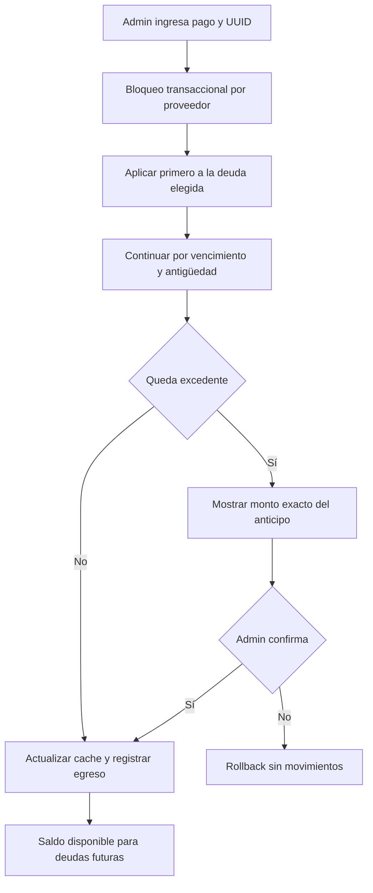

# 26 — Proveedores y cuentas por pagar

> **Creado y verificado contra código:** 2026-07-13  
> **Estado:** implementado en `codex/cambios-operativos-julio`; migración probada primero en `dev-hugo`; no desplegar ni migrar producción sin autorización  
> **Fuentes de verdad:** `src/lib/proveedores/pagos.ts`, `src/lib/proveedores/estado-cuenta.ts`, `src/app/api/proveedores/[id]/ficha/route.ts`, `src/app/dashboard/proveedores/[id]/ficha-proveedor-client.tsx`

Este módulo responde dos preguntas operativas sin mezclar proveedores: cuánto
debe Transavic a cada uno y cómo se aplicó cada pago. Complementa los docs
[09](./09-compras-inventario-mermas.md), [10](./10-pos-caja-tesoreria.md),
[20](./20-migracion-produccion.md) y [23](./23-mapa-dependencias-impacto.md).

## 1. Fuentes financieras de verdad

| Concepto | Fuente canónica | Observación |
|---|---|---|
| Deuda originada | `cuentas_por_pagar.monto_deuda` | Compra o deuda anterior manual. |
| Pago individual | `pagos_proveedores` | Nunca se colapsan pagos del mismo día. |
| Distribución del pago | `pagos_proveedores_aplicaciones` de pagos `registrado` | Une un pago con una o varias deudas del mismo proveedor. |
| Anticipo disponible | pago registrado menos suma de sus aplicaciones | No se compensa con otro proveedor. |
| Caché de una deuda | `cuentas_por_pagar.monto_pagado` | Se recalcula desde aplicaciones activas; no es el libro canónico. |
| Salida/contraasiento bancario | `transacciones.pago_proveedor_id` | Un egreso por pago y, al anular, un ingreso compensatorio. |
| Saldo de la cuenta bancaria | `cuentas_bancarias.saldo` | Puede quedar negativo por decisión operativa. |

La relación pago↔deuda lleva `proveedor_id` en ambos lados y tiene claves foráneas
compuestas. La base de datos impide aplicar dinero de un proveedor a una deuda de
otro aun si un endpoint tuviera un error.

## 2. Modelo de datos

### `pagos_proveedores`

Una fila por transferencia, Yape, efectivo u otra salida real. Guarda proveedor,
cuenta de origen, monto, fecha efectiva, referencia, deuda elegida, usuario y estado
`registrado|anulado`. El UUID enviado por el formulario es la clave de idempotencia.
`procesado_at` evita descontar dos veces la cuenta en reintentos concurrentes.

### `pagos_proveedores_aplicaciones`

Una fila por fracción aplicada. `origen` explica si nació con el pago, al consumir
un anticipo en una deuda posterior o durante la migración histórica. La combinación
`(pago_id, deuda_id)` es única.

### `transacciones.pago_proveedor_id`

Enlaza el movimiento de tesorería con la operación. Dos índices parciales permiten
como máximo un egreso y un ingreso de reverso por pago. La referencia sirve para
auditoría; no se usa para reconstruir aplicaciones nuevas.

## 3. Registro y distribución de un pago



Reglas:

1. La deuda marcada por el usuario tiene prioridad.
2. El resto se reparte por fecha de vencimiento, creación e ID.
3. El monto no aplicado queda como saldo a favor del proveedor seleccionado.
4. Al crear otra compra/deuda, el mismo bloqueo consume automáticamente anticipos
   anteriores, del más antiguo al más reciente.
5. Un pago de S/18,500 contra S/3,636.81 queda permitido; la pantalla exige
   confirmar que S/14,863.19 será anticipo si no existen otras deudas.
6. El saldo de la cuenta de origen se reduce aunque resulte negativo.

Pagos, creación de deudas, consumo de anticipos y anulaciones se serializan con
`pg_advisory_xact_lock` por proveedor. Esto evita que dos operaciones consuman el
mismo saldo pendiente.

## 4. Anulación y auditoría

Un movimiento financiero no se edita ni se elimina. Para corregirlo:

1. `POST /api/proveedores/[id]/pagos/[pagoId]/anular` exige motivo;
2. el pago cambia a `anulado`;
3. sus aplicaciones dejan de aportar porque la fuente solo considera pagos activos;
4. se recalcula el caché de todas las deudas del proveedor;
5. se crea un ingreso compensatorio en la misma cuenta bancaria.

La operación es idempotente: repetir la anulación no genera otro contraasiento.
La ficha y el PDF conservan dos filas cronológicas: el pago original y su
contraasiento posterior, con la misma cuenta e importe. El pago conserva su
referencia operativa; el contraasiento muestra el motivo de anulación. El pago
neto del conjunto es cero; ninguna de las dos evidencias se edita ni se elimina.

## 5. APIs y permisos

| Endpoint | Rol | Uso |
|---|---|---|
| `GET /api/proveedores/[id]/ficha?desde&hasta` | `admin` | Resumen, deudas, aplicaciones, pagos y libro mayor. |
| `POST /api/proveedores/[id]/pagos` | `admin` | Registrar, distribuir y confirmar anticipo. |
| `POST /api/proveedores/[id]/pagos/[pagoId]/anular` | `admin` | Anular con contraasiento. |
| `POST /api/cuentas-por-pagar` | `admin` | Compatibilidad: delega al servicio canónico. |
| `POST /api/cuentas-por-pagar/deuda` | `admin` | Crear deuda manual y consumir anticipo disponible. |
| `POST /api/compras` | `admin|produccion` según regla existente | Crea compra/deuda y aplica anticipo bajo bloqueo. |

Producción conserva el mantenimiento operativo de proveedores y compras, pero no
puede abrir la ficha, ver saldos financieros, registrar pagos ni generar el estado
de cuenta.

## 6. Ficha y PDF

`/dashboard/proveedores/[id]` muestra:

- deuda anterior, compras, pagos, deuda pendiente y saldo a favor;
- documentos con productos, pesos, costos, aplicaciones y saldo restante;
- cada pago como tarjeta independiente con fecha, hora, cuenta y referencia;
- anticipos disponibles, pagos anulados y sus contraasientos visibles;
- libro cronológico filtrable por fechas.

`construirEstadoCuentaProveedor()` usa centavos enteros para calcular saldo inicial,
compras, pagos y saldo final. La tabla y el PDF A4 reciben el mismo resultado; no
tienen fórmulas duplicadas. El PDF incluye cada pago en su propia fila, detalle de
documentos/productos, cuenta, referencia, distribución y saldo acumulado. En equipos
compatibles se comparte con Web Share; si no, se descarga.

## 7. Consolidado y efectos cruzados

El Consolidado calcula el saldo neto **por proveedor** y luego suma por separado:

- deudas positivas;
- saldos a favor positivos.

Nunca compensa el anticipo de un proveedor con la deuda de otro. Si cambia alguna
tabla o regla de este módulo, revisar además:

| Cambio | Impacto obligatorio |
|---|---|
| aplicación/anticipo | Compras, deuda manual, ficha, Consolidado y caché CxP |
| anulación | cuenta bancaria, `transacciones`, estado de deuda, ficha/PDF |
| productos/costos de compra | detalle de documento en ficha/PDF e inventario |
| permisos | Proveedores, CxP, Compras, Consolidado y sidebar |
| fecha financiera | saldo inicial del período, PDF y orden cronológico |

## 8. Migración histórica

Archivos:

- `scripts/migrate-pagos-proveedores-estado-cuenta-2026-07-13.sql`;
- `scripts/rollback-pagos-proveedores-estado-cuenta-2026-07-13.sql`;
- `scripts/verificar-pagos-proveedores.sql`.

La migración convierte cada egreso legacy `Pago a Proveedor:%` en pago y aplicación
individual. Antes de migrar aborta si existe un egreso legacy sin una CxP válida o si
la suma difiere de `monto_pagado` en más de S/0.01; después concilia aplicaciones
activas contra el caché. Distingue movimientos ya enlazados para que una reejecución
no confunda pagos nuevos con legacy. Es aditiva e idempotente. El rollback se bloquea
si ya existe un pago creado con el flujo nuevo.

Procedimiento:

```bash
# 1. dev-hugo; la URL se obtiene de .env.local sin imprimirla
psql "$DB_DEV_URL" -1 -v ON_ERROR_STOP=1 \
  -f scripts/migrate-pagos-proveedores-estado-cuenta-2026-07-13.sql

# 2. verificar, probar reejecución y rollback dentro de una transacción
psql "$DB_DEV_URL" -1 -v ON_ERROR_STOP=1 \
  -f scripts/verificar-pagos-proveedores.sql

# 3. solo tras aprobación, producción antes del deploy
psql "$DATABASE_URL_UNPOOLED" -1 -v ON_ERROR_STOP=1 \
  -f scripts/migrate-pagos-proveedores-estado-cuenta-2026-07-13.sql
```

No ejecutar el paso 3 desde una rama no aprobada.

## 9. Pruebas obligatorias

- tres pagos separados el mismo día;
- pago de S/18,500 contra S/3,636.81;
- deuda prioritaria, FIFO y reparto entre varias deudas;
- excedente exacto y confirmación previa;
- consumo del anticipo al crear una deuda futura;
- idempotencia de UUID y doble clic;
- pagos concurrentes bajo el mismo proveedor;
- rechazo de deuda perteneciente a otro proveedor;
- anular dos veces con un solo contraasiento;
- igualdad aplicaciones activas ↔ `monto_pagado` al centavo;
- cuentas bancarias con saldo negativo;
- libro y PDF con el mismo saldo final;
- render del PDF a imágenes y revisión visual de todas sus páginas.
