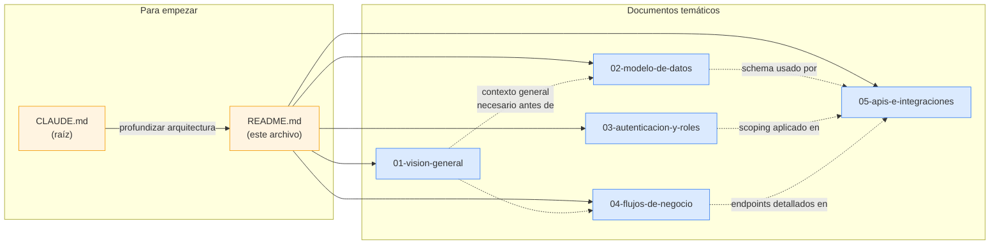

# Documentación de Arquitectura — Transavic

> **Última actualización:** 2026-06-02 (los 5 documentos verificados contra el código en esta fecha) · **2026-06-04:** app del repartidor / GPS en vivo pasó a producción + IA con caché persistente (`ia_insights_cache`) y respaldo Groq (429 resuelto) + traductor de Chrome desactivado + DELETE de usuario con pre-check de historial completo (docs 01, 02, 03, 05 actualizados)
> **Commit base:** `d2a49cd` + cambios hasta el 2 jun 2026 (PRs #6–#11)
> **Estado:** proyecto **EN PRODUCCIÓN** desde el 30 may 2026 (`transavic.vercel.app`)

Esta carpeta contiene la **referencia técnica de verdad** del sistema Transavic, verificada contra el código real. Está pensada para que el desarrollador principal (Hugo) y agentes IA futuros entiendan el sistema en profundidad sin re-leer 8,000 líneas de implementación.

Para overview rápido y gotchas del día a día, ver **[`/CLAUDE.md`](../../CLAUDE.md)** en la raíz del repo.

---

## 📚 Los 5 documentos

| # | Documento | Cuándo leerlo | Líneas |
|---|---|---|---|
| 1 | **[01-vision-general.md](./01-vision-general.md)** | Primera vez que entras al proyecto. Quieres entender stack, deployment y decisiones macro. | ~660 |
| 2 | **[02-modelo-de-datos.md](./02-modelo-de-datos.md)** | Vas a tocar el schema, agregar tablas/columnas, o entender por qué algo está denormalizado. | ~1170 |
| 3 | **[03-autenticacion-y-roles.md](./03-autenticacion-y-roles.md)** | Vas a crear un endpoint nuevo, agregar un rol, o entender cómo se aplica el scoping (empieza por §0: dónde viven los permisos). | ~675 |
| 4 | **[04-flujos-de-negocio.md](./04-flujos-de-negocio.md)** | Vas a modificar la máquina de estados del pedido, agregar transiciones, o entender cómo se conectan las áreas (el "lazo del dinero"). | ~1260 |
| 5 | **[05-apis-e-integraciones.md](./05-apis-e-integraciones.md)** | Referencia de endpoints (~70 handlers), integraciones (SUNAT, Maps, Brevo, apisperu, Gemini), offline queue. | ~1010 |

---

## 🎯 Guía "si vas a tocar X, lee Y"

| Tu tarea | Documentos a leer (en orden) |
|---|---|
| Entender el proyecto por primera vez | 01 → 04 → (los demás según necesidad) |
| Agregar una tabla o columna nueva | 02 → 05 (ver convenciones SQL y patrones de query) |
| Crear una API nueva | 05 (convenciones) → 03 (auth y scoping) → 04 (si afecta máquina de estados) |
| Agregar un rol nuevo | 03 (sección "Cómo agregar un rol nuevo") |
| Tocar el flujo del repartidor | 04 (sección "Repartidor") → 05 (offline queue) |
| Tocar el panel de despacho del admin | 04 (sección "Admin") → 05 (Google Directions) |
| Tocar el form de crear pedido | 04 (sección "Asesora crea pedido") |
| Modificar la máquina de estados | 04 (diagrama Mermaid completo en §3) |
| Integrar un servicio externo nuevo | 01 (variables de entorno) → 05 (patrón de integración con Google Maps como referencia) |
| Resolver una deuda de auditoría | 05 §8 (tabla de hallazgos) |
| Optimizar queries lentas | 02 (índices existentes) → 05 (cuáles endpoints hacen JOINs pesados) |
| Cambiar deployment o env vars | 01 (sección 5 y 6) |
| Debuggear un bug de auth | 03 (flujo completo de login) → 05 (qué endpoints hacen check) |
| Implementar las **8 mejoras 2026** | Los 5 documentos + propuesta comercial (`/propuesta-mejoras-transavic.pdf`) |

---

## 🗺️ Convenciones de los documentos

Todos los documentos siguen las mismas convenciones:

### Header estándar

```markdown
# <N> — <Título>

> **Última verificación contra código:** YYYY-MM-DD
> **Commit del proyecto:** <hash corto>
> **Archivos clave:** lista de archivos referenciados
```

### Referencias a archivos

Formato `path/al/archivo.ts:LINEA-FINAL` que permite click directo en editores modernos:

> Ver el `authorize()` en `src/auth.ts:23-41`.

### Diagramas

- **Mermaid** para flujos complejos (capas, ER, máquina de estados, secuencia).
- **ASCII art** para flujos lineales simples.
- **Tablas markdown** para comparativas, decisiones, hallazgos.

### Code blocks

- TypeScript, SQL y JSON **reales del proyecto** (no inventados).
- Cuando se simplifica, se indica con `// ... (lógica de validación) ...`.

### Sección final estándar

Cada documento (excepto este README) termina con **"Cómo verificar que este documento sigue vigente"** — comandos `grep` y `psql` específicos para detectar si hay drift entre la doc y el código.

---

## ⚙️ Cómo mantener esta documentación

### Cuando hagas un cambio importante

1. **Identifica qué documentos cubren el área que tocaste.**
   - ¿Modificaste schema? → actualizar 02.
   - ¿Agregaste endpoint? → actualizar 05.
   - ¿Cambiaste la máquina de estados? → actualizar 04 (incluido el diagrama Mermaid).
   - ¿Agregaste un rol? → actualizar 03 y CLAUDE.md.

2. **Actualizá la fecha del header** (`Última verificación contra código:`) y el `Commit del proyecto`.

3. **Ejecutá los comandos de "Cómo verificar que sigue vigente"** del documento que tocaste. Si alguno revela inconsistencias, corregilas.

4. **Commiteá** con mensaje descriptivo:
   ```
   docs(arquitectura): actualizar 02-modelo-de-datos con nueva tabla X
   ```

### Cuando agregues un documento nuevo

1. Numerarlo `06-...`, `07-...`, etc.
2. Agregar entrada en la tabla de §1 de este README.
3. Agregar entrada en la guía "si vas a tocar X, lee Y".
4. Actualizar `CLAUDE.md` mencionando el nuevo documento.

### Cuando elimines algo del código

- Si eliminás una tabla, columna, endpoint o feature, **eliminá las menciones en los documentos**.
- Si la eliminación tiene rationale histórico (ej: "antes había X pero se removió porque..."), considerar mantenerlo como nota corta para contexto futuro.

---

## 🚨 Hallazgos de auditoría conocidos

Durante la creación de esta documentación se detectaron **12 deudas técnicas** que conviene tratar. Ver la tabla completa en [`05-apis-e-integraciones.md §8`](./05-apis-e-integraciones.md#8-hallazgos-de-auditoría-deudas-a-tratar).

**Las más urgentes:**

| # | Hallazgo | Severidad |
|---|---|---|
| ~~1~~ | ~~`PATCH/DELETE /api/pedidos/[id]` sin auth check~~ — **✅ Resuelto 2026-05-13** | ✅ Resuelto |
| 2 | Migración de tabla `clientes` (CREATE TABLE) no documentada en `/scripts/` (DB no recreable desde cero) | 🟡 Media (abierto) |
| ~~3~~ | ~~`GET /api/clientes/[id]/pedidos` permite ver historial de clientes ajenos~~ — **✅ Resuelto** (valida rol + `asesor_id = userId`; verificado 2026-06-02) | ✅ Resuelto |

> La lista completa de hallazgos con su estado actual está en [`05-apis-e-integraciones.md §8`](./05-apis-e-integraciones.md).

## 🚀 Estado de implementación (mayo 2026)

| Fase | Estado | Documento detallado |
|---|---|---|
| **Sistema base** | ✅ En producción | Doc 01-05 |
| **Fase A — Base operativa** (precios, producción, guía digital, foto firmada) | ✅ **En producción** (30 may 2026) | `docs/superpowers/plans/2026-05-13-fase-a-base-operativa.md` |
| **Fase B — Visibilidad y dinero** (metas, notificaciones, cobranzas, SUNAT real) | ✅ **En producción** (30 may 2026) | `docs/superpowers/plans/2026-05-13-fase-b-visibilidad-y-dinero.md` |
| **Fase C — Inteligencia + App móvil** | IA Gemini ✅ **en producción**; app móvil del repartidor (Capacitor, GPS en vivo por **polling** — sin Pusher) ✅ **en producción** (4 jun 2026, PRs #18–#22; publicada en Google Play, Prueba Interna) | — |

### Cambios en el modelo de datos (Fase A + B)

**Tablas nuevas:**
- `precios_productos` (Fase A.1) — histórico de precios
- `correlativos` (Fase A.4) — numeración de guías
- `metas_asesoras` (Fase B.1) — overrides manuales de meta mensual
- `notificaciones` (Fase B.2) — notificaciones in-app
- `facturas` (Fase B.3) — gestión de cobranzas
- `comprobantes` + `comprobantes_contador` (Fase B.4) — SUNAT

**Columnas nuevas:**
- `productos.precio_compra`, `precio_venta`
- `pedido_items.precio_unitario`, `subtotal`, `cantidad_real`, `subtotal_real`
- `pedidos.numero_guia`, `guia_firmada_data` (base64), `guia_firmada_mime`, `guia_firmada_at`, `pesado_por`, `pesado_at`
- `clientes.plazo_pago_dias`

**Estados nuevos en `pedidos.estado`:**
- `En_Produccion` (entre `Pendiente` y `Asignado`)
- `Listo_Para_Despacho` (entre `En_Produccion` y `Asignado`)

**Rol nuevo:** `produccion` (asistente de producción que pesa los pedidos)

---

## 🧭 Mapa de relaciones entre documentos



---

## 📞 Contacto

- **Mantenedor principal:** Hugo Herrera (`eventonegocioslegendarios@gmail.com`)
- **Cliente del proyecto:** Antonio Resurrección (Transavic / Avícola de Tony)
- **Repo:** local en `/Users/hugoherrera/Programación/proyectos/transavic`

---

**Idioma:** Español (consistente con el código y comentarios del proyecto).
**Audiencia:** Desarrollador + agentes IA. Sin "value pitch" — referencia técnica densa y verificable.
