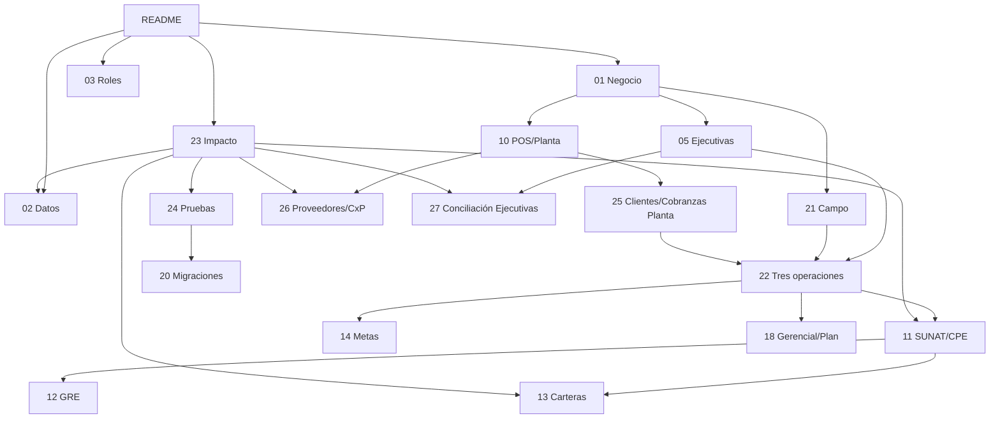

# Documentación de Arquitectura y Negocio — Transavic

> **Última actualización:** 2026-07-13
> **Base revisada:** `main` (`e6ce194`) + rama `codex/cambios-operativos-julio`
> **Producción:** `app.transavic.com`; ERP, separación Campo/Planta y facturación de Campo desplegados. Del lote del 13 jul, Proveedores y costo POS requieren migración; conciliación de Ejecutivas y reprogramación requieren solo despliegue de código. Nada de ese lote se ha aplicado aún en producción.

Esta carpeta es la referencia técnica y de negocio del sistema. Los documentos temáticos explican cada módulo; los docs 22–24 conectan los módulos, muestran el impacto de cambios y definen las pruebas de regresión.

---

## 📚 Índice de documentos

| # | Documento | Cuándo leerlo |
|---|---|---|
| 01 | **[Negocio avícola](./01-negocio-avicola.md)** | Entender marcas, tres operaciones de venta y flujo físico. |
| 02 | **[Modelo de datos](./02-modelo-datos.md)** | Modificar tablas, columnas, FKs, índices o vistas. |
| 03 | **[Roles y permisos](./03-roles-permisos.md)** | Cambiar auth, RBAC, guards o scoping SQL. |
| 04 | **[Máquina de estados](./04-maquina-estados.md)** | Cambiar estados/transiciones del pedido y efectos laterales. |
| 05 | **[Ventas y clientes de Ejecutivas](./05-ventas-clientes.md)** | Tocar preventa, directorio o duplicados de clientes. |
| 06 | **[Producción y pesaje](./06-produccion-pesaje.md)** | Cambiar pesos reales, unidades o cola de producción. |
| 07 | **[Despacho y rutas](./07-despacho-rutas.md)** | Tocar kanban, asignación, Directions o bloqueo de rutas. |
| 08 | **[Repartidores y GPS](./08-repartidores-gps.md)** | Tocar mi-ruta, offline, Capacitor o GPS obligatorio. |
| 09 | **[Compras, inventario y mermas](./09-compras-inventario-mermas.md)** | Cambiar abastecimiento, kardex, stock, mermas o préstamos. |
| 10 | **[POS, caja y tesorería](./10-pos-caja-tesoreria.md)** | Cambiar Venta en Planta, caja, cuentas, gastos o CxP. |
| 11 | **[Comprobantes SUNAT](./11-comprobantes-sunat.md)** | Tocar XML/firma/SOAP, CPE, claims, NC o reintentos. |
| 12 | **[Guías de Remisión](./12-guias-remision.md)** | Modificar GRE REST, destino, M1/L o reintento de guía. |
| 13 | **[Cobranzas por operación](./13-cobranzas-facturas.md)** | Cambiar deuda/pagos/anulación de Ejecutivas, Campo o Planta. |
| 14 | **[Metas e incentivos](./14-metas-incentivos.md)** | Cambiar metas, rachas, ranking o métrica de asesoras. |
| 15 | **[Asistente IA](./15-asistente-ia.md)** | Cambiar Gemini/Groq, anonimizado o caché. |
| 16 | **[Notificaciones y cron](./16-notificaciones-cron.md)** | Cambiar notificaciones o tareas programadas. |
| 17 | **[Análisis Avitech](./17-analisis-avitech.md)** | Entender el sistema de referencia y decisiones trasladadas. |
| 18 | **[Plan maestro](./18-plan-implementacion-maestro.md)** | Ver fases, estado real, backlog y decisiones ERP. |
| 19 | **[Arquitectura modular](./19-arquitectura-modular-transavic.md)** | Agregar módulos sin romper el core. |
| 20 | **[Migraciones a producción](./20-migracion-produccion.md)** | Aplicar SQL y desplegar en el orden correcto. |
| 21 | **[Clientes Avícola / Campo](./21-clientes-avicola.md)** | Tocar venta, abonos, guía, CPE o reportes de Campo. |
| 22 | **[Operaciones, ventas y facturación](./22-operaciones-ventas-facturacion.md)** | Entender cómo se separan y conectan Ejecutivas/Campo/Planta. |
| 23 | **[Mapa de dependencias e impacto](./23-mapa-dependencias-impacto.md)** | Saber qué módulos revisar cuando cambia una fuente de verdad. |
| 24 | **[Pruebas y despliegue transversal](./24-pruebas-regresion-despliegue.md)** | Validar concurrencia, CPE, PDF, filtros, roles y migraciones. |
| 25 | **[Clientes y cobranzas de Planta](./25-clientes-cobranzas-planta.md)** | Tocar directorio, crédito, abonos o relación POS↔CPE de Planta. |
| 26 | **[Proveedores y cuentas por pagar](./26-proveedores-cuentas-por-pagar.md)** | Tocar deudas, pagos, aplicaciones, anticipos o estado de cuenta de proveedores. |
| 27 | **[Conciliación de Ventas de Ejecutivas](./27-conciliacion-ventas-ejecutivas.md)** | Cambiar el indicador gerencial, su detalle o la prevención de pedidos duplicados. |
| 28 | **[Alta de WhatsApp por marca](./28-alta-whatsapp-por-marca.md)** | Conectar el número de WhatsApp de una marca al CRM: portfolio, app, WABA, número, token y webhook. |

---

## 🎯 Si vas a tocar X, lee Y

| Trabajo | Documentos, en orden |
|---|---|
| Entender el sistema por primera vez | 01 → 22 → 23 → 02 |
| Agregar columna, tabla, estado o índice | 23 → 02 → documento temático → 20 → 24 |
| Venta de Ejecutivas | 05 → 27 → 04 → 14 → 22 |
| Venta/abonos/facturación de Campo | 21 → 22 → 11 → 13 → 24 |
| POS/clientes/cobranzas de Planta | 10 → 25 → 22 → 13 → 24 |
| Factura, boleta, NC o reintento | 11 → 22 → 13 → 24 |
| GRE | 12 → 11 → 22 → 24 |
| Ventas Generales, Consolidado o Hoy/Ayer | 27 → 22 → 14 → 18 → 23 |
| Estado de cuenta/PDF de Campo | 21 → 13 → 24 |
| Meta, racha o ranking | 14 → 05 → 03 |
| Compras/inventario/mermas | 09 → 10 → 18 → 23 |
| Pago, anticipo o PDF de proveedor | 26 → 10 → 09 → 23 → 24 |
| Reprogramar desde Producción | 06 → 04 → 16 → 23 → 24 |
| Detalle o costo histórico POS | 10 → 25 → 02 → 24 |
| Conectar el WhatsApp de una marca | 28 → 15 → 16 → 24 |
| CRM de leads o chatbot | 15 → 28 → 16 |
| Roles, ruta o sidebar | 03 → 23 → documento temático |
| Desplegar a producción | 20 → 24 → 02 → 19 |

---

## 🗺️ Mapa de relaciones documentales

---

## Regla de mantenimiento

Cada cambio debe actualizar:

1. el documento temático;
2. el mapa 22/23 si cambia una relación transversal;
3. el modelo 02 y runbook 20 si cambia esquema;
4. el historial cuando el cambio queda verificado o desplegado;
5. las pruebas del doc 24 cuando nace un nuevo invariante.

Nunca describas un cambio local como desplegado. Diferencia siempre código, `dev-hugo` y producción.
