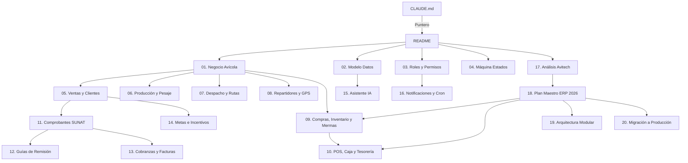

# Documentación de Arquitectura y Negocio — Transavic

> **Última actualización:** 2026-07-05
> **Commit base:** `9f29f5a` (post-mejoras GPS e inconsistencias corregidas; + expansión ERP 2026 en desarrollo local)
> **Estado:** Proyecto **EN PRODUCCIÓN** desde el 30 may 2026 — dominio `app.transavic.com` desde el 6 jul 2026 (`transavic.vercel.app` redirige)

Esta carpeta contiene la **referencia técnica y de negocio de verdad** del sistema Transavic, estructurada de forma quirúrgica en pequeños documentos granulares para facilitar la contextualización de desarrolladores e inteligencias artificiales (IAs).

---

## 📚 Índice de Documentos

| # | Documento | Cuándo leerlo |
|---|---|---|
| 01 | **[01-negocio-avicola.md](./01-negocio-avicola.md)** | Quieres entender la operativa real de Antonio en Lima Metropolitana, las marcas comerciales y las 5 áreas operativas. |
| 02 | **[02-modelo-datos.md](./02-modelo-datos.md)** | Vas a modificar el esquema físico de Postgres, revisar tipos de datos o consultar el historial de scripts de migración. |
| 03 | **[03-roles-permisos.md](./03-roles-permisos.md)** | Vas a añadir un rol, modificar los permisos o entender cómo se aplica el scoping a nivel de SQL. |
| 04 | **[04-maquina-estados.md](./04-maquina-estados.md)** | Vas a tocar los estados del pedido, sus transiciones en el backend o las reglas de reversión de entregas. |
| 05 | **[05-ventas-clientes.md](./05-ventas-clientes.md)** | Vas a modificar el formulario de preventa, el buscador de clientes recurrentes o la lógica anti-duplicados. |
| 06 | **[06-produccion-pesaje.md](./06-produccion-pesaje.md)** | Vas a tocar el panel de pesaje físico de producción, la conversión de unidades uni $\rightarrow$ kg o la desagrupación de ítems. |
| 07 | **[07-despacho-rutas.md](./07-despacho-rutas.md)** | Vas a modificar el tablero Kanban, la optimización de Directions API o el bloqueo y persistencia de rutas. |
| 08 | **[08-repartidores-gps.md](./08-repartidores-gps.md)** | Vas a tocar la pantalla móvil `/mi-ruta`, Capacitor, la cola offline o la detección de evasión de GPS (repartidores oscuros). |
| 09 | **[09-compras-inventario-mermas.md](./09-compras-inventario-mermas.md)** | Vas a tocar el registro de compras de la madrugada, la política de inventario y el kardex, los ajustes de stock, las mermas o los préstamos de mercadería. |
| 10 | **[10-pos-caja-tesoreria.md](./10-pos-caja-tesoreria.md)** | Vas a tocar el POS de planta, la caja diaria (apertura/arqueo/cierre), las cuentas bancarias, transacciones, gastos o cuentas por pagar. |
| 11 | **[11-comprobantes-sunat.md](./11-comprobantes-sunat.md)** | Vas a modificar la generación de XML UBL 2.1, firmado digital, SOAP fflate, Notas de Crédito, Comunicaciones de Baja o Resumen Diario. |
| 12 | **[12-guias-remision.md](./12-guias-remision.md)** | Vas a emitir o modificar la transmisión REST 2.0 de Guías de Remisión Electrónicas (GRE Remitente). |
| 13 | **[13-cobranzas-facturas.md](./13-cobranzas-facturas.md)** | Vas a modificar el flujo de cuentas por cobrar, estados de deuda, aging o la subida de vouchers de pago. |
| 14 | **[14-metas-incentivos.md](./14-metas-incentivos.md)** | Vas a tocar las metas comerciales individuales, rachas consistentes, ranking o la métrica de ventas por pedidos (`ventas-metricas.ts`). |
| 15 | **[15-asistente-ia.md](./15-asistente-ia.md)** | Vas a modificar el módulo asistente de Gemini, respaldo de Groq o el caché persistente. |
| 16 | **[16-notificaciones-cron.md](./16-notificaciones-cron.md)** | Vas a editar los 5 cron jobs automatizados en `vercel.json` o la campanita de notificaciones in-app. |
| 17 | **[17-analisis-avitech.md](./17-analisis-avitech.md)** | Quieres entender el sistema Avitech que usa Ariana (compras, pesaje, mermas, kardex, caja) y qué se replicó/mejoró en Transavic. |
| 18 | **[18-plan-implementacion-maestro.md](./18-plan-implementacion-maestro.md)** | Vas a trabajar en la expansión ERP 2026 (compras, POS, caja, CRM, gerencial): fases, reglas de negocio y estado real de la auditoría. |
| 19 | **[19-arquitectura-modular-transavic.md](./19-arquitectura-modular-transavic.md)** | Vas a agregar módulos nuevos sin romper el core de pedidos: patrón de aislamiento y estrategia de despliegue seguro. |
| 20 | **[20-migracion-produccion.md](./20-migracion-produccion.md)** | Guía de migración técnica consolidada de las Fases 2 y 3 para su despliegue seguro a producción. |

---

## 🎯 Guía "Si vas a tocar X, lee Y"

| Área de Trabajo | Documentos a consultar (en orden) |
|---|---|
| **Entender el negocio avícola por primera vez** | 01 $\rightarrow$ 04 $\rightarrow$ 02 |
| **Agregar una columna o tabla nueva** | 02 $\rightarrow$ 05 (conector del backend) |
| **Tocar el formulario de preventa** | 05 $\rightarrow$ 01 |
| **Tocar el panel de pesaje y balanza** | 06 $\rightarrow$ 04 (máquina de estados) |
| **Tocar la asignación de rutas y dnd** | 07 $\rightarrow$ 08 (coordenadas / tracking) |
| **Tocar la app del motorizado o Capacitor** | 08 $\rightarrow$ 03 (roles de repartidor) |
| **Tocar boletas, facturas o Notas de Crédito** | 11 $\rightarrow$ 13 (cobranzas) |
| **Tocar la emisión de Guías de Remisión** | 12 $\rightarrow$ 11 |
| **Tocar metas o tableros comerciales** | 14 $\rightarrow$ 03 (scoping de asesora) |
| **Tocar la IA o los reportes Gemini** | 15 $\rightarrow$ 02 (ia_insights_cache) |
| **Agregar o modificar tareas automáticas** | 16 $\rightarrow$ 03 (auth bypass de cron) |
| **Tocar compras, inventario/kardex, mermas o préstamos de mercadería** | **09** $\rightarrow$ 18 (reglas de negocio) $\rightarrow$ 02 §5 (esquema) |
| **Tocar el POS de planta, la caja diaria, cuentas, gastos o cuentas por pagar** | **10** $\rightarrow$ 18 (reglas de negocio) $\rightarrow$ 03 (permisos granulares) |
| **Tocar el CRM de leads o el chatbot de WhatsApp** | 18 $\rightarrow$ 15 (checklist de seguridad del bot) $\rightarrow$ 02 §5 |
| **Tocar el consolidado gerencial o rentabilidad** | 18 $\rightarrow$ 14 (métrica de ventas) |
| **Desplegar los módulos nuevos a producción** | 20 $\rightarrow$ 19 (aislamiento) $\rightarrow$ 02 §5 (tablas faltantes) |

---

## 🗺️ Mapa de Relaciones

